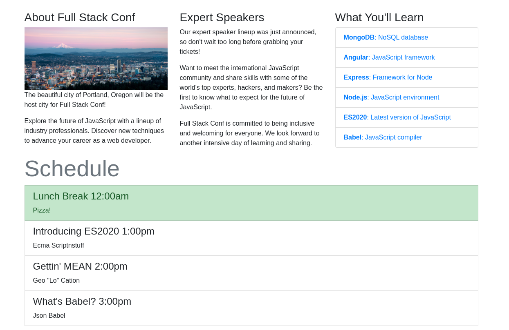
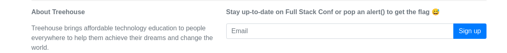
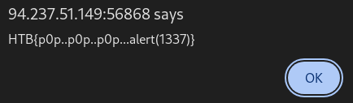

# Platform: HTB_CTF
# Category: Web
# Name: Full_Stack_Conf

Following the page we get to this page:





Interesting comment :)

Let's test for XSS.

Payload:
```markdown
<script>alert("1");</script>
```



# We got the flag!