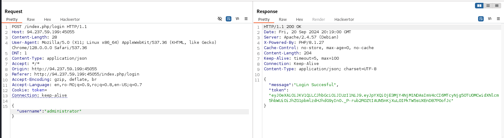
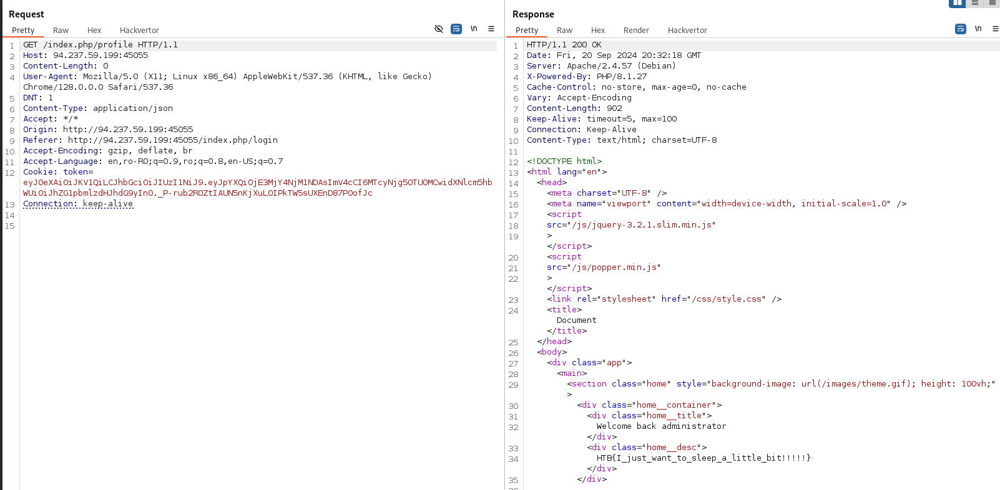

# Insomnia
# Web Challenge

After unzipping the file we got we can take a look at how the challenge works.

Starting with "entrypoint.sh":

```
sqlite3 /var/www/html/Insomnia/database/insomnia.db <<'EOF'
CREATE TABLE IF NOT EXISTS users (
    id INTEGER PRIMARY KEY,
    username TEXT NOT NULL,
    password TEXT NOT NULL
);
INSERT INTO users (username, password) VALUES ('administrator', LOWER(hex(randomblob(16))));
EOF

# Create JWT secret key
echo "JWT_SECRET='$(openssl rand -hex 32)'" >> /var/www/html/Insomnia/.env
```

As we can see an "administrator" user with a random password is being inserted in the database of the website. Also, the JWT secret key is randomly generated with openssl. 

It appears we can't brute force our way to the flag. We'll need to find a vulnerability in the web app.

Looking at the UserController.php file we can see the following:

```php
$json_data = request()->getJSON(true);
if (!count($json_data) == 2) {
    return $this->respond("Please provide username and password", 404);
}
$query = $db->table("users")->getWhere($json_data, 1, 0);
```

The if statement is flawed. If the array in json_data contains 2 elements it returns the 404 response. It should be the other way around.

Knowing this we can modify our request and send only the username. This should get us a token for any existing user as we can see here:

```php
 $result = $query->getRowArray();
        if (!$result) {
            return $this->respond("User not found", 404);
        } else {
            $key = (string) getenv("JWT_SECRET");
            $iat = time();
            $exp = $iat + 36000;
            $headers = [
                "alg" => "HS256",
                "typ" => "JWT",
            ];
            $payload = [
                "iat" => $iat,
                "exp" => $exp,
                "username" => $result["username"],
            ];
            $token = JWT::encode($payload, $key, "HS256");

            $response = [
                "message" => "Login Succesful",
                "token" => $token,
            ];
            return $this->respond($response, 200);
        }
```



It worked! We got a token for the administrator's account.

Now I'll use it to access the profile page.



## We got the flag!