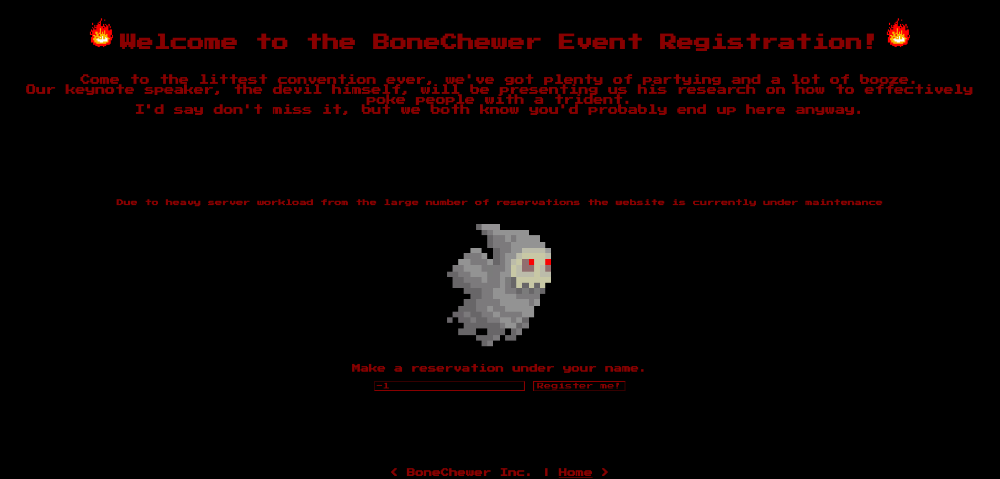
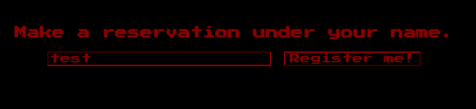
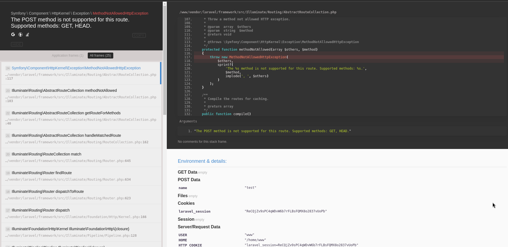
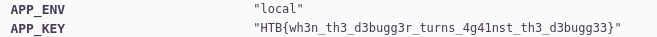

# Platform: HTB_CTF
# Category: Web
# Name: baby_BoneChewerCon

Following the link we get to this page:

I'll give it some input and see what happens.

We get to a Laravel debugging page:

Looking at the Environment & details we find the flag.

## We got the flag!