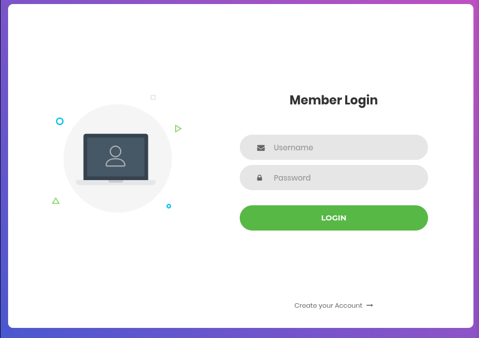
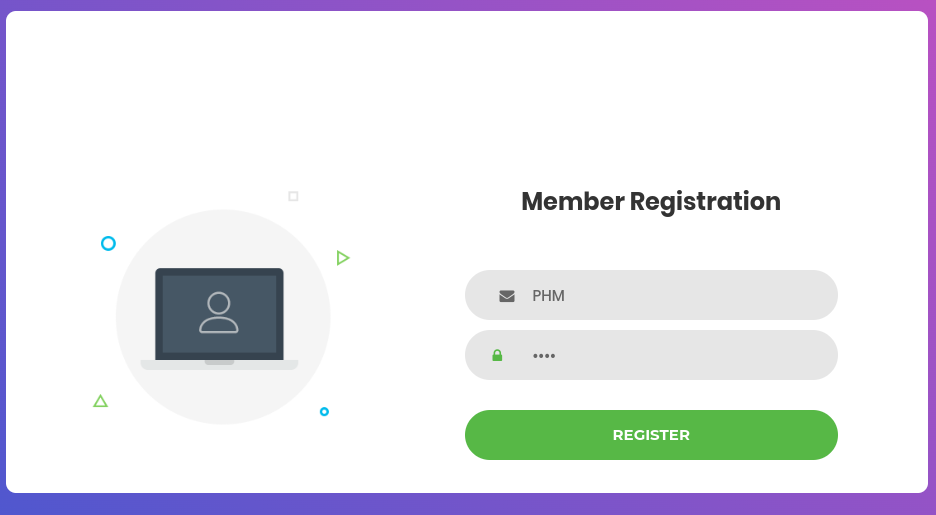
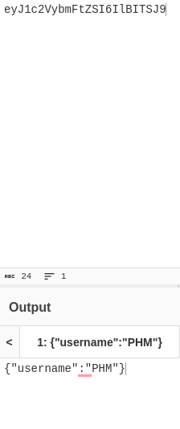
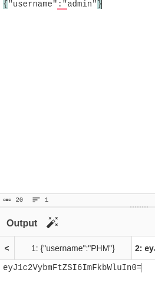
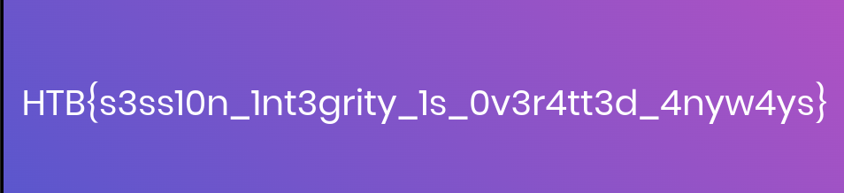

# Platform: HTB_CTF
# Category: Web
# Name: baby_auth

We start in a login page.

I don't have credentials so I'll create an account.

Now I'll login to that account.

The "PHPSESSID" cookie looks like it's base 64 encoded. I'll try to decode it with cyberchef.

I'll just change the username and refresh the page.

# It worked! We got the flag!