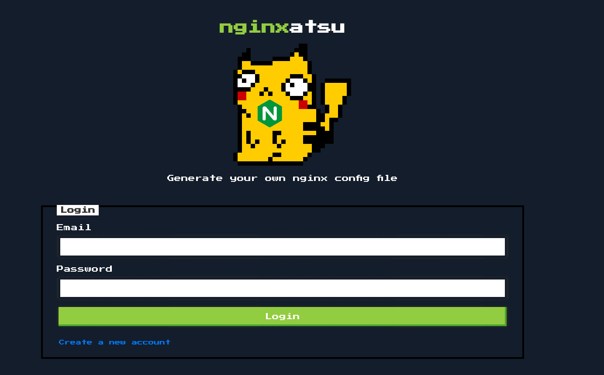
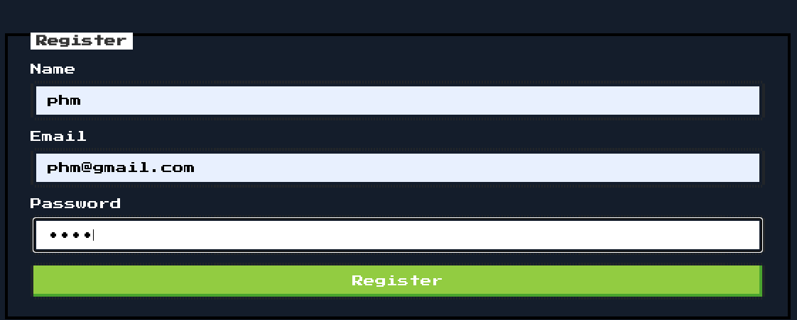
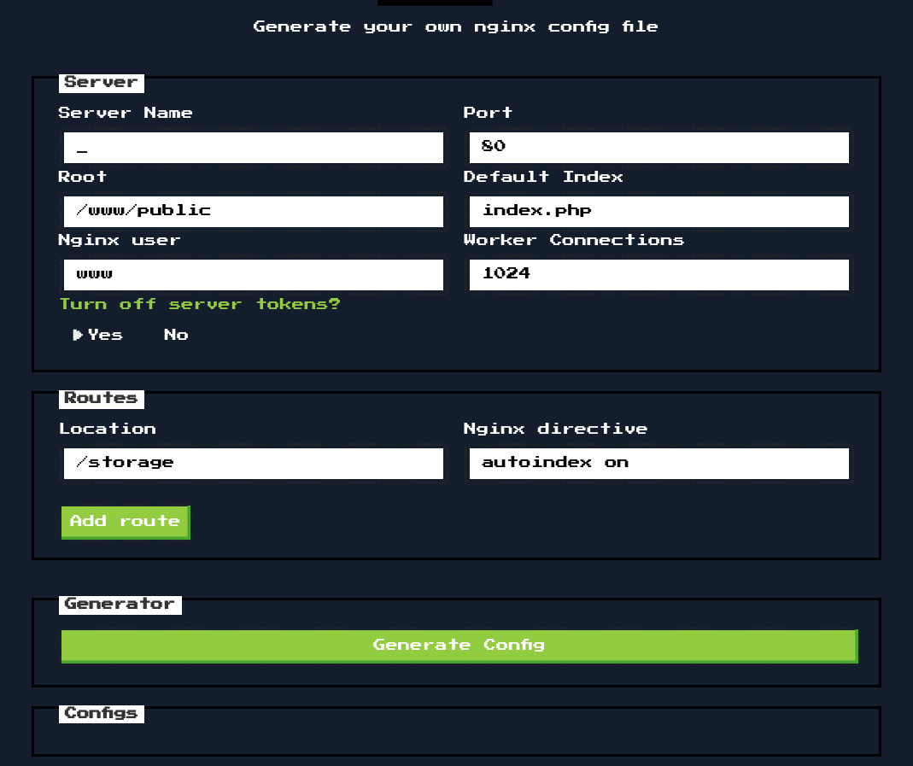
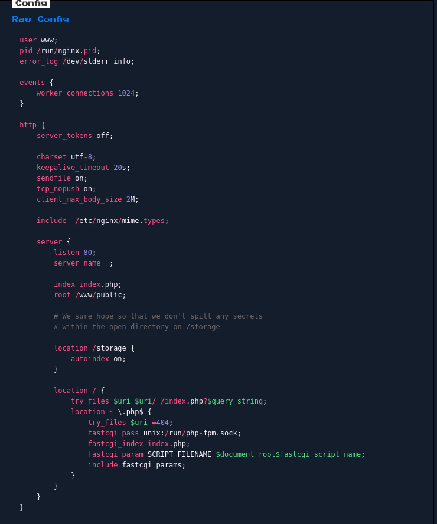
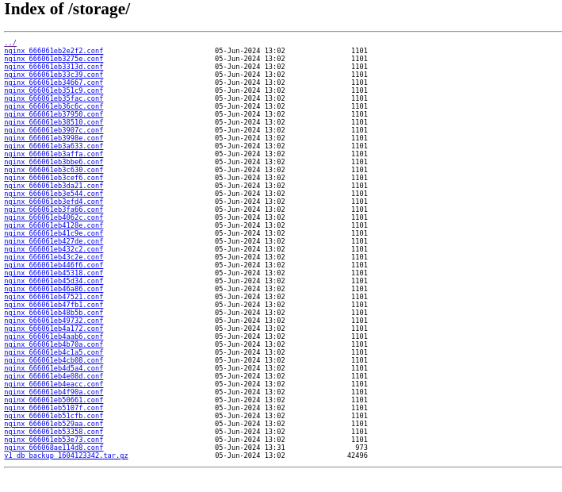
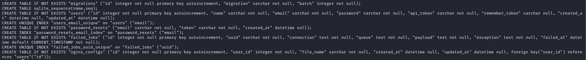
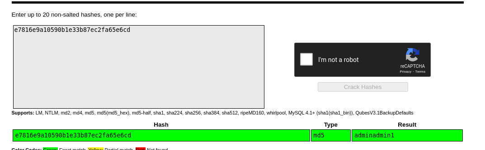
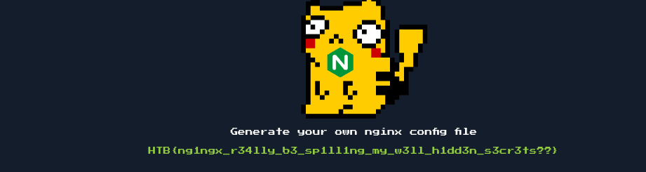

# Platform: HTB_CTF
# Category: Web
# Name: baby_nginxatsu

We arrive on a login page.



I'll register an account and login.



We get to a page that allows us to generate a config file.



I generated a config file and found something interesting.



We can access that folder. (http://94.237.49.212:39400/storage/)



I'll get the db baclup file on my machine and decomprese it.

```bash
tar -xf v1_db_backup_1604123342.tar.gz
cd database
ls
```

I'll open the data base with sqlite.

```bash
sqlite3 database.sqlite 
.schema
```



We can see there is an users table. I'll print the contents of that table.

```bash
select * from users;
```

Output:

```markdown
1|jr|nginxatsu-adm-01@makelarid.es|e7816e9a10590b1e33b87ec2fa65e6cd|yp30VzYpWYuSEFFt6yh6WXq1EMfGF6k6vjGfVhtPMaHOPL012BqWf41slzp4hr1MteKw||2024-06-05 13:02:35|2024-06-05 13:02:35
2|Giovann1|nginxatsu-giv@makelarid.es|23cd2048b08619bb0a527fe40e1c51d0|0xrMPca3nYXFVuoN95PZKGogMGfj8TEsBSg6bkY6By9OzKnYbrjPgA2c9OBb6ewGKqbD||2024-06-05 13:02:35|2024-06-05 13:02:35
3|me0wth|nginxatsu-me0wth@makelarid.es|d4f9c45306878fb578ea40dceba54c90|NVhefQB6zJA3HmcWvMHdeFvPNsmV4aLbBb9a2Sp756ugvx0thtL4bKwiuPNz4dJik7AF||2024-06-05 13:02:35|2024-06-05 13:02:35
```

I'll use CrackStation to crack the password and log into the admin account.



Now let's log in.



It worked!

## We got the flag!