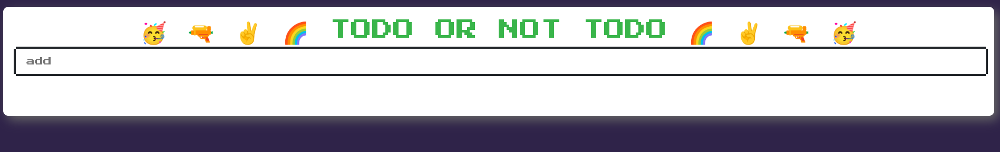
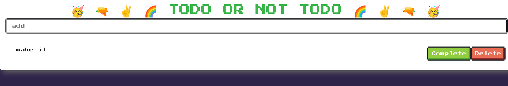
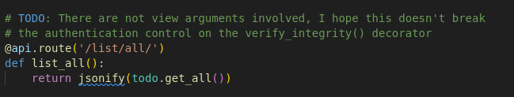
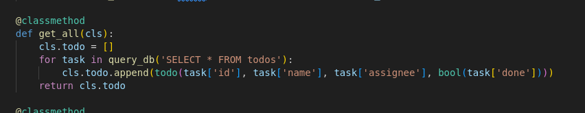
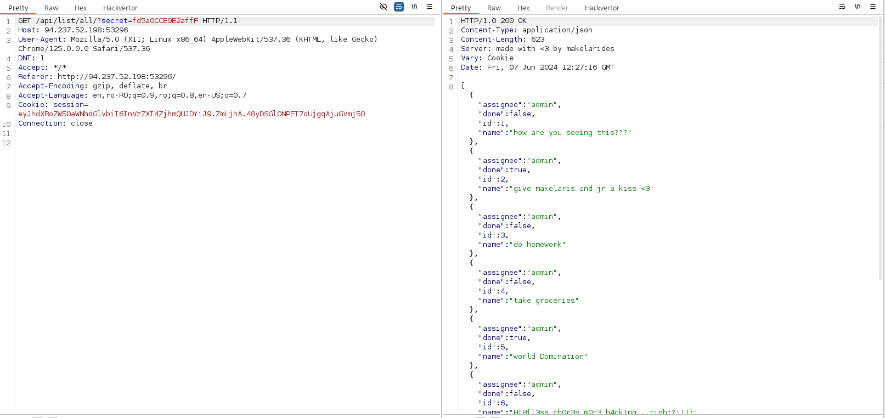
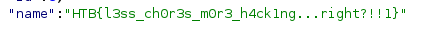

# Platform: HTB_CTF
# Category: 
# Name: baby_todo_or_not_todo

We start on this page.

We can add tasks to our to do list.

This is a White Box challenge so I'll take a look at the source code.

I found a comment on one of the files.

We can see the name of the function being called. Let's find the function.

We can see the function returns the contents of the "todo" table.

We know this function can be accessed by all users but it reveals information about the other users as well. Let's call the function.

We can also see the flag.

## We got the flag!