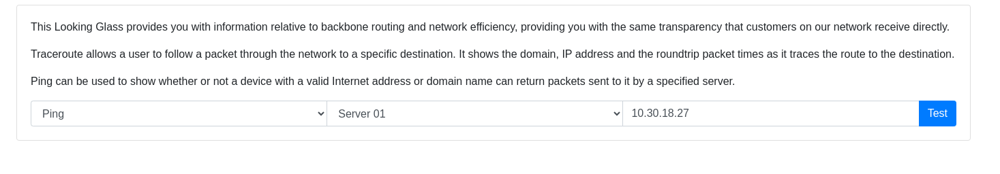
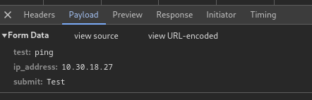
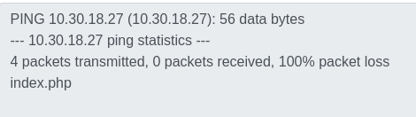
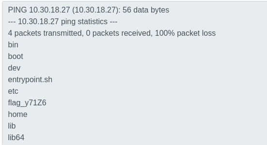
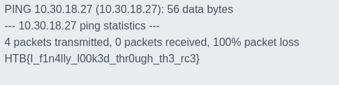

# Platform: HTB_CTF
# Category: Web
# Name: looking_glass

Following the link we get to this page:



Looking at the request made when pressing the "Test" button makes me think at a command injection vulnerability.



I'll try a simple adding address
```bash
;ls
```
to the ip field.



It works! Now let's see the root folder.

Payload:
```bash
;ls /
```



Now we just need to read the flag.

```bash
cat ../flag_y71Z6
```



## We got the flag!