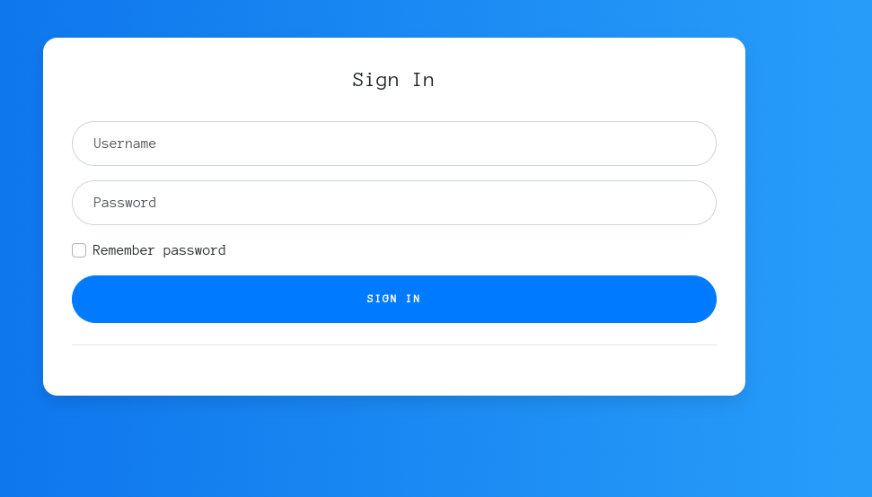
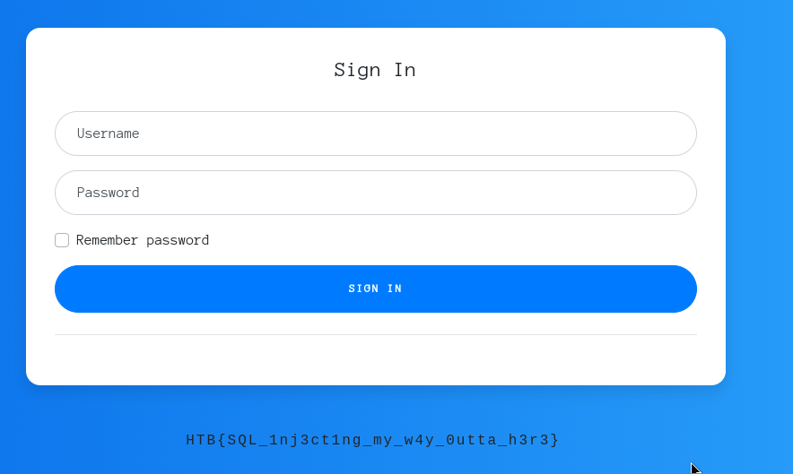

# Platform: HTB_CTF
# Category: Web
# Name: sanitize

Following the link we get to a login page.



The title of the pages sugest an SQLi type vulnerability. So I'll try a simple SQLi payload.

```markdown
' or 1=1;--
```



## We got the flag!