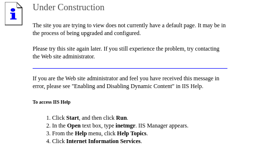

# Grandpa
## OS: Windows
## Difficulty: Easy

## Enumeration:

I'll start with a port scan:

```bash
nmap -sC -sV -p- -oA nmap 10.129.27.26 -vv
```

[nmap Results](nmap.nmap)

We can see that port 80 is opened.Let's take a look.



We can see that IIS is used to host the server. Finding the version might be useful.

```bash
whatweb http://10.129.27.26/
http://10.129.27.26/ [200 OK] Country[RESERVED][ZZ], HTTPServer[Microsoft-IIS/6.0], IP[10.129.27.26], Microsoft-IIS[6.0][Under Construction], MicrosoftOfficeWebServer[5.0_Pub], UncommonHeaders[microsoftofficewebserver], X-Powered-By[ASP.NET]
```

Whatweb reveals that IIS version 6.0 is being used.


